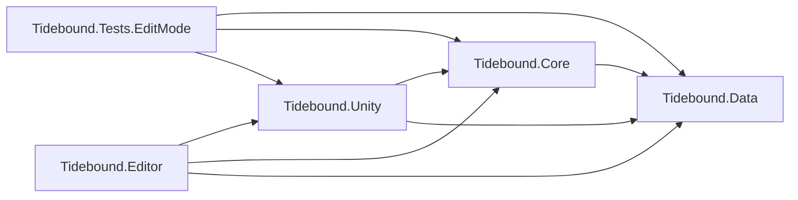
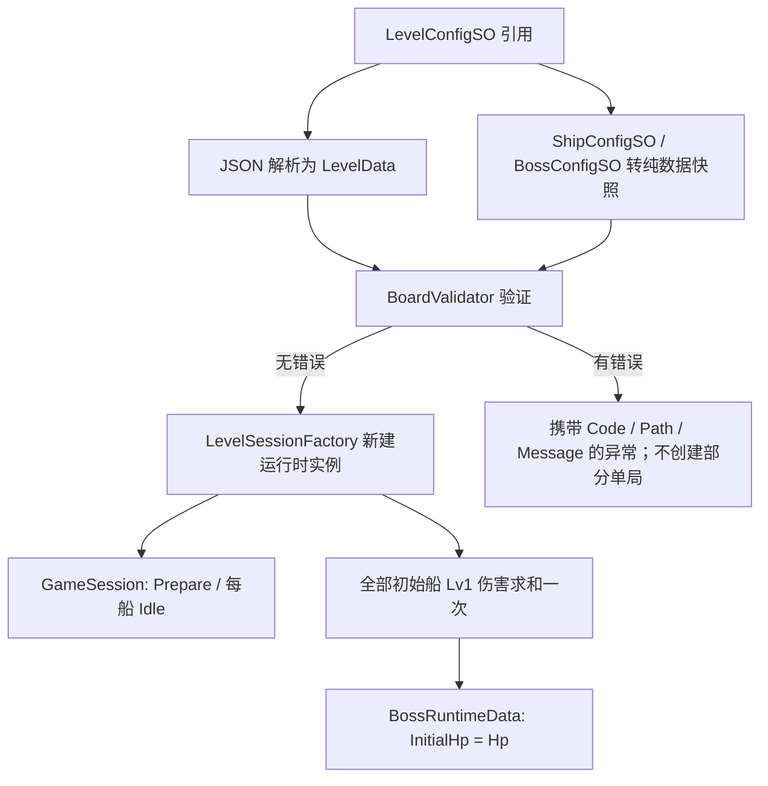

# Tidebound Fleet — Unity 架构与关卡体系基础

**V2-B1进度（2026-09-20）：** 已交付真实3D默认／蓝色候选／固定长船四向、斜角及第3关80船三档样片，另含第10关长船与V1对照，共7图；针对性PlayMode 6/6通过。研究开关默认关闭，不改变皮肤身份或经济。详见[B1验证](验证记录/V2B1_船体风格样片/B1_VALIDATION.md)。下一步B2主页／局内／奖励结果及图鉴组件板；首页旗舰仍需单独增强，真机未验收。

**最新交互修订（2026-09-20）：**完全死局改局内非模态文字与可用道具指引，取消自动弹窗；第10关按普通关卡结算，不自动返回主页。下一关由可用目录决定，暂未开放则留在结算提示；数百关目录与十关候选审计分离。见[流程修订与接入边界](设计分镜/20260920_V2制作准备/FLOW_REFINEMENT.md)。本轮已改可点击稿，Unity死局弹窗／正式导航待V2-C1接入。

状态：Phase 9 I5-A统一存档、恢复及金币结算灰盒。日期：2026-09-20。用户授权跳过真机前置，完整G1／Android验收保留待办。

I2a增量：Core新增独立`LocalLayoutAnalyzer`，提供同向船列、局部方向窗口、最大空矩形和分区占用报告；Editor接只读诊断与审计导出。没有更改生成器、移动事务或v2布局。168/168 EditMode通过，见[I2a验收](验证记录/Phase5R_I2a_局部结构诊断/I2A_VALIDATION.md)；I2b进一步加入RecipeLevelGenerator、LevelRecipe、几何归一及候选JSON／manifest，十关217/217 EditMode通过，见[I2b验收](验证记录/Phase5R_I2b_十关候选/I2B_VALIDATION.md)；本轮筛选版本为暂定，未改Movement／Transit和v2布局结构。

当前移动规则为受阻前进到最近阻挡前停住，不退回。I1复用现有移动和航道，新增完整阻挡图、LevelSolver、反向插入生成及版本化证明；7／80船两个样关已通过独立求解与移动／航道模型回放。最终153/153 EditMode、6/6 PlayMode通过，见[I1验收](验证记录/Phase5R_I1_反向生成与求解/I1_VALIDATION.md)。

旧首阻挡图、FNV证明和12个历史原型继续保留回归；新证明使用规则／出口版本与SHA-256，布局仍为v2。十关真实动画场景回放已完成，见[I2c验收](验证记录/Phase5R_I2c_竖屏可玩灰盒/I2C_VALIDATION.md)；真人触控与Android验收未完成。目标边界见[重设计方案](PHASE5R_REDESIGN.md)，剩余顺序见[后续计划](PHASE5_PLUS_PLAN.md)。

## 1. 工作工程与边界

- 工作工程：`10_开发工作区/TideboundFleet_Unity`，Unity **2022.3.25f1 / 530ae0ba3889 / Apple Silicon**。
- 来自购买工程 `00_远端接收区/已购源码与参考项目/unity--Bus_Mania_100_BugFix` 的独立文件副本，不使用指向原工程的资源链接。
- 复制 `Assets`、`Packages`、`ProjectSettings`，不复制个人 `UserSettings`、缓存和 `.DS_Store`。
- 所有新增业务代码放在 `Assets/Tidebound`。原车辆脚本、停车逻辑、旧场景和旧资源不改动、不删除。
- 开发副本补充 `com.unity.render-pipelines.universal: 14.0.11`，版本取自本机 2022.3.25f1 的包目录清单；显式声明 `com.unity.nuget.newtonsoft-json: 3.2.1`，避免配置加载依赖商业 SDK 间接安装 JSON 包。
- 旧工程仍在同一 Unity 工程内参与其自身编译；程序集隔离不意味着旧插件已经被移除或完成 Android/iOS 构建整改。
- 新增独立场景 `Assets/Tidebound/Scenes/Phase5R_PortraitGraybox.unity`，通过Tools菜单打开后Play；不更换项目启动／构建场景、不运行旧Loader或广告初始化。新灰盒已接Input→动画回调→Movement→Transit；旧BoardPrototypePreview仍仅为诊断预览。

`验证记录/Phase1_Unity架构基础建设/SourceBaseline.json` 记录复制前原工程目录摘要；同目录的 `Validation` 保存当次验证结果。基础建设见 [Phase 1 验收记录](验证记录/Phase1_Unity架构基础建设/PHASE1_VALIDATION.md)，棋盘规则见 [Phase 2 验收记录](验证记录/Phase2_棋盘系统/PHASE2_VALIDATION.md)，船移动见 [Phase 3 验收记录](验证记录/Phase3_船移动/PHASE3_VALIDATION.md)，航道见 [Phase 4 验收记录](验证记录/Phase4_航道系统/PHASE4_VALIDATION.md)，高密度基础见 [Phase 5 验收记录](验证记录/Phase5_高密度棋盘基础/PHASE5_VALIDATION.md)，关卡体系校准见 [Phase 5R 验证记录](验证记录/Phase5R_关卡体系校准/PHASE5R_VALIDATION.md)。

## 2. 实际目录

```text
TideboundFleet_Unity/
├── Assets/
│   ├── Tidebound/
│   │   ├── Runtime/
│   │   │   ├── Data/                    Tidebound.Data.asmdef
│   │   │   │   ├── Board/               GridPosition、ShipPlacementData
│   │   │   │   ├── Config/              LevelData
│   │   │   │   ├── Ship/                ShipDirection、ShipState、ShipDefinition、ShipRuntimeData
│   │   │   │   ├── Boss/                BossDefinition、BossRuntimeData
│   │   │   │   └── Core/                GameState
│   │   │   ├── Core/                    Tidebound.Core.asmdef
│   │   │   │   ├── Constants/           FoundationLimits
│   │   │   │   ├── Board/               占格、校验、只读快照、路径结果与原子事务
│   │   │   │   ├── LevelDesign/         完整依赖、LevelSolver、反向生成、生产配置与版本化证明
│   │   │   │   ├── Ship/                ShipMovementSystem、操作与状态结果
│   │   │   │   ├── GameSession/         GameSession、LevelSessionFactory
│   │   │   │   ├── Events/              IEventBus、SessionEventBus、类型化玩法事件
│   │   │   │   ├── Lane/                路线选择、并行转场、中央入口 FIFO
│   │   │   │   ├── Fleet/               预留
│   │   │   │   ├── Combat/              预留
│   │   │   └── Unity/                   Tidebound.Unity.asmdef
│   │   │       ├── Config/              Level、BaseShip、Boss、视觉 ScriptableObject
│   │   │       ├── Loading/             JSON 严格读写、LevelConfigLoader
│   │   │       ├── Ship/                兼容点击视图、Grid 映射、动画协调与时间参数
│   │   │       ├── Input/               高密度 Grid 集中点击路由
│   │   │       ├── Layout/              SafeArea 三段布局与当前回归网格计算
│   │   │       ├── LevelDesign/         JSON驱动的统一灰盒预览
│   │   │       ├── Lane/                场景路径、缩略船影视图和进度协调器
│   │   │       ├── Boss/                预留表现适配
│   │   │       └── UI/                  Screens、Components、HUD（预留）
│   │   ├── Config/
│   │   │   ├── Levels/                 教学关与高数量技术回归 JSON、引用资产、回放序列
│   │   │   ├── LevelPrototypes/Phase5R/ 12个历史候选及证明
│   │   │   ├── LevelPrototypes/Phase5R_Rebuild/ I1两个7／80船算法样关及新证明
│   │   │   ├── Ships/                  BaseShip.asset；旧四船型资产仅保留历史兼容
│   │   │   ├── Bosses/                 Kraken.asset
│   │   │   └── Visuals/                SpeedboatVisual.asset（无模型）
│   │   ├── Editor/                     Tidebound.Editor.asmdef
│   │   │   ├── LevelValidator/         LevelConfigInspector
│   │   │   ├── LevelStudio/            网格编辑、分析、试玩、证明录制与JSON保存
│   │   │   └── DebugTools/             预留
│   │   └── Tests/
│   │       ├── EditMode/               规则、分析、候选证明与回归测试
│   │       └── PlayMode/               移动、航道和候选灰盒表现测试
│   └── …                              原工程所有 Assets 原样保留
├── Packages/
└── ProjectSettings/
```

按程序集分层取代最初平铺的业务目录；namespace 仍按领域划分为 `Tidebound.Board`、`Tidebound.Ship`、`Tidebound.Boss`、`Tidebound.Config`、`Tidebound.Core`、`Tidebound.Events`、`Tidebound.EditorTools`、`Tidebound.Tests`。

不提前创建空 Controller、伪战斗实现或会抛出 `NotImplementedException` 的玩法方法。后续舰队模块采用 **FleetAggregationSystem**，不使用 FusionSystem，不实现船型合成。

## 3. 程序集依赖

箭头表示引用方向。



| 程序集 | 依赖与职责 | 限制 |
|---|---|---|
| Data | 数据类型、不可变船型定义、可变运行时数据、枚举 | `noEngineReferences=true`；无 Unity 类型、无 JSON 库 |
| Core | Grid 占格、路径查询、不可变事务、船移动、航道 FIFO、依赖分析、产品验证、搜索和解法证明 | 只引用 Data；无 Unity、物理系统、旧停车程序集 |
| Unity | SO/JSON 适配、Grid 世界映射、移动与航道表现、候选灰盒预览 | 引用 Data、Core 与 `Newtonsoft.Json.dll`；无 UnityEditor；不决定占格、可解性或入舰顺序 |
| Editor | 配置 Inspector、Tidebound Level Studio 编辑／分析／试玩／证明 | 仅 Editor；不进入 Player；保存前复用 Core 校验和真实事务 |
| Tests.EditMode | 真实序列化资产、负例、隔离及事件测试 | 仅 Editor、`UNITY_INCLUDE_TESTS`；显式 NUnit/TestRunner 引用 |

全部 `autoReferenced=false`、`overrideReferences=true`。预定义的旧 `Assembly-CSharp` 不会自动获得 Tidebound 引用，新代码也不引用旧 `Assembly-CSharp`、DOTween、广告或归因程序集。后续 UI 与 MonoBehaviour 必须放在自己的业务程序集下。

Unity 2022 会为启用引擎引用的 Tidebound.Unity 编译单元自动补入标准 `UnityEngine.UI` 模块；程序集边界测试允许此引擎模块。Data/Core 仍完全不引用引擎。这不代表本阶段实现了游戏 UI。

## 4. 配置唯一来源与数据结构

| 数据 | 唯一来源 | 字段／说明 |
|---|---|---|
| 关卡布局 | JSON | `schemaVersion, levelId, width, height, bossId, ships` |
| 船实例摆放 | JSON 的 ships 数组 | `id, typeId, length, position:{x,y}, direction`；length 仅允许 2／3 |
| 船型逻辑 | ShipConfigSO | 唯一 `TF_BASE_SHIP`，保存 `typeId, damageLv1=10`；额外引用独立视觉 SO |
| 船型表现 | ShipVisualConfigSO | `prefab, localScale`；允许本阶段为空模型；不参与逻辑 |
| Boss 身份／表现 | BossConfigSO | `bossId, displayName, prefab`；**不保存 HP** |
| Unity 关卡入口 | LevelConfigSO | 引用 JSON TextAsset、船型 SO 数组、Boss SO 数组；不存 levelId、宽高、船布局或 HP 副本 |
| 解析快照 | LevelData + ShipPlacementData | 从 JSON 新建的纯 C# 数据；不作为当前局可变状态直接使用 |
| 运行时船 | ShipRuntimeData | `Id, TypeId, SkinId, Position, Direction, Length, Damage, State`；身份、皮肤、长度、伤害本局只读 |
| 运行时 Boss | BossRuntimeData | `BossId, InitialHp, Hp`；InitialHp 只读，Hp 为独立运行时值 |
| 单局 | GameSession | 独立 SessionId、LevelId、尺寸、Ships、Boss、当前 Board、只读 InitialBoard、State、Events |

JSON schema v2 要求每艘船显式写入实例 `length`；不允许写入 `skinId`、`damage`、`hp` 或 `state`。字段名称严格区分大小写；缺失、未知、重复字段、整数溢出、隐式字符串转整数和非法方向均拒绝。

MVP 只有一个逻辑船型 `TF_BASE_SHIP`，每船固定 10 伤害。长度 2 的船先使用 `TF_SKIN_DEFAULT`，长度 3 的船固定使用 `TF_LONG_DEFAULT`；当前只建立稳定 skinId 数据契约，尚不实现皮肤分配和经济。

## 5. 加载数据流与生命周期



- 每次加载重新解析 JSON、复制船型数值，并为每艘船新建运行时对象；不保留对摆放 DTO 或 SO 的可变引用。
- 修改 A 局船位置、朝向、状态、Boss 当前血量，不影响 B 局或源配置。
- Boss HP 在创建单局时只求和一次。船离场、救援、洗牌、入舰队、后续配置变化都不会触发重新求和。
- I3的`FleetCombatSystem`持有命中扣血入口；Boss.Hp仅允许Data/Core与EditMode测试写入，Unity表现只读。单局加载不发出游戏事件。
- 调用者拥有 GameSession，结束使用后 Dispose；同时清理该局全部事件订阅。
- 不持久化运行时状态，不连接存档、升级、广告或旧 GameManager。

## 6. Grid 与视觉分离

坐标原点左下角，x 向右、y 向上，position 是船尾格。上／下／左／右分别对应 `(0,1)`、`(0,-1)`、`(-1,0)`、`(1,0)`。船宽固定 1 格，沿朝向占据 length 格。

`GridFootprint` 的输入只有整数船尾、方向、逻辑长度。船体模型、Transform.scale、Collider.bounds、Renderer.bounds、贴图像素和美术留白都不能参与占格计算。未来世界坐标映射由表现适配层从 Grid 单向生成。

`BoardModel` 是不可变逻辑快照。`GameSession.Board` 指向当前已提交棋盘；`InitialBoard` 永久保留开局快照，供重试／诊断使用。它复制船的 ID、类型、船尾、方向、长度和完整占格，不持有 Transform、Collider、SO 或可变 `ShipRuntimeData` 引用。

`QueryForwardPath(shipId)` 从船头前一格开始扫描，返回 `ForwardPathResult`：

- 遇阻时给出阻挡船、阻挡格、所有前方空格、可移动格数和最后合法船尾；紧邻阻挡时距离为 0。
- 无阻挡时给出到边缘的空格以及船尾完全越界所需距离；`TargetTail` 位于棋盘外一格。
- 查询是纯计算，不改变占位、RuntimeData、ShipState，不发布事件。

`ApplyPathResult` 只接受当前快照产生且仍匹配的结果，并一次性返回新的 `BoardModel`。受阻结果在新快照中替换完整占格，离场结果删除完整占格，原快照保持不变；过期结果被拒绝，0 距离结果保留原实例和全部占格。

Phase 3 的 `ShipMovementSystem` 是提交入口。它在表现报告到达逻辑完成点时，同时替换 `GameSession.Board`、更新 `ShipRuntimeData.Position/State` 并发布事件；这些属性只允许 Data/Core 和测试程序集写入，Unity 表现层不能直接修改。禁止表现脚本绕过状态机写格子或运行时位置。

当前运行时校验：schema v2、唯一且非空ID、唯一基础船型与Boss引用、技术安全上限24×24／160艘、逻辑长度2／3、固定伤害、Int32总伤害溢出、四方向、完整占格越界与重叠。船数区间、长船比例、方向熵、最大方向占比、空间聚集、初始出口和硬锁环由 `LevelProductionProfile` 与编辑器生产验证负责，不再污染运行时合法性。

**合法布局不等于可解布局，更不等于合格关卡。** Phase 5R 已增加真实首阻挡依赖图、强连通分量、硬锁环、小图有界精确搜索、布局指纹与证明回放；真人可读性、触控和正式难度仍必须单独验收。

## 7. 状态与事件契约

ShipState：Idle、Moving、BlockedFeedback、Exiting、InLane、InFleet。移动系统负责到 InLane；Phase 4 的 `TransitSystem` 在中央入口融入完成后一次性改为 InFleet。

GameState：Prepare、Playing、Paused、Victory、Failed。加载完成为 Prepare；`StartPlaying/Pause/Resume` 由移动系统管理。暂停保留活动操作和阶段，完成回调在恢复后只提交一次。I3由FleetCombatSystem在全部攻击命中后提交Victory；账本／HP异常提交Failed并提示重开。

每个 GameSession 有自己的非静态 `IEventBus`。事件是只读值类型，不携带 GameObject、SO 或可变 RuntimeData 引用。

| 契约 | 负载 | 当前触发点 |
|---|---|---|
| ShipMoveStartEvent | SessionId、ShipId、TypeId、From、Direction | 接受一次 Idle 船点击后 |
| ShipMoveCompleteEvent | 船上下文、From、To、WasBlocked | 到达受阻落点、零位移确认或船尾完整离界后 |
| ShipExitBoardEvent | 船上下文、船尾位置、出边方向、ExitSequence | 完整离界并释放占格后一次；序号单局递增 |
| ShipEnterFleetEvent | 船上下文、ExitSequence | 中央入口融入完成后一次 |
| AttackCreatedEvent | 船上下文、AttackId、Damage | Phase 7 舰队创建攻击凭证时 |
| BossDamagedEvent | SessionId、BossId、AttackId、Damage、RemainingHp | Phase 7 攻击命中时 |
| GameWinEvent | SessionId、LevelId | Phase 7 满足完整胜利条件后 |

总线主线程同步、按订阅顺序投递。发布时固定订阅快照；回调内新增／移除订阅从下一次发布生效。重复订阅分别拥有 token；Dispose token 幂等；Dispose 总线后再次订阅／发布抛出 ObjectDisposedException。订阅者异常向调用者传播并终止本次后续投递，不静默吞错。

Phase 3 在船尾完整离界时分配单局 `ExitSequence`。Phase 4 只消费该事件，完成入舰并发布 `ShipEnterFleetEvent`。攻击凭证、连击和胜利判断仍属于后续系统。

## 7.1 移动协调和 Unity 表现

- `ShipMovementSystem` 同一时刻只保留一个 `ActiveOperation`；忙碌期间的点击返回 Busy，不排队。
- 受阻且距离大于 0：先保持旧占格并播放直线动画，到达后原子提交新位置，再播放 0.12 秒横向反馈。
- 紧邻阻挡：立即确认零位移并进入横向反馈，完整占格不丢失。
- 无阻挡：ShipState 先进入 Exiting；船尾动画到棋盘外一格后释放占格、进入 InLane、发布完成和出场事件。
- `ShipMovementController` 把逻辑操作映射给 `IShipMovementView`；默认 `ShipMovementView` 使用协程，参考 12 格／秒并限制 0.18–0.60 秒。
- 默认受阻反馈只沿前进轴的垂直方向摆动，最终回到锚点，不用前进后退 Tween。
- `GridWorldMapper` 的轴、原点与 cellSize 只把 Grid 转成世界坐标，不能反向参与规则。
- `ShipMovementView` 使用 `IPointerClickHandler`。Collider／Graphic／Raycaster 只提供命中区域，不决定船长、占格或路径。
- 场景启动代码必须为每个当前棋盘实例提供唯一同 ID 视图，再调用 Controller.StartPlaying；缺少或重复视图会在绑定阶段失败。

## 7.2 航道协调和 Unity 表现

- 每局在船可能离场前创建一个 `TransitSystem(session)`；它订阅本局 `ShipExitBoardEvent`，拒绝跨局、重复船、重复序号及非 InLane 船。
- 上、左、右出口直接选择对应外围路线；下出口按到左右底角的较短距离选路，等距固定走右侧。
- 每艘船从接入至中央入口使用独立 1.20 秒逻辑进度，可以并行；路线更长只改变表现速度，不增加逻辑等待。
- 中央入口只接受 `NextEntranceSequence`。后序船即使先到也停在入口，不能越过尚未到达的前序船。
- 默认入口间隔和融入时长均为 0.15 秒。融入完成后先提交 InFleet、清除活动转场，再发布一次 `ShipEnterFleetEvent`。
- 暂停时 `TransitSystem.Advance` 不推进单局航道时钟；恢复后从原进度继续，序号和等待队列不变。
- `LaneTransitController` 只把逻辑进度映射到 `ILaneTransitView`。`LanePathLayout` 提供场景航点，`LaneWorldPath` 提供平滑曲线采样；Transform、路径长度和模型缩放不参与 FIFO。
- `LaneTransitController`在本局出场事件回调内同步应用航道起点、切线朝向和0.80倍船影尺寸，航行阶段保持尺寸；灰盒外围路径与1.5格航道中心线统一，PlanarShipLaneView将船尾锚点转换为船体中心；布局为航道外侧预留至少16逻辑单位。线性路径转角立即使用下一段朝向。顶部入舰融入表现继续独立计时，完成后隐藏实例，常驻舰队留在Phase 7。

## 7.3 舰队、攻击和胜利

`FleetRoster`依据标准船skinId聚合至最多5个席位，支持显式装备槽顺序；长度3船只进入独立Support计数。当前默认关卡仍只有默认标准皮肤，未添加皮肤经济或布局字段。

`FleetCombatSystem`在本局InFleet事件提交后，为每船创建唯一`AttackToken`，拒绝旧会话、错误身份、过早和重复事件。AttackId绑定Session与ShipId。创建和入舰不扣血；同组启动间隔0.20秒、飞行0.25秒，各组可以并行。攻击阶段Queued→InFlight→Hit由Core推进，先标记已命中再发BossDamagedEvent，防止重复或重入扣血。

战斗复用TransitSystem.ElapsedTime，并以事件发生时的航道时间安排发射；Unity先推进航道再调用combat.Advance()。长帧中的多次入舰仍保留各自时间，暂停两者同时冻结。炮弹视图只读取进度，不用OnComplete决定伤害；重开先Dispose战斗订阅，再清理航道、视图和Session。

胜利要求棋盘空、航道空、攻击全部命中、HP=0，并核对AttackToken总数等于开局船数；GameState先置Victory再发一次GameWinEvent。HP被异常修改或清盘后缺失攻击账本会明确Failed，不能假胜利。

顶部FleetCombatGrayboxView显示Boss方块、血条、最多5个舰队计数、独立长船支援、飞行炮弹和Victory。所有图形限制在顶部区域；测试Restart／Hint／Auto移至底部预留按钮位，此为I3初版；最新道具入口见下文I4修订。只用UGUI灰盒几何，不导入美术或旧源码战斗脚本。

## 8. TestLevel_001 教学测试数据

固定 4 列×6 行、7 艘基础船、每艘 2 格／10 伤害，加载结果 **InitialHp = Hp = 70**。

| 实例 | 船尾坐标 | 朝向 | 占格 |
|---|---|---|---|
| S001 | (0,0) | Right | (0,0)、(1,0) |
| S002 | (3,0) | Up | (3,0)、(3,1) |
| S003 | (0,1) | Up | (0,1)、(0,2) |
| S004 | (1,2) | Right | (1,2)、(2,2) |
| S005 | (3,3) | Up | (3,3)、(3,4) |
| S006 | (0,4) | Right | (0,4)、(1,4) |
| S007 | (2,5) | Left | (2,5)、(1,5) |

```text
y=5   .  7  7  .
y=4   6  6  .  5
y=3   .  .  .  5
y=2   3  4  4  .
y=1   3  .  .  2
y=0   1  1  .  2
      x0 x1 x2 x3
```

参考清盘顺序为 S005 → S002 → S001 → S004 → S006 → S003 → S007。Phase 3 得到连续 1–7 的出场序号并清空当前棋盘；Phase 4 再以同一顺序把七艘船各入舰一次，最终状态均为 InFleet，航道为空。InitialBoard 始终保留 7 艘开局船。该结果验证已知序列，不代表存在通用求解器。

`TestLevel_001` 是独立工程教学测试夹具。此次将它从原架构任务的 3 船／30 HP 调整为 7 船／70 HP；不据此擅自改写 GDD 12 个正式关卡的其他配方或难度顺序。

## 9. 查看与测试

在 Unity 中选中 `Assets/Tidebound/Config/Levels/TestLevel_001.asset`，Inspector 点击 **Validate data only**。该按钮只加载、校验和释放临时单局，不进入 Play、不修改 JSON 或 SO。

打开 Window → General → Test Runner → EditMode，运行 Tidebound.Tests 中的测试。命令行方式：

```sh
'/Applications/Unity/Hub/Editor/2022.3.25f1/Unity.app/Contents/MacOS/Unity' \
  -batchmode -nographics \
  -projectPath '/Users/flyn_n/Documents/Tidebound Fleet（潮汐舰队）/10_开发工作区/TideboundFleet_Unity' \
  -runTests -testPlatform EditMode -assemblyNames Tidebound.Tests.EditMode \
  -testResults '/private/tmp/TideboundFleet_EditMode-results.xml' \
  -logFile '/private/tmp/TideboundFleet_EditMode.log'
```

默认 Transform 动画和候选灰盒另使用同一命令的 `-testPlatform PlayMode -assemblyNames Tidebound.Tests.PlayMode`，测试结果写入独立 XML。I1最终结果为153/153 EditMode、6/6 PlayMode，详见[I1验收](验证记录/Phase5R_I1_反向生成与求解/I1_VALIDATION.md)。

不要在另一个 Editor 已打开同一工程时运行命令。测试由 Test Runner 管理退出，不添加可能提前终止测试的 `-quit`。命令行测试参数参考 [Unity Test Framework 1.1 文档](https://docs.unity3d.com/Packages/com.unity.test-framework@1.1/manual/reference-command-line.html)。程序集边界参考 [Unity 2022.3 手册](https://docs.unity3d.com/2022.3/Documentation/Manual/ScriptCompilationAssemblyDefinitionFiles.html)。

## 10. 后续开发顺序

1. **Phase 5R 重新验收：**先复验受阻前进、动态依赖Solver与反向生成，完成7／80艘的10关回放和竖屏灰盒；再做真人与最低Android设备测试，冻结规格。后续顺序以重设计方案为准。
2. **Phase 6A 最小验证工具：**随5R接入生成、求解、回放、十关批量校验和报告；保留v2布局，增量完善版本化证明。不等待完整编辑器。
3. **Phase 7 舰队与战斗：**消费 ShipEnterFleetEvent，建立最多五个标准船皮肤席位、长船支援计数、AttackToken、Boss 扣血与一次胜利。
4. **Phase 8–11 产品闭环：**依次接入道具与死局、离线存档与皮肤经济，再进入6B量产工具及30关、正式UI，最后IAA与分析。
5. **平台验证与Phase 12发布：**5R先本地试构建Android并只修必要的旧依赖阻断；发布阶段再完成工具链、Android／iOS和设备覆盖验收。

详细入口、退出和回退条件见 [Phase 5R及后续开发计划](PHASE5_PLUS_PLAN.md)，关卡工具范围见 [关卡编辑器与验证工具规划](LEVEL_EDITOR_PLAN.md)。Phase 5已把代码迁移到长度2／3、单基础船和schema v2；12×18／80艘只保留为技术回归事实。正式网格、完整体量、方向交错、真机触控和最低设备性能由Phase 5R重新验收。

2022.3.25f1 当前用于复现购买工程与本阶段验证，不等于已锁定最终上架版本。已有安全公告及商店工具链要求仍需在发布阶段单独验收。


## Phase 8 I4修订：两船救援、五船洗牌与库存

- `ShipToolSystem`消费外部共享的`ToolInventory`，不在GameSession中创建每局计数。`ToolInventoryData`v1保存三类余额和已发放回执，`IToolInventoryStore`隔离纯Core与Unity文件适配器。
- `ToolGiftPolicy`当前第3关解锁各送1个，第10／20／30……关随机送1个；里程碑唯一回执先写入再暴露余额。切关、重开及重新加载不再次赠送。
- `PeripheralShips`取每行／列首尾占格所属船集合。救援抽取最多2个不同身份，库存扣1后`RescueDirectlyToLane`一次提交两船离场，再分配原共享ExitSequence并发布ShipExitBoardEvent；逻辑批次发布时锁普通移动。两船视图立即对齐航道中心、0.8倍和航向，后续FIFO／攻击不变。
- `RemainingFleetShuffler`随机选最多5艘，只在选中集合内按同长度循环交换槽位并转向；至少一处实际转向。其余船的坐标和朝向不变。快速独立Solver验证后整体提交；每个候选有限搜索，整次有预算，失败不扣数。它不是关卡生产生成器。
- 反转只需手选目标与合法足迹，以中心转180°直接提交；不再Solver拦截。`BoardProgressMonitor`继续按Board快照缓存运行中死局，Busy不判定，穷尽无解与预算Unknown分开；诊断不结束会话，仍可救援。
- `ToolInventoryFileStore`将版本化JSON和完整性摘要写临时文件、flush并原子替换主文件，保留上版bak。校验失败不自动回滚余额或清空重赠，保留文件并关闭库存写入，核心仍可玩。摘要仅检测意外损坏，不作为付费防作弊或订单验证。
- Editor试玩库存位于项目Library/Tidebound，不进入Git；移动端位于Application.persistentDataPath。测试默认注入内存库存，不污染实际试玩。
- 余额先保存后生效，避免正常重开／重载补满；目前尚无整局断点存档，极端退出若发生在扣库存到提交棋盘之间，不能保证恢复该次效果。I5应将库存消耗与可恢复的局面事务统一，真实付费前完成崩溃恢复验收。
- `AttemptEndedEvent`保持终态互斥和会话隔离，无金币结算。取得道具的Ad／Coins／GooglePlay灰盒入口暂不可交易；未来接入已确认奖励／已验证订单，不能用打开界面或本地模拟回调当付款成功。


## I5-A：统一档案与结算事务（2026-09-20）

- `Core/Save/PlayerSaveData` v2为唯一玩家档案：进度、金币、道具与赠送回执、当前attempt、最大本地日期／重开次数、每attempt唯一结算记录。当前余额由结算记录校验；未来商店需要扩展扣款账本，不能直接改余额。
- `SavedGameRuntime`复用原GameSession、Movement、Transit、Combat。保存初始船身份／收益、当前棋盘、离场序列与时间、已命中ID、暂停和未完成移动意图。恢复以现有航道FIFO／攻击逻辑重放，同一个sessionId与收益seed不变；不保存Transform或逐帧动画像素。
- 普通移动先落盘PendingMoveId再开始动画；恢复时完成已受理移动，受阻仍停在最近阻挡前。每次逻辑变化写检查点，后台／暂停／退出额外强制保存时间轴。硬中断可能回到上个持久检查点的时间，但不会重复结算或重抽收益。
- 道具通过`IToolMutationStore`把库存减少与操作后的棋盘／救援离场序列一次写入，成功后才发布运行时效果。救援两船共享一次库存扣减与一个文件事务。
- `PlayerSaveService`以attemptId去重；胜利=已命中金币+首通固定奖励+推进下一关；死局部分结算+当日计数+新attempt同一事务。求解器的Unsolvable或LimitReached不能冒充“所有船无法移动”的结算条件。
- `PlayerSaveFileStore`使用UTF-8 JSON、SHA-256完整性摘要、Flush(true)、同目录临时文件及替换备份。摘要用于损坏检测，不是防作弊或支付凭证。主文件损坏／仅剩备份时保留文件并关闭账户写入，仍可练习基础玩法；不静默回滚旧库存和奖励。
- 首次读取v2为空时迁移旧`tool-inventory-v1.json`库存及里程碑回执；v2一旦存在，不再重导旧档。Editor保存在项目Library/Tidebound，设备保存在persistentDataPath，均不提交Git。未增加新SDK或修改平台构建配置。
- `PortraitPuzzleGraybox`默认进入持久推进模式；胜利1.2秒后进入下一关，最后一关完成停在已保存完成态；隐藏旧关选择。`EnableReviewMode`及截图工具使用独立内存档，审查选关不改账户。
- 当前只包含默认船金币、库存及尝试状态；皮肤／装备／抽卡、金币购买、真实广告与Google支付留给后续迭代。移动端文件替换、后台回调和性能仍需真机验证。


## I5-B：金币购买与每局道具额度

- `CoinShopCatalog`为可信不可变商品配置，Unity从`Resources/CoinToolShop.json`读取；调用只提交商品ID和唯一请求ID，价格／数量不从按钮参数接收。
- 档案v3新增`Purchases`，`Coins=已结算收入-金币购买支出`。每个购买记录含历史商品、配置版本、价格、数量、等级，且必须与库存`coin:`回执一一对应；历史记录不按新价格重算。
- `BuyWithCoins`一起保存钱包、库存、购买记录和attempt；失败不提交，成功后同步`ToolInventory`缓存，防止后续赠送／使用把刚买的库存覆盖。相同请求／商品重复调用返回AlreadyPurchased，相同请求改商品返回RequestConflict。
- v2读取校验后原地升级v3，沿用原文件名`player-save-v2.json`以便自动找到旧档；失败不覆盖旧档。版本以文件内Version为准。
- `GameSession.ToolUses`及`AttemptSaveData.ToolUses`记录成功使用次数，三种来源无关地共享5次上限；`ProjectTool`将计次与扣数／效果一起提交。读档恢复计数，普通购买不增加使用次数。
- `CoinShopPanel`独立负责商品列表／确认／余额与库存反馈；灰盒Menu与空库存共用入口。面板继承菜单或自身的暂停所有权，关闭后只恢复自己暂停的游戏；已由玩家暂停的局仍暂停。
- 已开放长期经济／排名设计，但本轮不修改BattleCoinsV1首通公式、不接抽取、广告、支付或真实排行榜服务。


## E1：自动帮助与完全死局弹窗（2026-09-20）

- `Core/Tools/BoardAssistance`只读取不可变Board快照；缓存首个`QueryForwardPath.CanExit`候选和所有船零位移状态，不调用Solver、不改变船位置。新快照重置计时与弹窗去重，空盘面不判死局。
- `PortraitPuzzleGraybox.Assistance`统一处理5秒无操作、1.4秒单次高亮、输入／暂停／后台／工具选择／弹层屏障。默认提示开启，可在Menu关闭或选静态高亮；偏好使用PlayerPrefs，与账号经济存档分离。没有输入的同一轮空闲仅提示一次，新操作重新计时。
- `BoardGridInputRouter`增加可选活动回调与指针按住状态，空白点击、按住也算操作；UI回调和后台／焦点变化同步清除高亮。所有候选来自Grid，不读取视图尺寸。
- `DeadlockPanel`在所有船无法移动、无未完成移动意图、航道和待攻击归零后显示。关闭后相同Board实例不重复弹，重新载入仍可能提示一次。库存不足复用CoinShopPanel，5次用满禁用本局道具，购买只补下局库存；重开沿用既有原子结算事务。
- `SavedGameRuntime.PresentationPause`仅为运行时弹层暂停来源；Capture不将其写成用户主动暂停，避免重进卡在不可恢复的临时弹层状态。死局弹窗转商店交接暂停所有权，手动暂停继续按原行为保存；没有修改v3存档结构、历史账本、道具效果或经济参数。
- [E1验证](验证记录/E1_自动帮助与死局弹窗/E1_VALIDATION.md)：338/338 EditMode、27/27 PlayMode。后续E2a将Ready屏障接入此协调器；本轮仍沿用原进关与胜利自动推进流程。


## E2a：进入流程、保存屏障与恢复（2026-09-20）

- `Core/LevelDesign/LevelEntrySequence`是无Unity依赖的展示时钟：WaitingForSave、Field、Ships、Ready；新局0.18秒场地＋0.48秒最多8组显现，同局恢复／减弱动效0.12秒统一淡入。7船与80船总时长相同，不用视图反推逻辑。
- `PortraitPuzzleGraybox.Entry`复用候选目录、SavedGameRuntime和PlayerSaveService。先保存新attempt再允许Ready；待提交runtime只保留一个，失败面板重试相同身份，重开事务成功后才结束并销毁旧局。失败期间暂停旧局移动，临时暂停不污染持久用户暂停。
- `BoardGridInputRouter`新增可选输入许可回调，按下和抬起均检查；进入开始／Ready清除选择，提前点击不排队。灰盒公开动作入口同样检查Ready，E1只在Ready后计时。场地映射与HUD在开始演出前已完成。
- Body CanvasGroup和局部缩放负责最终格位的显现；船根节点、Grid、方向和阻挡始终不变。恢复时不回放整盘，也不推进航道／攻击；暂停／后台／菜单冻结时钟，退出后凭同一attempt走恢复短路径。
- 正式Start启用animateEntry，旧模块审查入口可省略演出，新的E2a PlayMode测试显式开启。Entry motion偏好保存在PlayerPrefs，不修改v3经济档。
- 已清盘但胜利凭证保存失败时，SelectLevel拒绝进入，Restart只重试原结算。E2b之前保留原1.2秒自动推进；结果页、真实章节目标及已结算未继续的界面恢复尚待接入。
- 证据与边界见[E2a验证](验证记录/E2a_进关与恢复/E2A_VALIDATION.md)。未改变收益版本、道具规则、原存档格式或移动平台配置，未完成真机验收。


## E2b：胜利结果与手动继续（2026-09-20）

- `Core/Save/VictoryResult`只投影经过验证的当前胜利Attempt与匹配SettlementRecord，包含已保存金额、已发布关卡范围、10关章节段及前后进度；不写档、不重算历史收益、不发奖励。未结算胜利不能生成已入账结果。
- `PortraitPuzzleGraybox.Result`由现有Combat.IsVictorious驱动。正式campaign移除1.2秒自动跳关；Checkpoint成功后才绑定结果，失败只显示重试并停止每帧保存。结果期退出／后台不重复写已稳定的凭证或暗中重试失败交易。
- `VictoryResultPanel`提供奖励、章节条、下一关、返回航程概览与减弱动效。0.6秒Boss区淡出、0.18秒面板可读、0.55秒进度条仅影响展示；下一关无需等待全部动效。概览是结果的内存视图，不新增正式首页或持久导航字段。
- 已保存Victory恢复时跳过E2a入场和重复结果演出，直接读凭证；旧v3格式即可表达“已赢但尚未继续”。下一attempt可靠提交后覆盖当前Attempt，恢复转为E2a同局短路径。没有新账本、迁移版本或奖励回执类型。
- ContinueFromResult检查结果可读、存在已发布下一关与防重入；通过原SelectLevel／CommitEntry保存下一局。直接切关无法绕过结果流程；创建失败保留旧结果凭证和单一待提交候选，复用E2a RetryEntry。
- `BeforeNextLevel`在新runtime创建之前调用；I5-C可在第2关返回false以处理首抽／装备，再由显式继续恢复流程。资格、领取、装备与去重须由I5-C持久服务实现，本轮不假发首抽奖励。
- 账号异常练习通关提供无奖励的重新练习入口；模块Review模式仍独立，不冒充campaign结果。验证见[E2b记录](验证记录/E2b_结算与章节目标/E2B_VALIDATION.md)，真机与性能尚未验收。


## V1：3D船体表现适配（2026-09-20）

- `ShipPrototypeMesh`生成有厚度的标准／长船原型，局内坐标仍为XY，负Z为视觉高度。`ShipPrototypeResources`按表现实例共享Mesh、5种标准材质、长船固定材质和阴影，OnDestroy释放运行时资源；无外部美术依赖。
- `ShipPrototypeAppearance`包装原Body的CanvasGroup及MeshRenderer，统一入口SetEntry、SetHint、SetMode。E2a对齐最终格位后按原序列显现；E1及旧手动Solver提示只改表现。模型与阴影在alpha=0时隐藏，缩放围绕视觉中心。
- GridWorldMapper、BoardGridInputRouter、ShipMovementView和PlanarShipLaneView继续负责原坐标、输入和航道时序；Mesh／Collider不参与Grid判定。同一根节点随入航道当帧转向并缩放0.8倍，入舰后整体隐藏。
- 正交相机保持正俯视。底面改用平色Mesh以支持深度，透明Grid UI面保留输入；世界法线明暗和软椭圆阴影用于低成本体积表达，未修改渲染管线配置或引入实时阴影。
- 占位材质按现有FleetRoster的SlotIndex映射，长船独立固定。当前内容只含默认标准皮肤；五色四向捕获为显示样本，不改存档或皮肤身份。I5-C未来应传入实际装备／attempt身份，而非根据颜色推断经济。
- `SetShipPrototypeMode`保留开发平面参考，不重建玩法。截图入口`TIDEBOUND_CAPTURE_VOLUME_ONLY`覆盖12种画面；验证工程已补齐正式URP 14.0.11依赖与配置，356项EditMode和48项PlayMode通过，见[V1验证](验证记录/V1_3D船体可读性/V1_VALIDATION.md)。真人触控／设备性能仍待验收。


## I5-C1：收藏数据与v4统一存档（2026-09-20）

- `Core/Collection/SkinCatalog`是版本化的16款目录，只有身份、品质、工作名与排序；长船不属于收藏。`CollectionRules`保留原基线供回执校验，未激活长期候选定价或改变BattleCoinsV1。
- `CollectionData`持有五个可为空的固定槽、拥有集合、券／保底、档案seed和收藏／装备回执。校验通过重放凭证重建拥有、券余额、普通抽数及保护状态；本轮仅建立数据／校验，没有抽取或发放入口。新手FirstBlue暂按独立赠送记录，不计普通保底，与现有模拟口径一致。
- `PlayerSaveData.CurrentVersion=4`，v2／v3验证后在原文件原子迁移一次；Copy深复制收藏。钱包等式新增收藏支出项，旧档为0。历史结算、订单价格与attempt完整保留，不重发道具或免费皮肤。
- `PlayerSaveFileStore`仍使用player-save-v2.json、原Envelope与替换备份机制。v4必须明确保存收藏关键字段；JSON读取禁用日期推断，避免时间字符串精度被自动转换。损坏、未知版本及迁移失败保留原文件、关闭账户写入。
- `PlayerSaveService.SetEquipment`复用Commit，固定5槽且仅已拥有、唯一标准皮肤。请求ID在购买／收藏／装备间唯一；旧请求重放只确认历史成功，不回滚新装备。移动事务与未提交胜利期间返回Busy，实际皮肤分配仍由后续C2在创建新attempt前接入。
- `CanClaimFirstBlue`由最高通关≥2与未领取回执计算，旧玩家同样保留资格。本轮不自动发放；E2b结果恢复仍读取原胜利凭证。验证见[I5-C1记录](验证记录/I5C1_收藏存档/I5C1_VALIDATION.md)。

## I5-C2：收藏交易、灰盒与开局身份（2026-09-20）

- `CollectionDrawEngine`用档案seed＋规则版本＋已提交普通抽数＋抽取种类派生固定随机流，不使用请求ID或时间作为随机种子。重复点击返回原回执；写盘失败没有结果展示，重新打开／换请求ID仍得同一候选结果。十连按起始U一次锁定9倍单价，批内逐抽更新拥有、券与三种计数。
- `PlayerSaveService.Collect`把金币扣减、收藏／券／保底、回执与活动attempt一次Commit。普通抽取和兑换先要求处理免费蓝皮；首抽是独立赠送，不推进普通保底。兑换不推进抽数或保底。规则保留CollectionBaselineV1，不启用长期候选价格和首通封顶。
- `CollectionShipAllocator`按标准船ID排序，对平衡袋做固定洗牌。E<K时用历史已结算attempt数量轮换选取装备，重开候选按即将写入的结算多加1；同一份新局候选失败重试复用E2a。长船永远固定，空池回退默认。
- `AttemptSaveData.EquipmentSlots`是v4向后兼容的可空扩展：旧档缺失／null沿用历史推断顺序，新局保存5位槽和已分配每船身份、奖励上限与奖励种子。恢复不再读取实时收藏。FleetRoster和战斗HUD按真实槽号处理空位；保持每船10伤害、每船一次攻击及旧BattleCoinsV1公式。
- `CollectionPanel`含分页、品质／来源筛选、拥有／锁定／装备状态、独立交易确认与保存后结果、满槽替换选择。`CollectionShipPreview`用独立29层、192×192 RenderTexture复用V1网格，方向／炮击只演示，不调用战斗或经济。资源随页面销毁。
- `PortraitPuzzleGraybox.Collection`接管临时暂停和输入；关闭后恢复原先暂停归属。菜单和结算都有收藏入口，第2关结果的下一关先处理待领蓝皮。可在当前10关结束后继续操作收藏。验证详见[I5-C2记录](验证记录/I5C2_收藏闭环/I5C2_VALIDATION.md)。

## I5-C3：生产契约与离线校准（2026-09-20）

- `Editor/LevelStudio/EconomyContractExport`从实际CollectionDrawEngine／CollectionData／BattleCoinRules／ToolGiftPolicy／商店／10关文件导出只读契约及520笔已验证事务；不读玩家存档。Editor程序集引用工程已有Newtonsoft.Json，无新增运行时包。
- `Tools/Economy/production_contract.json`保存参数、合成事务与22个生产源文件／配置的SHA256。模型加载先验证文件未变，再逐笔对照Python镜像随机流与C#结果；变化需重新导出。hash用于漂移检测，不是反作弊或支付验证。
- `simulate_economy.py`以生产固定池为基线，候选曲线／扩池仅存在离线模型。道具按类型计库存和组合包，抽取按完整批次锁价，兑换在批后；装备策略与玩家预算为外生假设，不修改游戏行为。每关校验金币／券／道具库存守恒。
- 输出包含55方案和3／10／30／100／300关分位数、首次事件达成比例、支出／请求缺口／库存等。`test_economy.py`14项测试，`plot_report.py`可选Matplotlib生成可复核静态图；工具不进入玩家构建。
- 本轮未改Runtime、存档schema、生产价格、收益公式或SDK。C3候选参数与采用版本边界见[I5-C3报告](验证记录/I5C3_经济校准/I5C3_VALIDATION.md)，不得直接修改旧SinglePrice／FirstClear使历史回执失效。
