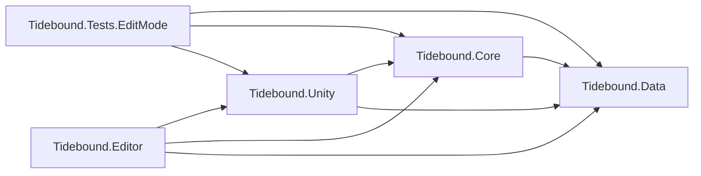
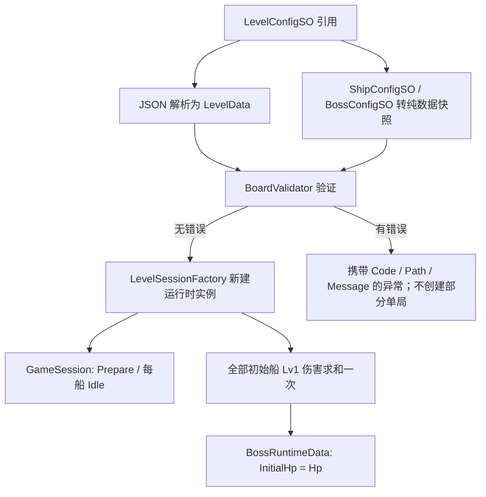

# Tidebound Fleet — Phase 1 Unity 基础架构

状态：基础数据与配置工程；不包含可玩玩法。日期：2026-09-18。

## 1. 工作工程与边界

- 工作工程：`10_开发工作区/TideboundFleet_Unity`，Unity **2022.3.25f1 / 530ae0ba3889 / Apple Silicon**。
- 来自购买工程 `00_远端接收区/已购源码与参考项目/unity--Bus_Mania_100_BugFix` 的独立文件副本，不使用指向原工程的资源链接。
- 复制 `Assets`、`Packages`、`ProjectSettings`，不复制个人 `UserSettings`、缓存和 `.DS_Store`。
- 所有新增业务代码放在 `Assets/Tidebound`。原车辆脚本、停车逻辑、旧场景和旧资源不改动、不删除。
- 开发副本补充 `com.unity.render-pipelines.universal: 14.0.11`，版本取自本机 2022.3.25f1 的包目录清单；显式声明 `com.unity.nuget.newtonsoft-json: 3.2.1`，避免配置加载依赖商业 SDK 间接安装 JSON 包。
- 旧工程仍在同一 Unity 工程内参与其自身编译；程序集隔离不意味着旧插件已经被移除或完成 Android/iOS 构建整改。
- 本阶段不更换启动场景、不运行旧 Loader、不调用旧广告初始化。直接进入 Play 不代表已有潮汐舰队可玩原型。

`验证记录/Phase1_Unity架构基础建设/SourceBaseline.json` 记录复制前原工程目录摘要；同目录的 `Validation` 保存当次验证结果。完整验收结论见 [Phase 1 验收记录](验证记录/Phase1_Unity架构基础建设/PHASE1_VALIDATION.md)。

## 2. 实际目录

```text
TideboundFleet_Unity/
├── Assets/
│   ├── Tidebound/
│   │   ├── Runtime/
│   │   │   ├── Data/                    Tidebound.Data.asmdef
│   │   │   │   ├── Board/               GridPosition、ShipPlacementData
│   │   │   │   ├── Config/              LevelData
│   │   │   │   ├── Ship/                ShipDirection、ShipState、ShipDefinition、ShipRuntimeData
│   │   │   │   ├── Boss/                BossDefinition、BossRuntimeData
│   │   │   │   └── Core/                GameState
│   │   │   ├── Core/                    Tidebound.Core.asmdef
│   │   │   │   ├── Constants/           FoundationLimits
│   │   │   │   ├── Board/               GridFootprint、BoardValidator、BoardModel、校验诊断
│   │   │   │   ├── GameSession/         GameSession、LevelSessionFactory
│   │   │   │   ├── Events/              IEventBus、SessionEventBus、七类事件
│   │   │   │   ├── Fleet/               预留
│   │   │   │   ├── Combat/              预留
│   │   │   │   └── Lane/                预留
│   │   │   └── Unity/                   Tidebound.Unity.asmdef
│   │   │       ├── Config/              四种 ScriptableObject 类
│   │   │       ├── Loading/             LevelJsonReader、LevelConfigLoader
│   │   │       ├── Ship/                预留表现适配
│   │   │       ├── Boss/                预留表现适配
│   │   │       └── UI/                  Screens、Components、HUD（预留）
│   │   ├── Config/
│   │   │   ├── Levels/                 TestLevel_001.json、TestLevel_001.asset
│   │   │   ├── Ships/                  Speedboat、Gunboat、Battleship、Flagship.asset
│   │   │   ├── Bosses/                 Kraken.asset
│   │   │   └── Visuals/                SpeedboatVisual.asset（无模型）
│   │   ├── Editor/                     Tidebound.Editor.asmdef
│   │   │   ├── LevelValidator/         LevelConfigInspector
│   │   │   └── DebugTools/             预留
│   │   └── Tests/
│   │       ├── EditMode/               Tidebound.Tests.EditMode.asmdef、五组测试
│   │       └── PlayMode/               预留，本阶段无 PlayMode 测试
│   └── …                              原工程所有 Assets 原样保留
├── Packages/
└── ProjectSettings/
```

按程序集分层取代最初平铺的业务目录；namespace 仍按领域划分为 `Tidebound.Board`、`Tidebound.Ship`、`Tidebound.Boss`、`Tidebound.Config`、`Tidebound.Core`、`Tidebound.Events`、`Tidebound.EditorTools`、`Tidebound.Tests`。

不提前创建空 Controller、伪战斗实现或会抛出 `NotImplementedException` 的玩法方法。后续舰队模块采用 **FleetAggregationSystem**，不使用 FusionSystem，不实现船型合成。

## 3. 程序集依赖

箭头表示引用方向。



| 程序集 | 依赖与职责 | 限制 |
|---|---|---|
| Data | 数据类型、不可变船型定义、可变运行时数据、枚举 | `noEngineReferences=true`；无 Unity 类型、无 JSON 库 |
| Core | 初始占格、合法性验证、创建单局、类型化事件总线 | 只引用 Data；无 Unity、物理系统、旧停车程序集 |
| Unity | ScriptableObject、TextAsset 引用、JSON 解析适配 | 引用 Data、Core 与 `Newtonsoft.Json.dll`；无 UnityEditor |
| Editor | 配置 Inspector 中的仅数据验证按钮 | 仅 Editor；不进入 Player |
| Tests.EditMode | 真实序列化资产、负例、隔离及事件测试 | 仅 Editor、`UNITY_INCLUDE_TESTS`；显式 NUnit/TestRunner 引用 |

全部 `autoReferenced=false`、`overrideReferences=true`。预定义的旧 `Assembly-CSharp` 不会自动获得 Tidebound 引用，新代码也不引用旧 `Assembly-CSharp`、DOTween、广告或归因程序集。后续 UI 与 MonoBehaviour 必须放在自己的业务程序集下。

Unity 2022 会为启用引擎引用的 Tidebound.Unity 编译单元自动补入标准 `UnityEngine.UI` 模块；程序集边界测试允许此引擎模块。Data/Core 仍完全不引用引擎。这不代表本阶段实现了游戏 UI。

## 4. 配置唯一来源与数据结构

| 数据 | 唯一来源 | 字段／说明 |
|---|---|---|
| 关卡布局 | JSON | `schemaVersion, levelId, width, height, bossId, ships` |
| 船实例摆放 | JSON 的 ships 数组 | `id, typeId, position:{x,y}, direction` |
| 船型逻辑 | ShipConfigSO | `typeId, length, damageLv1`；额外引用独立视觉 SO |
| 船型表现 | ShipVisualConfigSO | `prefab, localScale`；允许本阶段为空模型；不参与逻辑 |
| Boss 身份／表现 | BossConfigSO | `bossId, displayName, prefab`；**不保存 HP** |
| Unity 关卡入口 | LevelConfigSO | 引用 JSON TextAsset、船型 SO 数组、Boss SO 数组；不存 levelId、宽高、船布局或 HP 副本 |
| 解析快照 | LevelData + ShipPlacementData | 从 JSON 新建的纯 C# 数据；不作为当前局可变状态直接使用 |
| 运行时船 | ShipRuntimeData | `Id, TypeId, Position, Direction, Length, Damage, State`；身份、长度、伤害本局只读 |
| 运行时 Boss | BossRuntimeData | `BossId, InitialHp, Hp`；InitialHp 只读，Hp 为独立运行时值 |
| 单局 | GameSession | 独立 SessionId、LevelId、尺寸、Ships、Boss、InitialBoard、State、Events |

JSON 不允许写入 `length`、`damage`、`hp` 或 `state` 来覆盖静态定义。字段名称严格区分大小写；缺失、未知、重复字段、整数溢出、隐式字符串转整数和非法方向均拒绝。

四型 Lv1 配置为：快艇 2 格／10；炮艇 2 格／20；战舰 3 格／30；旗舰 4 格／50。尚不实现攻击频率、升级路线和成长系统。

## 5. 加载数据流与生命周期



- 每次加载重新解析 JSON、复制船型数值，并为每艘船新建运行时对象；不保留对摆放 DTO 或 SO 的可变引用。
- 修改 A 局船位置、朝向、状态、Boss 当前血量，不影响 B 局或源配置。
- Boss HP 在创建单局时只求和一次。船离场、救援、洗牌、入舰队、后续配置变化都不会触发重新求和。
- 本阶段没有扣血接口；`Hp` 的变化仅供以后战斗系统持有并更新。单局加载不发出任何游戏事件。
- 调用者拥有 GameSession，结束使用后 Dispose；同时清理该局全部事件订阅。
- 不持久化运行时状态，不连接存档、升级、广告或旧 GameManager。

## 6. Grid 与视觉分离

坐标原点左下角，x 向右、y 向上，position 是船尾格。上／下／左／右分别对应 `(0,1)`、`(0,-1)`、`(-1,0)`、`(1,0)`。船宽固定 1 格，沿朝向占据 length 格。

`GridFootprint` 的输入只有整数船尾、方向、逻辑长度。船体模型、Transform.scale、Collider.bounds、Renderer.bounds、贴图像素和美术留白都不能参与占格计算。未来世界坐标映射由表现适配层从 Grid 单向生成。

`BoardModel` 当前是**初始占格只读快照**，通过 `GameSession.InitialBoard` 暴露；不是已实现的移动棋盘。直接编辑运行时数据不会刷新这个快照。Phase 4 才增加当前位置与占位共同提交的事务接口，禁止表现脚本直接写位置绕过棋盘。

本阶段校验：schema、唯一且非空 ID、船型与 Boss 引用、尺寸上限 8×9、逻辑长度 2..4、正伤害、Int32 总伤害溢出、四方向、全船头尾越界、全船占格重叠、缺失配置和重复配置 ID。

**合法布局不等于可解布局。** 本阶段不提供自动求解、路径扫描、移动距离计算、卡局检测或洗牌验证。

## 7. 状态与事件契约

ShipState：Idle、Moving、BlockedFeedback、Exiting、InLane、InFleet。BlockedFeedback 表示短暂受阻反馈，后续应回到 Idle 并保留新位置；本阶段只定义枚举，不实现状态转换。

GameState：Prepare、Playing、Paused、Victory、Failed。加载完成为 Prepare；Failed 仅预留，不代表碰撞或卡局会失败。

每个 GameSession 有自己的非静态 `IEventBus`。事件是只读值类型，不携带 GameObject、SO 或可变 RuntimeData 引用。

| 契约 | 负载 | 未来触发点，本阶段均不触发 |
|---|---|---|
| ShipMoveStartEvent | SessionId、ShipId、TypeId、From、Direction | 棋盘接受一次操作 |
| ShipMoveCompleteEvent | 船上下文、From、To、WasBlocked | 本次棋盘位移／零位移结果提交 |
| ShipExitBoardEvent | 船上下文、船尾位置、出边方向、ExitSequence | 船尾完全离界且占位释放后一次 |
| ShipEnterFleetEvent | 船上下文、ExitSequence | 到达舰队后一次 |
| AttackCreatedEvent | 船上下文、AttackId、Damage | 舰队为该入场船创建一次攻击凭证 |
| BossDamagedEvent | SessionId、BossId、AttackId、Damage、RemainingHp | 一次攻击凭证命中结算后 |
| GameWinEvent | SessionId、LevelId | 满足完整胜利条件后一次 |

总线主线程同步、按订阅顺序投递。发布时固定订阅快照；回调内新增／移除订阅从下一次发布生效。重复订阅分别拥有 token；Dispose token 幂等；Dispose 总线后再次订阅／发布抛出 ObjectDisposedException。订阅者异常向调用者传播并终止本次后续投递，不静默吞错。

去重、ExitSequence 分配、攻击凭证消费、连击和胜利判断属于后续生产事件的系统。本阶段总线不模拟这些逻辑，也不自动把测试事件串成玩法。

## 8. TestLevel_001 教学测试数据

固定 4 列×6 行、7 艘快艇、每艘 2 格／10 伤害，加载结果 **InitialHp = Hp = 70**。

| 实例 | 船尾坐标 | 朝向 | 占格 |
|---|---|---|---|
| S001 | (0,0) | Right | (0,0)、(1,0) |
| S002 | (3,0) | Up | (3,0)、(3,1) |
| S003 | (0,1) | Up | (0,1)、(0,2) |
| S004 | (1,2) | Right | (1,2)、(2,2) |
| S005 | (3,3) | Up | (3,3)、(3,4) |
| S006 | (0,4) | Right | (0,4)、(1,4) |
| S007 | (2,5) | Left | (2,5)、(1,5) |

```text
y=5   .  7  7  .
y=4   6  6  .  5
y=3   .  .  .  5
y=2   3  4  4  .
y=1   3  .  .  2
y=0   1  1  .  2
      x0 x1 x2 x3
```

手工推演的后续移动验收顺序可用 S005 → S002 → S001 → S004 → S006 → S003 → S007；这只是后续检查参考，不表示本阶段已执行移动或求解器测试。

`TestLevel_001` 是独立工程教学测试夹具。此次将它从原架构任务的 3 船／30 HP 调整为 7 船／70 HP；不据此擅自改写 GDD 12 个正式关卡的其他配方或难度顺序。

## 9. 查看与测试

在 Unity 中选中 `Assets/Tidebound/Config/Levels/TestLevel_001.asset`，Inspector 点击 **Validate data only**。该按钮只加载、校验和释放临时单局，不进入 Play、不修改 JSON 或 SO。

打开 Window → General → Test Runner → EditMode，运行 Tidebound.Tests 中的测试。命令行方式：

```sh
'/Applications/Unity/Hub/Editor/2022.3.25f1/Unity.app/Contents/MacOS/Unity' \
  -batchmode -nographics \
  -projectPath '/Users/flyn_n/Documents/Tidebound Fleet（潮汐舰队）/10_开发工作区/TideboundFleet_Unity' \
  -runTests -testPlatform EditMode -assemblyNames Tidebound.Tests.EditMode \
  -testResults '/private/tmp/TideboundFleet_EditMode-results.xml' \
  -logFile '/private/tmp/TideboundFleet_EditMode.log'
```

不要在另一个 Editor 已打开同一工程时运行命令。测试由 Test Runner 管理退出，不添加可能提前终止测试的 `-quit`。命令行测试参数参考 [Unity Test Framework 1.1 文档](https://docs.unity3d.com/Packages/com.unity.test-framework@1.1/manual/reference-command-line.html)。程序集边界参考 [Unity 2022.3 手册](https://docs.unity3d.com/2022.3/Documentation/Manual/ScriptCompilationAssemblyDefinitionFiles.html)。

## 10. 后续开发顺序

1. **棋盘规则：**基于 Grid 实现前向扫描、最大可走距离、受阻停新位置、完整占位原子更新；先纯逻辑测试，保持 0 位移占位不丢失。
2. **交互与表现：**船显示、四向点击、表现映射、动画锁与暂停；逻辑不得读取模型尺寸。
3. **航道：**船尾完整出界、出场序号、航道并行与中央 FIFO 入场。
4. **舰队与战斗：**FleetAggregationSystem、每入场一次攻击凭证、去重命中、Boss 扣血与一次胜利。
5. **连击、道具与界面：**依照 GDD 接入时间窗口、三道具、布局适配及教学。
6. **发布工程：**处理旧 Helper/商业 SDK 的 Editor 引用边界，确定安全修复后的引擎版本，验证 Android/iOS 构建和真机。

2022.3.25f1 当前用于复现购买工程与本阶段验证，不等于已锁定最终上架版本。已有安全公告及商店工具链要求仍需在发布阶段单独验收。
