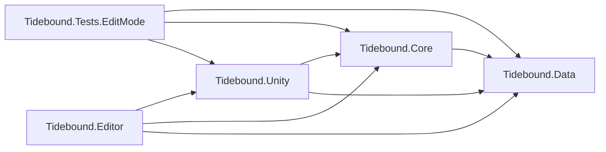
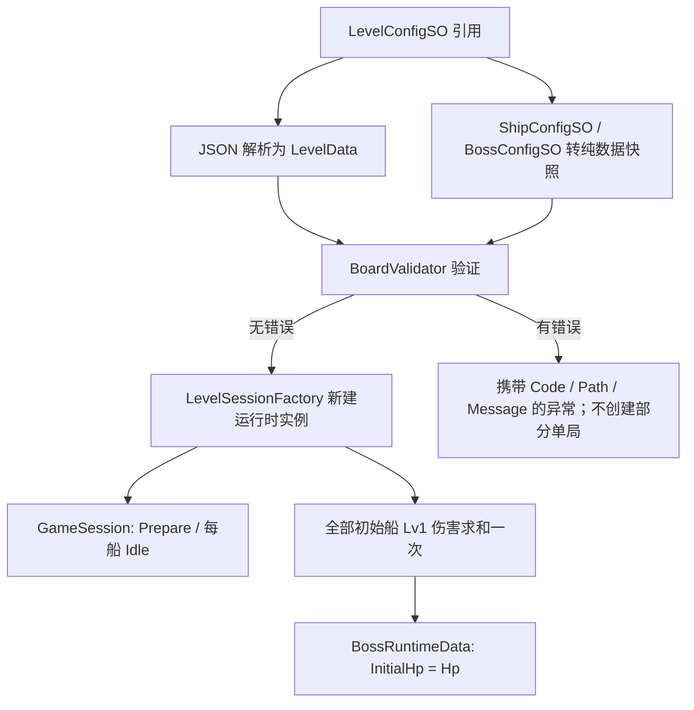

# Tidebound Fleet — Unity 架构与关卡体系基础

状态：Phase 5R I2c十关竖屏灰盒与动画集成自动化已完成；真人／Android验收待执行。日期：2026-09-19。

I2a增量：Core新增独立`LocalLayoutAnalyzer`，提供同向船列、局部方向窗口、最大空矩形和分区占用报告；Editor接只读诊断与审计导出。没有更改生成器、移动事务或v2布局。168/168 EditMode通过，见[I2a验收](验证记录/Phase5R_I2a_局部结构诊断/I2A_VALIDATION.md)；I2b进一步加入RecipeLevelGenerator、LevelRecipe、几何归一及候选JSON／manifest，十关217/217 EditMode通过，见[I2b验收](验证记录/Phase5R_I2b_十关候选/I2B_VALIDATION.md)；本轮筛选版本为暂定，未改Movement／Transit和v2布局结构。

当前移动规则为受阻前进到最近阻挡前停住，不退回。I1复用现有移动和航道，新增完整阻挡图、LevelSolver、反向插入生成及版本化证明；7／80船两个样关已通过独立求解与移动／航道模型回放。最终153/153 EditMode、6/6 PlayMode通过，见[I1验收](验证记录/Phase5R_I1_反向生成与求解/I1_VALIDATION.md)。

旧首阻挡图、FNV证明和12个历史原型继续保留回归；新证明使用规则／出口版本与SHA-256，布局仍为v2。十关真实动画场景回放已完成，见[I2c验收](验证记录/Phase5R_I2c_竖屏可玩灰盒/I2C_VALIDATION.md)；真人触控与Android验收未完成。目标边界见[重设计方案](PHASE5R_REDESIGN.md)，剩余顺序见[后续计划](PHASE5_PLUS_PLAN.md)。

## 1. 工作工程与边界

- 工作工程：`10_开发工作区/TideboundFleet_Unity`，Unity **2022.3.25f1 / 530ae0ba3889 / Apple Silicon**。
- 来自购买工程 `00_远端接收区/已购源码与参考项目/unity--Bus_Mania_100_BugFix` 的独立文件副本，不使用指向原工程的资源链接。
- 复制 `Assets`、`Packages`、`ProjectSettings`，不复制个人 `UserSettings`、缓存和 `.DS_Store`。
- 所有新增业务代码放在 `Assets/Tidebound`。原车辆脚本、停车逻辑、旧场景和旧资源不改动、不删除。
- 开发副本补充 `com.unity.render-pipelines.universal: 14.0.11`，版本取自本机 2022.3.25f1 的包目录清单；显式声明 `com.unity.nuget.newtonsoft-json: 3.2.1`，避免配置加载依赖商业 SDK 间接安装 JSON 包。
- 旧工程仍在同一 Unity 工程内参与其自身编译；程序集隔离不意味着旧插件已经被移除或完成 Android/iOS 构建整改。
- 新增独立场景 `Assets/Tidebound/Scenes/Phase5R_PortraitGraybox.unity`，通过Tools菜单打开后Play；不更换项目启动／构建场景、不运行旧Loader或广告初始化。新灰盒已接Input→动画回调→Movement→Transit；旧BoardPrototypePreview仍仅为诊断预览。

`验证记录/Phase1_Unity架构基础建设/SourceBaseline.json` 记录复制前原工程目录摘要；同目录的 `Validation` 保存当次验证结果。基础建设见 [Phase 1 验收记录](验证记录/Phase1_Unity架构基础建设/PHASE1_VALIDATION.md)，棋盘规则见 [Phase 2 验收记录](验证记录/Phase2_棋盘系统/PHASE2_VALIDATION.md)，船移动见 [Phase 3 验收记录](验证记录/Phase3_船移动/PHASE3_VALIDATION.md)，航道见 [Phase 4 验收记录](验证记录/Phase4_航道系统/PHASE4_VALIDATION.md)，高密度基础见 [Phase 5 验收记录](验证记录/Phase5_高密度棋盘基础/PHASE5_VALIDATION.md)，关卡体系校准见 [Phase 5R 验证记录](验证记录/Phase5R_关卡体系校准/PHASE5R_VALIDATION.md)。

## 2. 实际目录

```text
TideboundFleet_Unity/
├── Assets/
│   ├── Tidebound/
│   │   ├── Runtime/
│   │   │   ├── Data/                    Tidebound.Data.asmdef
│   │   │   │   ├── Board/               GridPosition、ShipPlacementData
│   │   │   │   ├── Config/              LevelData
│   │   │   │   ├── Ship/                ShipDirection、ShipState、ShipDefinition、ShipRuntimeData
│   │   │   │   ├── Boss/                BossDefinition、BossRuntimeData
│   │   │   │   └── Core/                GameState
│   │   │   ├── Core/                    Tidebound.Core.asmdef
│   │   │   │   ├── Constants/           FoundationLimits
│   │   │   │   ├── Board/               占格、校验、只读快照、路径结果与原子事务
│   │   │   │   ├── LevelDesign/         完整依赖、LevelSolver、反向生成、生产配置与版本化证明
│   │   │   │   ├── Ship/                ShipMovementSystem、操作与状态结果
│   │   │   │   ├── GameSession/         GameSession、LevelSessionFactory
│   │   │   │   ├── Events/              IEventBus、SessionEventBus、类型化玩法事件
│   │   │   │   ├── Lane/                路线选择、并行转场、中央入口 FIFO
│   │   │   │   ├── Fleet/               预留
│   │   │   │   ├── Combat/              预留
│   │   │   └── Unity/                   Tidebound.Unity.asmdef
│   │   │       ├── Config/              Level、BaseShip、Boss、视觉 ScriptableObject
│   │   │       ├── Loading/             JSON 严格读写、LevelConfigLoader
│   │   │       ├── Ship/                兼容点击视图、Grid 映射、动画协调与时间参数
│   │   │       ├── Input/               高密度 Grid 集中点击路由
│   │   │       ├── Layout/              SafeArea 三段布局与当前回归网格计算
│   │   │       ├── LevelDesign/         JSON驱动的统一灰盒预览
│   │   │       ├── Lane/                场景路径、缩略船影视图和进度协调器
│   │   │       ├── Boss/                预留表现适配
│   │   │       └── UI/                  Screens、Components、HUD（预留）
│   │   ├── Config/
│   │   │   ├── Levels/                 教学关与高数量技术回归 JSON、引用资产、回放序列
│   │   │   ├── LevelPrototypes/Phase5R/ 12个历史候选及证明
│   │   │   ├── LevelPrototypes/Phase5R_Rebuild/ I1两个7／80船算法样关及新证明
│   │   │   ├── Ships/                  BaseShip.asset；旧四船型资产仅保留历史兼容
│   │   │   ├── Bosses/                 Kraken.asset
│   │   │   └── Visuals/                SpeedboatVisual.asset（无模型）
│   │   ├── Editor/                     Tidebound.Editor.asmdef
│   │   │   ├── LevelValidator/         LevelConfigInspector
│   │   │   ├── LevelStudio/            网格编辑、分析、试玩、证明录制与JSON保存
│   │   │   └── DebugTools/             预留
│   │   └── Tests/
│   │       ├── EditMode/               规则、分析、候选证明与回归测试
│   │       └── PlayMode/               移动、航道和候选灰盒表现测试
│   └── …                              原工程所有 Assets 原样保留
├── Packages/
└── ProjectSettings/
```

按程序集分层取代最初平铺的业务目录；namespace 仍按领域划分为 `Tidebound.Board`、`Tidebound.Ship`、`Tidebound.Boss`、`Tidebound.Config`、`Tidebound.Core`、`Tidebound.Events`、`Tidebound.EditorTools`、`Tidebound.Tests`。

不提前创建空 Controller、伪战斗实现或会抛出 `NotImplementedException` 的玩法方法。后续舰队模块采用 **FleetAggregationSystem**，不使用 FusionSystem，不实现船型合成。

## 3. 程序集依赖

箭头表示引用方向。



| 程序集 | 依赖与职责 | 限制 |
|---|---|---|
| Data | 数据类型、不可变船型定义、可变运行时数据、枚举 | `noEngineReferences=true`；无 Unity 类型、无 JSON 库 |
| Core | Grid 占格、路径查询、不可变事务、船移动、航道 FIFO、依赖分析、产品验证、搜索和解法证明 | 只引用 Data；无 Unity、物理系统、旧停车程序集 |
| Unity | SO/JSON 适配、Grid 世界映射、移动与航道表现、候选灰盒预览 | 引用 Data、Core 与 `Newtonsoft.Json.dll`；无 UnityEditor；不决定占格、可解性或入舰顺序 |
| Editor | 配置 Inspector、Tidebound Level Studio 编辑／分析／试玩／证明 | 仅 Editor；不进入 Player；保存前复用 Core 校验和真实事务 |
| Tests.EditMode | 真实序列化资产、负例、隔离及事件测试 | 仅 Editor、`UNITY_INCLUDE_TESTS`；显式 NUnit/TestRunner 引用 |

全部 `autoReferenced=false`、`overrideReferences=true`。预定义的旧 `Assembly-CSharp` 不会自动获得 Tidebound 引用，新代码也不引用旧 `Assembly-CSharp`、DOTween、广告或归因程序集。后续 UI 与 MonoBehaviour 必须放在自己的业务程序集下。

Unity 2022 会为启用引擎引用的 Tidebound.Unity 编译单元自动补入标准 `UnityEngine.UI` 模块；程序集边界测试允许此引擎模块。Data/Core 仍完全不引用引擎。这不代表本阶段实现了游戏 UI。

## 4. 配置唯一来源与数据结构

| 数据 | 唯一来源 | 字段／说明 |
|---|---|---|
| 关卡布局 | JSON | `schemaVersion, levelId, width, height, bossId, ships` |
| 船实例摆放 | JSON 的 ships 数组 | `id, typeId, length, position:{x,y}, direction`；length 仅允许 2／3 |
| 船型逻辑 | ShipConfigSO | 唯一 `TF_BASE_SHIP`，保存 `typeId, damageLv1=10`；额外引用独立视觉 SO |
| 船型表现 | ShipVisualConfigSO | `prefab, localScale`；允许本阶段为空模型；不参与逻辑 |
| Boss 身份／表现 | BossConfigSO | `bossId, displayName, prefab`；**不保存 HP** |
| Unity 关卡入口 | LevelConfigSO | 引用 JSON TextAsset、船型 SO 数组、Boss SO 数组；不存 levelId、宽高、船布局或 HP 副本 |
| 解析快照 | LevelData + ShipPlacementData | 从 JSON 新建的纯 C# 数据；不作为当前局可变状态直接使用 |
| 运行时船 | ShipRuntimeData | `Id, TypeId, SkinId, Position, Direction, Length, Damage, State`；身份、皮肤、长度、伤害本局只读 |
| 运行时 Boss | BossRuntimeData | `BossId, InitialHp, Hp`；InitialHp 只读，Hp 为独立运行时值 |
| 单局 | GameSession | 独立 SessionId、LevelId、尺寸、Ships、Boss、当前 Board、只读 InitialBoard、State、Events |

JSON schema v2 要求每艘船显式写入实例 `length`；不允许写入 `skinId`、`damage`、`hp` 或 `state`。字段名称严格区分大小写；缺失、未知、重复字段、整数溢出、隐式字符串转整数和非法方向均拒绝。

MVP 只有一个逻辑船型 `TF_BASE_SHIP`，每船固定 10 伤害。长度 2 的船先使用 `TF_SKIN_DEFAULT`，长度 3 的船固定使用 `TF_LONG_DEFAULT`；当前只建立稳定 skinId 数据契约，尚不实现皮肤分配和经济。

## 5. 加载数据流与生命周期



- 每次加载重新解析 JSON、复制船型数值，并为每艘船新建运行时对象；不保留对摆放 DTO 或 SO 的可变引用。
- 修改 A 局船位置、朝向、状态、Boss 当前血量，不影响 B 局或源配置。
- Boss HP 在创建单局时只求和一次。船离场、救援、洗牌、入舰队、后续配置变化都不会触发重新求和。
- 本阶段没有扣血接口；`Hp` 的变化仅供以后战斗系统持有并更新。单局加载不发出任何游戏事件。
- 调用者拥有 GameSession，结束使用后 Dispose；同时清理该局全部事件订阅。
- 不持久化运行时状态，不连接存档、升级、广告或旧 GameManager。

## 6. Grid 与视觉分离

坐标原点左下角，x 向右、y 向上，position 是船尾格。上／下／左／右分别对应 `(0,1)`、`(0,-1)`、`(-1,0)`、`(1,0)`。船宽固定 1 格，沿朝向占据 length 格。

`GridFootprint` 的输入只有整数船尾、方向、逻辑长度。船体模型、Transform.scale、Collider.bounds、Renderer.bounds、贴图像素和美术留白都不能参与占格计算。未来世界坐标映射由表现适配层从 Grid 单向生成。

`BoardModel` 是不可变逻辑快照。`GameSession.Board` 指向当前已提交棋盘；`InitialBoard` 永久保留开局快照，供重试／诊断使用。它复制船的 ID、类型、船尾、方向、长度和完整占格，不持有 Transform、Collider、SO 或可变 `ShipRuntimeData` 引用。

`QueryForwardPath(shipId)` 从船头前一格开始扫描，返回 `ForwardPathResult`：

- 遇阻时给出阻挡船、阻挡格、所有前方空格、可移动格数和最后合法船尾；紧邻阻挡时距离为 0。
- 无阻挡时给出到边缘的空格以及船尾完全越界所需距离；`TargetTail` 位于棋盘外一格。
- 查询是纯计算，不改变占位、RuntimeData、ShipState，不发布事件。

`ApplyPathResult` 只接受当前快照产生且仍匹配的结果，并一次性返回新的 `BoardModel`。受阻结果在新快照中替换完整占格，离场结果删除完整占格，原快照保持不变；过期结果被拒绝，0 距离结果保留原实例和全部占格。

Phase 3 的 `ShipMovementSystem` 是提交入口。它在表现报告到达逻辑完成点时，同时替换 `GameSession.Board`、更新 `ShipRuntimeData.Position/State` 并发布事件；这些属性只允许 Data/Core 和测试程序集写入，Unity 表现层不能直接修改。禁止表现脚本绕过状态机写格子或运行时位置。

当前运行时校验：schema v2、唯一且非空ID、唯一基础船型与Boss引用、技术安全上限24×24／160艘、逻辑长度2／3、固定伤害、Int32总伤害溢出、四方向、完整占格越界与重叠。船数区间、长船比例、方向熵、最大方向占比、空间聚集、初始出口和硬锁环由 `LevelProductionProfile` 与编辑器生产验证负责，不再污染运行时合法性。

**合法布局不等于可解布局，更不等于合格关卡。** Phase 5R 已增加真实首阻挡依赖图、强连通分量、硬锁环、小图有界精确搜索、布局指纹与证明回放；真人可读性、触控和正式难度仍必须单独验收。

## 7. 状态与事件契约

ShipState：Idle、Moving、BlockedFeedback、Exiting、InLane、InFleet。移动系统负责到 InLane；Phase 4 的 `TransitSystem` 在中央入口融入完成后一次性改为 InFleet。

GameState：Prepare、Playing、Paused、Victory、Failed。加载完成为 Prepare；`StartPlaying/Pause/Resume` 由移动系统管理。暂停保留活动操作和阶段，完成回调在恢复后只提交一次。Victory/Failed 仍由后续系统处理。

每个 GameSession 有自己的非静态 `IEventBus`。事件是只读值类型，不携带 GameObject、SO 或可变 RuntimeData 引用。

| 契约 | 负载 | 当前触发点 |
|---|---|---|
| ShipMoveStartEvent | SessionId、ShipId、TypeId、From、Direction | 接受一次 Idle 船点击后 |
| ShipMoveCompleteEvent | 船上下文、From、To、WasBlocked | 到达受阻落点、零位移确认或船尾完整离界后 |
| ShipExitBoardEvent | 船上下文、船尾位置、出边方向、ExitSequence | 完整离界并释放占格后一次；序号单局递增 |
| ShipEnterFleetEvent | 船上下文、ExitSequence | 中央入口融入完成后一次 |
| AttackCreatedEvent | 船上下文、AttackId、Damage | Phase 7 舰队创建攻击凭证时 |
| BossDamagedEvent | SessionId、BossId、AttackId、Damage、RemainingHp | Phase 7 攻击命中时 |
| GameWinEvent | SessionId、LevelId | Phase 7 满足完整胜利条件后 |

总线主线程同步、按订阅顺序投递。发布时固定订阅快照；回调内新增／移除订阅从下一次发布生效。重复订阅分别拥有 token；Dispose token 幂等；Dispose 总线后再次订阅／发布抛出 ObjectDisposedException。订阅者异常向调用者传播并终止本次后续投递，不静默吞错。

Phase 3 在船尾完整离界时分配单局 `ExitSequence`。Phase 4 只消费该事件，完成入舰并发布 `ShipEnterFleetEvent`。攻击凭证、连击和胜利判断仍属于后续系统。

## 7.1 移动协调和 Unity 表现

- `ShipMovementSystem` 同一时刻只保留一个 `ActiveOperation`；忙碌期间的点击返回 Busy，不排队。
- 受阻且距离大于 0：先保持旧占格并播放直线动画，到达后原子提交新位置，再播放 0.12 秒横向反馈。
- 紧邻阻挡：立即确认零位移并进入横向反馈，完整占格不丢失。
- 无阻挡：ShipState 先进入 Exiting；船尾动画到棋盘外一格后释放占格、进入 InLane、发布完成和出场事件。
- `ShipMovementController` 把逻辑操作映射给 `IShipMovementView`；默认 `ShipMovementView` 使用协程，参考 12 格／秒并限制 0.18–0.60 秒。
- 默认受阻反馈只沿前进轴的垂直方向摆动，最终回到锚点，不用前进后退 Tween。
- `GridWorldMapper` 的轴、原点与 cellSize 只把 Grid 转成世界坐标，不能反向参与规则。
- `ShipMovementView` 使用 `IPointerClickHandler`。Collider／Graphic／Raycaster 只提供命中区域，不决定船长、占格或路径。
- 场景启动代码必须为每个当前棋盘实例提供唯一同 ID 视图，再调用 Controller.StartPlaying；缺少或重复视图会在绑定阶段失败。

## 7.2 航道协调和 Unity 表现

- 每局在船可能离场前创建一个 `TransitSystem(session)`；它订阅本局 `ShipExitBoardEvent`，拒绝跨局、重复船、重复序号及非 InLane 船。
- 上、左、右出口直接选择对应外围路线；下出口按到左右底角的较短距离选路，等距固定走右侧。
- 每艘船从接入至中央入口使用独立 1.20 秒逻辑进度，可以并行；路线更长只改变表现速度，不增加逻辑等待。
- 中央入口只接受 `NextEntranceSequence`。后序船即使先到也停在入口，不能越过尚未到达的前序船。
- 默认入口间隔和融入时长均为 0.15 秒。融入完成后先提交 InFleet、清除活动转场，再发布一次 `ShipEnterFleetEvent`。
- 暂停时 `TransitSystem.Advance` 不推进单局航道时钟；恢复后从原进度继续，序号和等待队列不变。
- `LaneTransitController` 只把逻辑进度映射到 `ILaneTransitView`。`LanePathLayout` 提供场景航点，`LaneWorldPath` 提供平滑曲线采样；Transform、路径长度和模型缩放不参与 FIFO。
- `LaneTransitController`在本局出场事件回调内同步应用航道起点、切线朝向和0.80倍船影尺寸，航行阶段保持尺寸；灰盒外围路径与1.5格航道中心线统一，PlanarShipLaneView将船尾锚点转换为船体中心；布局为航道外侧预留至少16逻辑单位。线性路径转角立即使用下一段朝向。顶部入舰融入表现继续独立计时，完成后隐藏实例，常驻舰队留在Phase 7。

## 8. TestLevel_001 教学测试数据

固定 4 列×6 行、7 艘基础船、每艘 2 格／10 伤害，加载结果 **InitialHp = Hp = 70**。

| 实例 | 船尾坐标 | 朝向 | 占格 |
|---|---|---|---|
| S001 | (0,0) | Right | (0,0)、(1,0) |
| S002 | (3,0) | Up | (3,0)、(3,1) |
| S003 | (0,1) | Up | (0,1)、(0,2) |
| S004 | (1,2) | Right | (1,2)、(2,2) |
| S005 | (3,3) | Up | (3,3)、(3,4) |
| S006 | (0,4) | Right | (0,4)、(1,4) |
| S007 | (2,5) | Left | (2,5)、(1,5) |

```text
y=5   .  7  7  .
y=4   6  6  .  5
y=3   .  .  .  5
y=2   3  4  4  .
y=1   3  .  .  2
y=0   1  1  .  2
      x0 x1 x2 x3
```

参考清盘顺序为 S005 → S002 → S001 → S004 → S006 → S003 → S007。Phase 3 得到连续 1–7 的出场序号并清空当前棋盘；Phase 4 再以同一顺序把七艘船各入舰一次，最终状态均为 InFleet，航道为空。InitialBoard 始终保留 7 艘开局船。该结果验证已知序列，不代表存在通用求解器。

`TestLevel_001` 是独立工程教学测试夹具。此次将它从原架构任务的 3 船／30 HP 调整为 7 船／70 HP；不据此擅自改写 GDD 12 个正式关卡的其他配方或难度顺序。

## 9. 查看与测试

在 Unity 中选中 `Assets/Tidebound/Config/Levels/TestLevel_001.asset`，Inspector 点击 **Validate data only**。该按钮只加载、校验和释放临时单局，不进入 Play、不修改 JSON 或 SO。

打开 Window → General → Test Runner → EditMode，运行 Tidebound.Tests 中的测试。命令行方式：

```sh
'/Applications/Unity/Hub/Editor/2022.3.25f1/Unity.app/Contents/MacOS/Unity' \
  -batchmode -nographics \
  -projectPath '/Users/flyn_n/Documents/Tidebound Fleet（潮汐舰队）/10_开发工作区/TideboundFleet_Unity' \
  -runTests -testPlatform EditMode -assemblyNames Tidebound.Tests.EditMode \
  -testResults '/private/tmp/TideboundFleet_EditMode-results.xml' \
  -logFile '/private/tmp/TideboundFleet_EditMode.log'
```

默认 Transform 动画和候选灰盒另使用同一命令的 `-testPlatform PlayMode -assemblyNames Tidebound.Tests.PlayMode`，测试结果写入独立 XML。I1最终结果为153/153 EditMode、6/6 PlayMode，详见[I1验收](验证记录/Phase5R_I1_反向生成与求解/I1_VALIDATION.md)。

不要在另一个 Editor 已打开同一工程时运行命令。测试由 Test Runner 管理退出，不添加可能提前终止测试的 `-quit`。命令行测试参数参考 [Unity Test Framework 1.1 文档](https://docs.unity3d.com/Packages/com.unity.test-framework@1.1/manual/reference-command-line.html)。程序集边界参考 [Unity 2022.3 手册](https://docs.unity3d.com/2022.3/Documentation/Manual/ScriptCompilationAssemblyDefinitionFiles.html)。

## 10. 后续开发顺序

1. **Phase 5R 重新验收：**先复验受阻前进、动态依赖Solver与反向生成，完成7／80艘的10关回放和竖屏灰盒；再做真人与最低Android设备测试，冻结规格。后续顺序以重设计方案为准。
2. **Phase 6A 最小验证工具：**随5R接入生成、求解、回放、十关批量校验和报告；保留v2布局，增量完善版本化证明。不等待完整编辑器。
3. **Phase 7 舰队与战斗：**消费 ShipEnterFleetEvent，建立最多五个标准船皮肤席位、长船支援计数、AttackToken、Boss 扣血与一次胜利。
4. **Phase 8–11 产品闭环：**依次接入道具与死局、离线存档与皮肤经济，再进入6B量产工具及30关、正式UI，最后IAA与分析。
5. **平台验证与Phase 12发布：**5R先本地试构建Android并只修必要的旧依赖阻断；发布阶段再完成工具链、Android／iOS和设备覆盖验收。

详细入口、退出和回退条件见 [Phase 5R及后续开发计划](PHASE5_PLUS_PLAN.md)，关卡工具范围见 [关卡编辑器与验证工具规划](LEVEL_EDITOR_PLAN.md)。Phase 5已把代码迁移到长度2／3、单基础船和schema v2；12×18／80艘只保留为技术回归事实。正式网格、完整体量、方向交错、真机触控和最低设备性能由Phase 5R重新验收。

2022.3.25f1 当前用于复现购买工程与本阶段验证，不等于已锁定最终上架版本。已有安全公告及商店工具链要求仍需在发布阶段单独验收。
