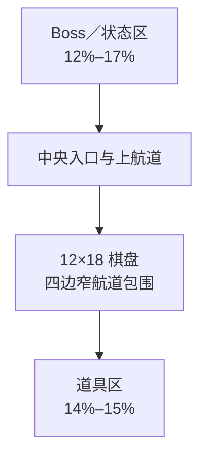

# Tidebound Fleet 棋盘布局与容量规划

版本：1.0

日期：2026-09-18

状态：产品布局基线，尚未开发

## 1. 结论

正式关卡采用 **12 列×18 行** 的逻辑棋盘。第 1 关单独使用 4×6、7 艘船教学；第 2 关固定 80 艘 1×2 标准船；后续正式关卡以 80 艘为中心，允许 78–82 艘。

产品关卡同时满足以下硬限制：

- 总船数不超过 82。
- 1×3 固定长船不超过 8 艘，且不超过本关总船数的 10%。
- 总占格不超过 172 格。
- 至少保留 44 个空格，即 12×18 棋盘至少保留 20.4% 空白。
- 空格必须分布到棋盘结构中，不能把 44 个空格集中成一个与解法无关的空区。

12×19 可以提供更多空白，但会在短屏设备上进一步缩小单格；13 列会直接缩小船体短边；11 列则需要更多行才能容纳 80 艘。综合 Boss、航道、道具区和触控可读性，12×18 是当前更稳妥的基线。

## 2. 屏幕纵向分区

所有比例都基于 Unity `Screen.safeArea`，刘海、圆角、动态岛和 Home Indicator 不计入可用区域。

| 安全区纵横比 H/W | Boss／状态区 | 棋盘＋航道区 | 道具区 | 用途 |
|---|---:|---:|---:|---|
| ≥2.00 长屏 | 17% | 68% | 15% | 主设计比例，390×844、430×932 一类设备 |
| 1.85–1.99 标准屏 | 15% | 70% | 15% | 适度压缩 Boss 留白 |
| <1.85 紧凑屏 | 12% | 74% | 14% | Boss 使用紧凑表现，道具仍保持完整点击区 |

Boss 区永远不超过 20%，棋盘和航道区永远不少于 60%，道具区永远不超过 20%。紧凑屏只缩减 Boss 背景、镜头留白和非必要装饰，不缩小 Boss HP、暂停按钮或道具按钮的点击区域。



## 3. 棋盘与航道几何

### 3.1 自适应单格

棋盘保持正方形逻辑格。设安全区宽高为 W、H：

```text
cellSize = min(
  可用于棋盘的净宽 / 12,
  可用于棋盘的净高 / 18
)
```

四周航道不占用 Grid。左右航道的可见宽度取 `0.42–0.48×cellSize`，每侧不得超过安全区宽度的 4%；上下航道采用同一视觉宽度。航道只是非交互动画路径，不抢占船只触控。

以三类安全区估算：

| 安全区 | 预计单格短边 | 1×2 逻辑点击区域 | 1×3 逻辑点击区域 |
|---|---:|---:|---:|
| 360×640 紧凑屏 | 约 25 | 25×50 | 25×75 |
| 390×844 主设计屏 | 约 29 | 29×58 | 29×87 |
| 430×932 大长屏 | 约 32 | 32×64 | 32×96 |

最终数值必须在 Unity SafeArea 原型中实测，表中数值用于判断方案量级，不是像素常量。

### 3.2 点击规则

12 列密集棋盘无法让每艘船的短边同时达到普通 UI 的 44pt／48dp 推荐点击尺寸，因此不能依赖小 Collider 或美术透明边缘。HUD 和道具按钮仍遵守平台推荐尺寸；棋盘使用专用输入规则：

1. 每个占用格只归属一个 shipId，点击任意占用格都选中该船。
2. 触控命中以 Grid 占格为准，不以 Renderer、Sprite 或模型 Bounds 为准。
3. PointerDown 时锁定占格所属船，PointerUp 仍在该船占格或允许的轻微漂移范围内才执行。
4. 相邻船的扩展点击区不得重叠；空格点击默认不自动吸附到另一艘船。
5. 按下后 100ms 内显示整船描边、方向和预期路径，让玩家在动作提交前感知命中对象。
6. 1×2 可换皮船的可见船体宽度建议为 `0.72–0.78×cellSize`，用水面缝隙分开相邻船；完整占格仍可点击。
7. 1×3 固定长船使用统一轮廓，不拉伸任何皮肤资产。

Apple 建议常用游戏控件至少 44×44pt，Android 建议交互 UI 至少 48×48dp。这些标准说明 12 列棋盘必须接受“棋盘对象采用专用命中和真人验证”的约束，不能宣称每艘船都满足常规按钮尺寸。[Apple 游戏控制指南](https://developer.apple.com/design/human-interface-guidelines/game-controls)；[Android 无障碍触控指南](https://developer.android.com/guide/topics/ui/accessibility/views/apps-views)。

## 4. 容量计算

设棋盘总格数为 C，船总数为 N，长船数为 L：

```text
占用格 = 2×N + L
空格数 = C - 占用格
空白率 = 空格数 / C
```

因为 1×3 长船只比 1×2 标准船多占 1 格，所以不能只看船数，关卡编辑器必须同时限制占用格。

### 4.1 80 艘、8 艘长船的候选棋盘

| 棋盘 | 总格 | 占用格 | 空格 | 空白率 | 判断 |
|---|---:|---:|---:|---:|---|
| 11×18 | 198 | 168 | 30 | 15.2% | 太满，且增加行数后点击并无优势 |
| 12×17 | 204 | 168 | 36 | 17.6% | 空隙不足 |
| **12×18** | **216** | **168** | **48** | **22.2%** | 点击尺寸与容量的平衡点 |
| 12×19 | 228 | 168 | 60 | 26.3% | 空隙更好，但短屏单格更小 |
| 13×18 | 234 | 168 | 66 | 28.2% | 船体短边缩小，不利点击 |

### 4.2 12×18 的船数上限

| 配方 | 占用格 | 空格 | 空白率 | 用途 |
|---|---:|---:|---:|---|
| 78 艘，其中 6 艘长船 | 162 | 54 | 25.0% | 正式入门或节奏回落 |
| 80 艘，全为标准船 | 160 | 56 | 25.9% | 第 2 关 |
| 80 艘，其中 8 艘长船 | 168 | 48 | 22.2% | 标准上限配方 |
| 82 艘，其中 8 艘长船 | 172 | 44 | 20.4% | MVP 困难关硬上限 |
| 84 艘，其中 8 艘长船 | 176 | 40 | 18.5% | 不进入正式基线 |
| 88 艘，其中 10 艘长船 | 186 | 30 | 13.9% | 拒绝，过密且削弱点击与疏通空间 |

因此，MVP 不再规划 86–88 艘正式关。数量固定在约 80，难度来自方向、阻挡依赖、初始候选、长船关键锁点和错误路线。

## 5. 空格分布规则

空白率达标不代表关卡可读或可解。正式关还必须满足：

- 把 12×18 划分为 4×6 个 3×3 宏区；每个宏区原则上至少保留 1 个空格。策划可以因关键结构破例，但校验器必须提示。
- 第 2 关开局至少有 12 艘可前进或直接出场的船。
- 每条边至少提供 2 个早期出口方向，避免玩家误以为只有上方能离场。
- 不允许把大部分空格集中到单个角落或与解法无关的整片水面。
- 长船优先用于少量关键依赖，不按视觉均匀撒满全图。
- 同方向平行相邻船之间必须保留明显水面缝隙；皮肤特效不能填满缝隙。

## 6. 关卡数量配方

| 关卡 | 总船数 | 长船数 | 最低空格 | 定位 |
|---|---:|---:|---:|---|
| 1 | 7 | 0 | 由 4×6 教学布局决定 | 唯一低数量教学 |
| 2 | 80 | 0 | 56 | 完整体量，最大留白，低依赖 |
| 3–5 | 78–80 | 0–2 | 54 | 适应完整棋盘 |
| 6–10 | 78–80 | 2–4 | 52 | 引入长船但保持开放 |
| 11–20 | 78–80 | 4–8 | 48 | 通过结构增加难度 |
| 21–25 | 80–81 | 6–8 | 46 | 更少初始候选和可恢复错误 |
| 26–30 | 80–82 | 6–8 | 44 | MVP 困难关硬上限 |

范围不是随机任取。每关必须同时通过总船数、长船数、占用格、空白分布和解法证明五项检查。

## 7. 灰盒验证门槛

在生产 30 关之前，先制作同一 12×18 布局的三个显示版本：12×18／80 艘、12×19／80 艘、12×18／82 艘。至少在 360×640、390×844、430×932 三类安全区测试。

通过条件：

- 5 名首次玩家各完成 30 次指定目标点击，首次正确命中率至少 95%。
- 任何单艘测试目标的误触率不得超过 10%。
- 第 2 关开局 3 秒内，至少 4/5 玩家找到一个有效目标。
- 灰度与五皮肤混合下，头尾方向识别准确率至少 90%。
- 12×18／80 艘达到门槛后才冻结布局；如果失败，先降低船数或调整视觉，不进入 30 关量产。

## 8. 对工具的要求

Tidebound Level Studio 必须实时显示：总船数、长船数、占用格、空格、空白率、24 个宏区的空格分布、四方向数量和初始可操作数。达到 82 艘或 172 占用格时显示硬上限；超过任一上限禁止发布。
