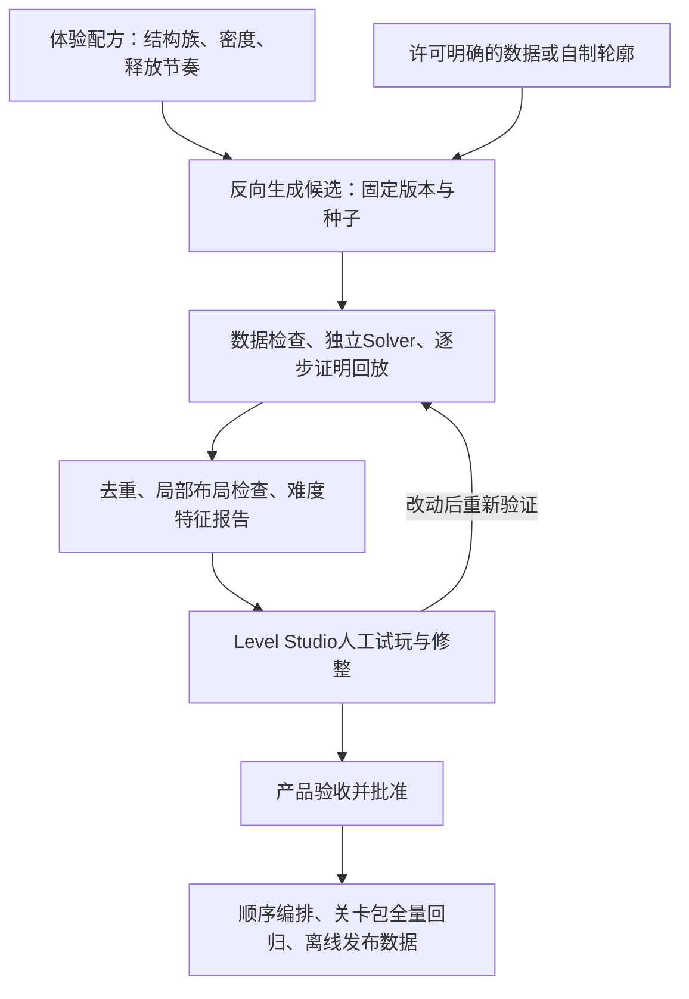

# 面向100～300关的关卡内容生产体系

版本：1.0；日期：2026-09-19。状态：**设计方案（L1），尚未实现百关流水线。** I1现有2个算法样关，完整10关及I2/G1仍待完成。本文补充[后续计划](PHASE5_PLUS_PLAN.md)，不提前冻结14×18、不提前量产30关或进入战斗。

## 1. 玩家体验与生产目标

玩家在熟悉的竖屏场地中持续遇到不同的疏通问题：有时先开外围，有时移开关键长船，有时需要观察两组交叉依赖；连续释放后获得出海和攻击反馈。百关后的变化来自结构与释放节奏，船头方向、点击方式和上下边界保持一致。

生产目标是可持续交付**有独立清盘证据、结构有差异、体验经过审核的关卡包**。第1关7艘，第2关起约80艘。暂不以增加船数、缩小点击目标、加计时／生命或新障碍来延长内容。

最便宜的验证顺序：先10关验证统一场地和操作→30关验证连续体验与制作成本→100关验证去重及内容节奏→300关分批扩展。数字是内容目标，不是当前完成数量。300关不要求一次全部生产完。

## 2. 五层体系

| 层 | 负责什么 | 不负责什么 |
|---|---|---|
| 配方 | 定义体验目标、硬约束、结构族及版本 | 直接决定每艘船位置 |
| 生成 | 在有限预算内寻找满足条件的完整布局与构造解 | 靠随机填满或自动降标准凑数量 |
| 验证与筛选 | 证明确有解、检查重复／条带／空洞、输出特征 | 自动宣称好玩或人体触控合格 |
| 编辑与审核 | 查看阻挡／落点、保留关键结构、试玩修整 | 编辑后继续使用旧证明 |
| 关卡目录与包 | 固定内容身份、难度编排、版本回退、离线加载 | 玩家开局时随机抽一个未经审核的seed |

继续复用`BoardModel`、`LevelSolver`、`LevelSolutionProof`、`LevelJsonReader/Writer`和Level Studio。生产统计／编辑操作留在Editor；运行时只读批准的v2布局，不安装外部编辑器，不生成数百关，不需要联网。

## 3. 生成路线：先做好依赖疏通，再研究必须部分移动的关

### A类：反向插船，作为首批主力

1. 使用冻结前的统一候选场地及四边出口，设置初始摆放区域。
2. 从空棋盘插入最终离场船；每次新船自身前向全路径必须空，足迹不重叠。
3. 新船可阻挡已放船；记录完整依赖边，按结构配方控制链深、分叉和出口数。
4. 失败按确定性候选序回溯；超预算返回失败并保留原因，不降船数、不改成长船以外的尺寸、不输出半关。
5. 完成后倒序得到构造解；从导出JSON重新建立棋盘，由独立Solver求解，再逐步回放两种证明。

这类初始关有一条每船一次、共N次点击的最优出场解。**因此同为80船的A类关，最优点击数通常都是80，不能拿它来区分难度。** 初始允许部分移动，不等于解法必须部分移动；玩家部分前进后仍可能改变依赖或造成死局。

反向插入有可解保证，但不保证所有指定结构都可嵌入14×18几何。配方先作为目标和筛选条件，不先画任意有向图再假定一定能摆成船。拼装局部结构后仍对整个棋盘重新求解。

### B类：必要的部分前进，作为后续受控研究

若体验数据表明A类关不足以支撑中后期，再安排动态结构研究，不用假“先动一下”的演示冒充策略。

- 用4～12船局部样本研究“前进后让路／改变交叉阻挡”，先证明存在完整解，再评估组合成本。
- 可探索逆状态转换：从后态S枚举某船沿自身反方向的前态S'；S'必须合法，且真实`QueryForwardPath + ApplyPathResult`一次操作后恰好得到S。只接受这一正向验证成立的逆操作；反向记录最后倒序输出。
- 不能随机把船往后挪就声称完成反向生成；每个逆移及其整关组合都需重新验证。加入辅助船可能破坏局部证明。
- 若要声称“必须部分前进”，除完整解外还需证明不存在纯离场解。当前静态刚性船／四边出口规则下，纯离场只删除占格；穷尽剥离到固定点后仍有船，才能排除纯离场解。局部Solver证明不自动扩展到80船整体。
- 整关有界搜索超时记录`LimitReached`；不能写成死局或最优。候选必须通过规定的独立求解／完整回放门槛才入池。

I2先交付A类完整10关；B类原型放到30关阶段的实际需求评估后，不抢占真实竖屏与G1验证。

## 4. 配方与结构族

配方包含三组字段，放生产配置／伴随设计数据，不污染布局schema v2：

| 组 | 字段与用途 |
|---|---|
| 身份／复现 | `recipeId, recipeVersion, generatorVersion, rulesVersion, exitMode, seed, candidateIndex`；固定候选顺序与预算 |
| 硬约束 | 网格、7或约80船、2／3长船配额、合法摆放区、初始出口范围、完整依赖链深范围；当前十关沿用重设计配方 |
| 筛选与体验目标 | 结构族、关键解锁数量、前中后段可用选择曲线、方向混合、条带／空洞上限、重复阈值、人工说明 |

先建立6个结构族，均不增加新的移动规则：

| 结构族 | 玩家观察重点 | 生成／筛选方向 |
|---|---|---|
| 分层释放 | 先外围、后内部 | 多层依赖但避免单一长同向条带 |
| 多链交错 | 交替处理不同链 | 依赖链空间交错、四方向局部混合 |
| 关键船解锁 | 找到一次释放多条路径的船 | 限制关键船数量，记录解锁分支；非强制唯一首步 |
| 双区联动 | 一侧释放让另一侧可走 | 分区统计与跨区依赖；防止两块互不相关的小题硬拼 |
| 长船桥接 | 识别1×3船占住的关键通路 | 保留长船配额和清晰船头，检查足迹及跨行列阻挡 |
| 连续释放／缓和 | 更容易找到下一艘，保持顺畅 | 较多出口、较短链、平缓的可选数曲线，船数仍保持完整体量 |

轮廓是第二维度：完整矩形、轻微凹角、中央留白、宽通道等先做简单候选；复杂动物轮廓不列为首批目标。摆放mask只控制起始足迹，mask外空格不是墙。约80艘的容量下限为`2×船数＋长船数`格，达到下限也不保证能装入或可解；窄通道、孤岛和触控问题需额外筛掉。

同一结构族可以出多关，但不是把一个布局镜像25次。`6结构族×若干配方×多个通过审核的seed`只是候选来源，最终数目以独立通过的内容为准。

## 5. 难度与质量指标的定义

先保存多维特征，不急着发明一个“难度分”。初期按人工标记舒缓／常规／挑战，收集数据后才拟合评分。

| 特征 | 计算／使用方法 | 易混淆之处 |
|---|---|---|
| 初始直出与部分前进数 | 逐船真实路径查询，两个集合分别记录 | 无直出不等于无有效移动 |
| 完整依赖深度 | 使用完整阻挡图，节点数计深度；有环则深度不可直接按DAG计算 | 不混用旧首阻挡图的边数 |
| 解锁曲线 | 每一步记录可直出数、可部分移动数、本步新解锁数；按清除比例切前／中／后段 | 一条证明路径的曲线不是全体玩家路径分布 |
| 选择收窄 | 可直出数仅1的步骤比例、连续低选择步数 | 叫“单直出比例”，不能称唯一合理选择／全局强制步 |
| 同向条带 | 按行／列统计连续同向**不同船**，同船占两格只计一次；同时记录跨空格的近邻平行排列 | 全局方向熵高仍可能出现难看的条带 |
| 局部混合 | 固定窗口内各方向分布，记录非空窗口的最低值和分位数 | 很少船的窗口单独处理，不能用空白拉高混合指标 |
| 空间空洞 | 最大空矩形及各区占用率；标记配方刻意留白 | 整片水面连通很常见，不能只用最大空白连通域作拒绝标准 |
| 关键解锁 | 对当前可离场船尝试事务，统计新增可离场对象 | 度数高不一定等于玩家难发现 |
| 误操作后风险 | 多策略、固定种子采样；分别报告证实无解／终端卡局／未知及样本数 | 采样失败率不是全状态死局概率；超时不能算死局 |
| 人体体验 | 首步发现时间、方向识别、指定目标命中、通关时间、部分移动理解 | 自动化不能替代真人或最低Android设备 |

I2先收集长同向条带、局部混合和空洞数据并在对比样本中校准阈值。阈值变动必须更新筛选版本，不能静默降低质量以凑齐10关。I1的80船样本保留回归，不自动成为正式第2关。

## 6. 百关去重：身份、几何与结构分开

1. **证明指纹：**继续用包含ship ID、坐标、方向、规则的`LevelStateIdentity`。它负责证明绑定，不能拿来做内容去重，因为改ID会改变指纹。
2. **几何内容键：**忽略level ID、ship ID及列表顺序，保留网格、船类型／长度／坐标／方向和规则。按数值元组排序，使用无歧义序列化；先规范化再比较完整键，哈希只作索引。
3. **对称重复：**固定长方形场地在原图、水平镜像、垂直镜像、180°旋转中取统一表示；同步变换船尾和方向。当前不纳入90°旋转或任意平移，不改变竖屏尺寸与边界距离。对称布局按解谜内容视作同一候选族，表现仍可另测。
4. **近似重复：**比较长度比例、出口／链深分布、关键解锁位置、分区占用与曲线特征；只提示策划并排审核。仅图度数相同不是图同构，更不证明两关体验相同。
5. **序列重复：**关卡编排避免相邻连续使用同一结构族、同样轮廓或相同释放曲线。镜像、换色、换皮不计作新增原创关卡。

几何去重必须覆盖改ID、打乱数组、镜像长船与方向转换的测试，并有相似但不等价的负例。规则未来增加可变出口或非对称障碍时，应重新审查允许的对称变换。

## 7. 内容身份、状态与证据

布局JSON继续是唯一坐标来源。以下为待实现的数据职责，不表示当前已有相应文件格式或加载器：

| 数据 | 内容 |
|---|---|
| `Level_<stableId>.json` | schema v2布局；stableId不随显示第几关改变 |
| `.solution.json` | 现有逐步解法、规则版本和布局指纹；同船允许多次点击 |
| `.design.json` | 配方／生成器／筛选器版本、seed与预算、结构族、来源记录、特征报告、人工体验证据索引 |
| 关卡目录 | 显示顺序→稳定ID＋内容修订；包版本、审核状态及对应证据指纹 |

状态链：`Draft → Candidate → Approved → PackIncluded`。退役版本另标`Retired`，不把“当前不选用”当数据无效。

- Candidate：当前规则数据合法，独立Solver通过且原始JSON证明完整回放，硬约束及去重通过；`LimitReached`只能保留草稿等待更大离线预算／修改。
- Approved：关卡负责人确认结构与节奏；G1的交互／平台规格先通过。不能因为自动化为绿就自动批准。
- PackIncluded：只从Approved生成目录，验证重复ID、缺失数据、失效证明、顺序和版本，任何一关失败整包不交付。
- 布局／规则／出口变化：旧证明和批准失效。仅配方／筛选标准变化也需重新筛选，但布局不变时不伪造新的几何结果。目录换序不改布局证明；仍需复核连续体验。
- 为将来存档保留`contentRevision`；同一进行中的关卡版本不得在更新时静默换坐标，具体恢复／迁移由I5存档阶段实现。

外部直接采用内容还需记录源URL、版本／提交、适用许可、采用字段和改造说明。采购包与原始第三方数据不随原创关卡提交上传。研究行为不要求把外部源码加入项目。

## 8. 批处理与可复现性

推荐离线批次以“配方×候选序号”枚举seed。先用少量候选测成功率和耗时，再决定扩大预算；不承诺生成100个必然得到100个合格关。

每个任务记录：期望数量、尝试数、成功数、失败分类、预算、耗时、版本、输出指纹。分类至少包括非法配置、容量不足、无法满足配方、搜索预算耗尽、证明失效、结构拒绝、重复、等待人工。

按候选完成粒度保存检查点，取消／重启后不重复覆盖已验收内容；手工编辑的关禁止自动覆盖。批量导出先在暂存目录完成全包检查，再提交目录引用；失败保留旧包。定时预算只负责保护工具响应，跨机器可能在不同进度超时，复现正式内容以保存的JSON及证明为准，不能只保存seed。

初期使用JSON、同步单候选有界任务和编辑器进度／取消即可。正式批次避免长时间卡住Editor主线程；可用分帧任务或独立Unity batchmode，并将失败状态写入报告。没有性能证据前不引入服务端、复杂并行框架、二进制格式或在线实时生成。

## 9. 数量与关卡节奏

| 内容阶段 | 体验重点 | 产出与放行 |
|---|---|---|
| 1～10／I2 | 教学一次，马上进入完整体量；验证长船、链深、出口差异 | 按原十关配方生成与回放，真实竖屏／G1；只在验证后冻结尺寸 |
| 11～30／I6 | 建立6结构族，舒缓与挑战交替 | 每批5关；完整核心闭环已成立，每关人工过目并试玩，全量自动回归 |
| 31～100／后续内容迭代 | 验证长期重复感与难度排序 | 每批10关；新增结构组合，审核候选近重复；保留完整试玩证据 |
| 101～300／后续内容迭代 | 扩展已证明有效的配方，逐批补充新结构 | 每批10～20关；使用前批数据校准，异常批次退回修整，不一键批准 |

作为待校准的编排起点，每10关可用“熟悉→常规→常规→挑战→舒缓→常规→变化→挑战→舒缓→综合”。这是体验节奏标签，不是每10关增加计时、生命、棋盘尺寸或Boss新规则。开局7船教学只出现一次。

在100关前先回答：玩家能否识别结构差别？前后段是否过长？是否因方向看不清而误点？若玩家觉得每关相同，优先增加结构族与重新编排，不能用更多seed掩盖问题。

## 10. 下一批工单与成熟度

| 工单／所属能力 | 阶段／责任 | 状态与具体交付 | 验收／回退 |
|---|---|---|---|
| T-C00 内容路线与外部调研／C-Content | 本轮／开发 | L1文档完成；采用决策、结构族、证据契约、阶段边界 | 文档与当前真实能力区分；不导入未经核实内容 |
| T-P04a 局部结构诊断／C-Content | I2／开发 | 待做；在现有Analyzer补条带、窗口方向、空洞报告，提供已知好坏对照 | 能指出I1样本问题；阈值附对比证据；不改变移动语义 |
| T-P04b 十关配方与批次／F-Puzzle | I2／开发＋关卡负责人 | 待做；显式十关配方、确定性候选枚举、失败报告及人工筛选 | 7＋9×约80船真实JSON，满足各自配方；无法满足就报告瓶颈，不降标准 |
| T-P05a 最小验证入口／C-Content | I2／开发 | 待做；Level Studio接新Solver／proof，10关批量回放；最小内容清单隔离草稿 | 失效证明／缺关／重复ID拒绝；自动化状态不冒充Approved |
| T-U01～02 可玩竖屏／F-Puzzle | I2／开发 | 待做；统一三段区，接Input→Movement→Transit；支持十关选择及自动演示 | 真实回调每船一次出场与入舰；受阻停在新位置；与工具任务同属本轮必要交付 |
| T-Q01 真人与设备／F-Puzzle | I2／产品负责人组织 | 待做；执行既有G1，冻结规格 | 无设备／真人证据保持待验收；不过关回到布局和点击，不进入战斗 |
| T-C01 目录和去重／C-Content | I6／开发 | L1→L2；稳定ID、几何／对称去重、近似比较与版本状态 | 单元负例＋目录全量验证；不修改历史批准包 |
| T-C02 30关生产／F-Puzzle | I6／关卡负责人＋开发 | L1→L2；6结构族、5关批次、人工体验记录 | 每批通关与连续节奏审核；失败只撤回当前批 |
| T-C03 100／300关扩展／F-Puzzle | 30关验证后／关卡负责人＋开发 | L1；10～20关批次、指标校准、必要时B类小原型 | 每关证据与来源可追溯，回归和人工审核均完成 |

工程底座当前已有I1自动化证据，不等于内容生产达到L3。短期主要风险是80船局部排列、触控与实际场景尚未验证；先把这些风险关掉，再提高量产能力。

本轮只修改规划文档，没有新增关卡、Unity代码或配置，因此不重复运行Unity测试；沿用[I1验收](验证记录/Phase5R_I1_反向生成与求解/I1_VALIDATION.md)仅作为已有底座证据。后续每个代码工单单独测试、记录并提交上传。
