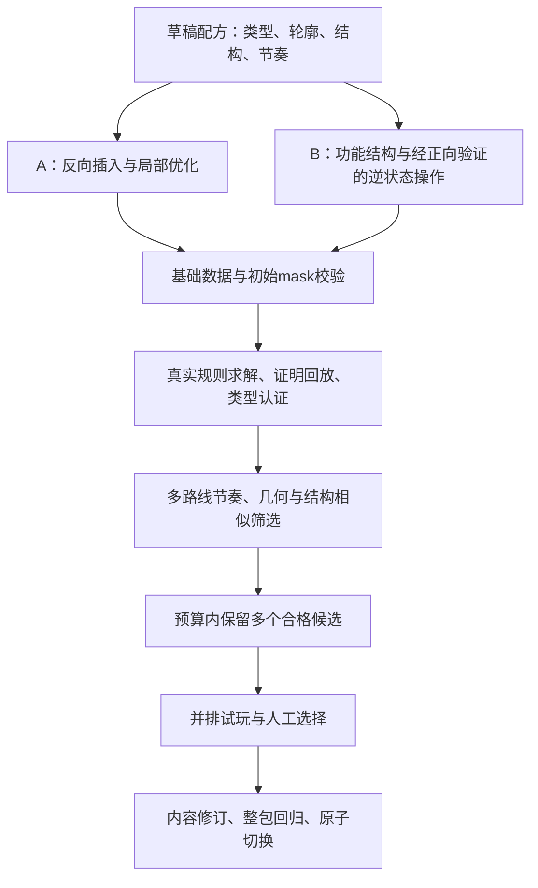

# Level Studio v2：编辑、诊断、生成与内容修订设计

> **2026-09-28 体量与战斗预算：** 新版目标见[百关v3](CAMPAIGN_100_V3_PLAN_20260928.md)，不再固定80艘。编辑器已增加“船数与海怪血量／初始战斗预算”，从正式SessionFactory派生初始攻击数及HP；编辑增减船自动刷新，试玩出船不重算初始HP，非法布局不显示过期预算。新逐关配方／批次生成与新包发布仍待实施，不改旧v1配方强行通过新内容。

> **最新授权与标准已更新：** 用户要求从第5关起增加真实错误分支，开局无道具有解、错步可能死局、道具有效解困。本文旧“保留前10关布局／14关才教动态／早期不设陷阱／68A与32B”安排已被覆盖。当前生产设计、竞品研究及已实现工具见[风险难度重设计](LEVEL_RISK_REDESIGN_20260927.md)。下文未重写的内容保留为此前方案记录，不能据此放行新关。

日期：2026-09-27。状态：最小诊断、撤销／回放和证明载入已实施，批量编辑／版本发布仍是设计。已实现操作见[首批实施说明](DIFFICULTY_V2_IMPLEMENTATION_20260927.md)。总计划见[难度改造计划](DIFFICULTY_V2_PLAN_20260927.md)，改造前工具说明见[现状审查](LEVEL_EDITOR_GUIDE_AND_DIFFICULTY_REVIEW_20260927.md)。

## 1. 工具要帮助策划回答什么

策划能选中一艘船，看到它为什么受阻、这次会停在哪、移开后谁获益；能够从任意试玩状态后退并比较另一种顺序，分清“可以移动”“存在完整解”“这个动作必须做”；最后把挑中的候选变成有版本、有证据、可回退的关卡修订。

A类：存在纯直出清盘解。B类：不存在纯直出清盘解，但有包含部分前进的完整无道具解。A／B是解法类型，和舒缓／常规／挑战的体验标签分开。动态关系可以简单，纯直出关也可以有较高观察挑战。

## 2. 界面结构

以现有UI Toolkit窗口增量扩展，优先可读的棋盘叠加，不先开发复杂节点图编辑器。

| 区域 | 展示／操作 |
|---|---|
| 顶部 | 关卡ID、内容修订、来源包、草稿／候选状态；编辑／试玩／对比；保存、校验、求解、导出候选 |
| 左侧 | 关卡列表与筛选：章节、A/B、节奏、证据状态、提示依赖、未完成修订；支持选择v1与v2候选并排 |
| 中间 | 固定整数格棋盘；编辑模式可缩放视图，不改变游戏Grid；笔刷／选择；方向、船尾、长船及摆放mask可切换 |
| 右侧 | 选中船属性、完整阻挡列表、路径／落点、释放格、局部结构及配方目标 |
| 底部 | 操作时间轴、逐步状态、三类验证结果、出口及部分移动曲线、失败／未知原因 |

选船显示三种不同信息：当前能直出、当前能部分前进、紧邻零位移。颜色之外加图标和文字；不要用同一绿色表示“可执行”和“安全可通关”。

### 最小编辑交互

- 编辑模式分“选择”和“放置”工具，避免一点击就误增删；保留方向／长度笔刷快捷方式。
- 选择船可改船尾坐标、方向、长度，修改作为完整事务，越界／重叠则拒绝；批量移动也必须整体成功或整体拒绝。
- P0先做Undo／Redo、明确退出试玩、重置、脏状态提示。复制、框选、镜像、锁定关键结构列P1。
- Undo记录草稿数据快照／命令，只影响编辑器。**不增加玩家局内撤销道具或回滚战斗。**
- 草稿是唯一可编辑来源。运行时JSON由已校验草稿导出，不引入Scene／Prefab中的第二份船位。

## 3. 选船诊断与时间轴

### 当前状态叠加

从当前 `BoardModel.QueryForwardPath` 和完整阻挡分析得到：

1. 船尾、船头、完整占格、到边界的前向扫描线。
2. 首阻挡与后续阻挡，注明只有首阻挡决定本次停止位置。
3. 操作前后footprint：腾出的格子／新增占格；直接离场与部分前进分别绘制。
4. 模拟一次真实事务后新增／失去的直出与部分移动对象。
5. 可选的后继求解结果：有完整解、已证无解、搜索未知。未求解时显示“未验证”，不推断安全。

后继分析不改当前局面。每个结果绑定状态指纹；编辑或试玩前进一步后，过期结果不能继续覆盖当前棋盘。

### 试玩与回放

- 每步记录船ID、起终船尾、Exit／Partial结果、前后状态指纹、移动距离、当时出口数及新解锁。
- 支持同一船多次出现，记录重复ID不是数据重复错误。
- 支持单步前进、后退、重置及从某一步分叉；恢复用不可变棋盘快照／从头确定性回放。
- 零位移点击单独作为操作观察记录，不算解法有效步骤。
- 逻辑试玩和正式场景试玩分开显示。场景试玩使用隔离测试档，不消耗玩家道具或修改进度。

## 4. 三个独立认证入口

| 入口 | 结果 | 证明边界 |
|---|---|---|
| 纯直出剥离 | 清盘／固定点剩余船／未完成 | 清盘证明是A；完整剥离后仍有船，仅排除纯直出解，不能判无解 |
| 完整规则求解 | Solved／Deadlocked／LimitReached／Invalid | 复用真实路径与事务；有环或零直出不能直接判死局 |
| 必要部分移动 | 已证下界、已知上界、是否精确 | 只有下界=上界才能显示“最少恰好k次” |

当前无道具规则每个完整解恰有N次离场，且只统计有效操作。因此若已经证明最短有效解长度为L，则 **最少部分移动数=L−N**。现有BFS证明最短解时已可得精确结果，不必为同一问题重复跑另一套求解器。

如果只找到包含p次部分移动的可回放解，只证明上界≤p。若纯直出剥离留下船，另得下界≥1；p>1时不能直接写成“必须p次”。如果预算耗尽但已找到有效解，保留有解证明与最优性未知两种事实，不把它们压成同一个失败状态。

现有 `LevelSolver` 返回Solved时带Proven；以后若加启发式找解，必须调整结果语义，区分可行解与最优解，不能沿用Proven标志冒充最优。

### 求解分层

1. 合法性、直接剥离、封闭零位移环等便宜的严格证据。
2. 4～12船原型：BFS求最短路；另做有预算的完整可达状态遍历，只有穷尽后才报告全状态安全性。现有Solver找到首个清盘后就返回，不能直接据其Solved报告全图安全，也不预先保证12船必能穷尽。
3. 80船候选：先回放构造见证，再由独立求解流程找完整解；精确最优性另给预算，不作为所有候选必须穷举的前提。
4. 动态关最低生产证据为整关无道具解＋整关纯直出失败。要使用“至少2次”等更强标签，额外提交对应下界证明。

任何子题分解、偏序消除、局部下界都须先证明适用条件；不能因为视觉上相隔很远就把两个谜题当成互不影响。

## 5. 难度面板：指标先于总分

| 维度 | 数据与口径 | 用途 |
|---|---|---|
| 形态 | 全板占用率、mask内填充率、端点对齐、内部空洞、局部方向混合 | 判断是否形成清晰、错位的船阵 |
| 释放 | 每状态E=直出船数、P=可部分前进数、R=剩余船数、E/R | 同时看出口数量和相对松散程度 |
| 节奏 | 按清除0～20%、20～60%、60～100%分段；低出口持续长度、快速松盘点 | 防止开局紧、中盘立即散，允许爽快收尾 |
| 动态 | 纯直出剩余核、必要部分移动下界／上界、停止位置变化 | 验证B类关系实际参与解题 |
| 决策 | 已证可解／已证无解／未知的后继动作数；关键动作出现进度 | 区分能动和应该动；限制惩罚性陷阱 |
| 体验 | 首次有效操作、停顿分布、零位移误点、提示次数、重复感 | 最终校准真人难度 |

前中后段按离场比例定义；B类可能在同一清除比例发生多次部分移动，所以同时保留“按有效操作步”的曲线。禁止丢掉不减船数的操作，或把其动作数误当清除率。

### 多路线筛选

A类保留现有三策略，增加最大即时解锁、最小即时解锁及多固定seed顺序。报告每策略曲线与最容易采样路线，不能只给平均值。ID升降序与生成插入序相关，不能视为三个独立玩家群体。

建议“过早松盘”先作为提示：例如前60%某段E/R快速上升并持续、多个自然策略均能轻易展开。实际阈值由对照样关校准，不能只用任意峰值一次拒绝。单出口长链另作警告，避免把唯一候选循环当深度策略。

B类多路线策略在当前完整规则上运行。只挑CanExit不是完整策略，也不能当作安全提示；采样遇LimitReached单独记未知。报告结构变化和错误位置，不能把状态计数比例标成玩家失败率。

## 6. 摆放轮廓与功能结构

### PlacementMask

当前 `GenerationArea` 只有矩形。v2新增生产侧可编辑mask，先提供切角团块、上下收窄、左右错位三种模板；不增加墙、封闭出口或新的Runtime碰撞。

- 所有初始footprint必须在mask内；移动后允许进入mask外的棋盘格。
- 容量下限为 `2×船数＋长船数`，mask面积足够也不保证可摆放／可解。
- 80船6长船占166格；220格mask的填充率75.45%，全14×18棋盘仍是65.87%。220仅为实验起点。
- 空洞诊断分别显示mask内部空白与轮廓外有意留白。旧“全矩形最大空矩形≤12”不能直接沿用，否则会错误拒绝合法收口。
- 窗口方向熵增加mask覆盖率与样本量，低覆盖／少船窗口单列，不能用排除窗口伪造全部通过。
- 视觉错位来自整数船位；船图、Collider和Grid不发生随机偏移。

### FunctionalMotif

每个结构描述摆放、关键船、预期关系、停靠物、保留格／前向通路、可允许的变体及真实证明。首批四种A结构：偏置入口、双区交错、长船闸门、两段收紧；B首批使用已核验的小原型思想，不直接复制成大量孤立拼图。

锁定关键船位置不等于锁定逻辑。填充船会改变首阻挡与停止距离，也可能打开绕过必要移动的纯直出路径。每次变体和填充后，都要重测整关剥离、完整解及关系是否仍必要。

## 7. 生成管线：保留A，另建B策略

A仍要求无环、N船N步直出证明。B允许完整阻挡环和零初始出口，但绝不因此自动合格：必须排除纯直出清盘并证明完整规则有解。保留旧A的回归与规则版本，新增题型／筛选版本，而非悄悄放松旧阈值。

B先由少量人工结构起步；可探索从后态枚举逆移动，但每个逆候选必须满足真实一次正向事务回到后态。难度指标不满足则拒绝／保留草稿；不通过自动缩船数、改变尺寸或增加道具补齐数量。

有限预算内保留目标相近、曲线不同的多个候选；首轮目标3个，不足时如实展示。先以约束过滤，再按多维表现排序，避免未经校准的一维难度分。选择结束才生成包修订。

## 8. 数据职责与保存

| 数据 | v2职责 |
|---|---|
| Runtime布局JSON | 继续schema v2；只存实际布局和身份，不塞mask、编辑器颜色或难度评分 |
| `.design.json`（拟新增） | 草稿ID、来源、类型A/B、mask、结构、锁定集合、目标区间、种子和工具版本 |
| `.solution.json` | 已有LevelSolutionProof v1支持Partial、重复船ID及状态hash，可先复用 |
| `.analysis.json`（拟新增） | 多策略曲线、类型／最优性证据、指标版本、玩家试验索引；绑定布局／规则／配方hash |
| manifest v2（拟新增） | 显示关位→稳定ID＋内容修订＋资产键；包版本、证据索引、审核状态 |

通用Save只存草稿，不承诺入包；“认证候选”重建指标及证明；“构建修订包”负责全包摘要、兼容性和原子切换。旧 `Save Proof` 不再被误解为完整生产认证入口。

编辑布局、规则或配方后将相关证据标过期；导出前复验，禁止手动把unknown改成passed。保存中断不覆盖旧包；生成任务支持取消，保留已完成候选及失败原因。

状态建议：Draft → LogicCertified → PlaytestCandidate → Reviewed → PackReady。状态旁明确人体验收／设备验收字段；不能用一个绿色状态冒充所有维度通过。现有v1自动通过内容保留原状态。

## 9. 实施切片与文件范围

| 优先级 | 交付 | 主要范围 | 完成条件 |
|---|---|---|---|
| P0a | 选船、明确模式、Undo／Redo、单步回放 | `Editor/LevelStudio` | 改动可撤销、退出试玩不丢草稿、无过期叠加 |
| P0b | 剥离／完整求解／必要移动分开展示 | `Core/LevelDesign`＋Editor | 4/8船报告正确；unknown与无解严格分开 |
| P0c | 读取已有曲线、候选对比、隔离试玩 | `Unity/Loading`＋Editor | L24/L38与变体能并排，真实档案不受影响 |
| P1a | mask及内部诊断、A策略候选池 | 生成器、LocalLayoutAnalyzer、design适配 | 轮廓外不是墙，不降低旧A门槛冒充新通过 |
| P1b | B结构、动态曲线、整关认证 | 新策略＋既有Solver/Proof | 全80船也通过，不依赖局部证明冒充整关 |
| P1c | 包修订路由、存档版本兼容 | Catalog/Save/PackValidator | 旧attempt可恢复、新开局加载目标版本、奖励不重复 |
| P2 | 批量模板、结构相似检索、审核效率 | Editor/Tools | 30关流程可持续后再扩展，不阻塞前期试题 |

Editor只做生产与展示；Core不引用Unity；JSON适配留在Unity层。后台求解仅接不可变纯逻辑快照，取消或布局代次改变后丢弃过期结果。先把逻辑耗时与最大状态数显示出来，再决定并发优化。

## 10. 回归重点

有意义的新增检查包括：合法有环有解、无出口仍可部分前进、封闭零位移环、预算未知、同船多次移动、mask外可通行、影响停靠物的填充反例、撤销后证据失效、编辑后旧proof拒绝、旧包与新版包共存、失败导出原包不变。

PlayMode按每步 `Outcome` 检查：Partial后船数不变且落点正确；Exit后船数减1并最终恰好一次入舰／命中。保留暂停、Busy、重开、道具、断点恢复和胜利只结算一次。当前每步都要求 `before−1` 的百关测试必须更新，不能删掉断言后就宣称支持B。
