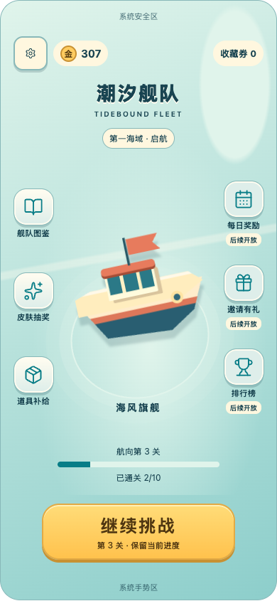
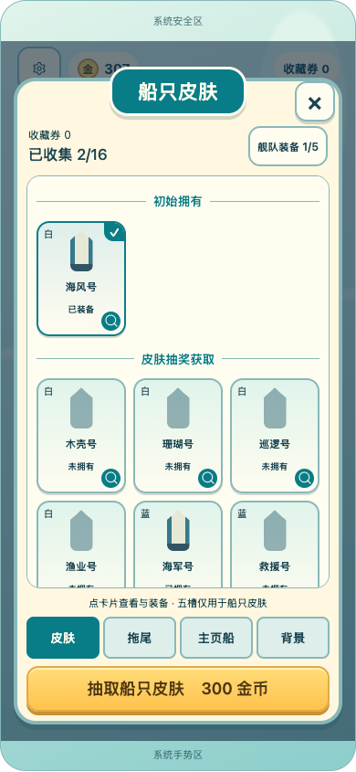
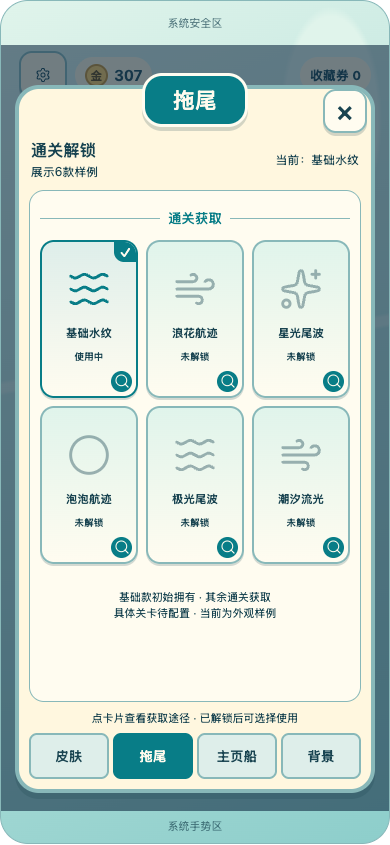
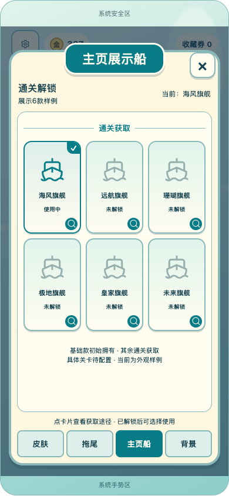
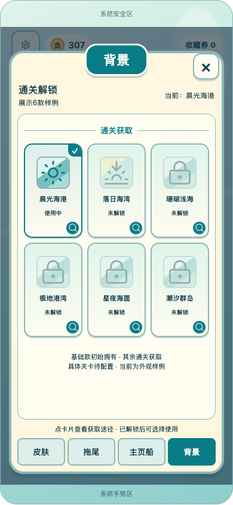
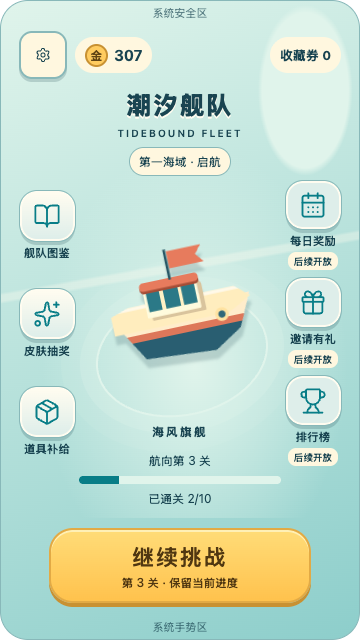

# V2-A3：四类图鉴与左右主页入口

**A4后续覆盖：** [结算奖励与分享](REWARD_RESULT_REVISION.md)已移除主页通关条，并为奖励目标加入仅供展示的通关节点；本页截图保留为A3历史证据。正式节点仍未冻结。

2026-09-20。根据用户明确纠正及本轮六张参考图修改。本条覆盖V2-A2将收藏限制为船只皮肤、将主页功能压缩为底部三入口的取舍。完成的是可点击版式与规范；Unity仍为现有运行时，未增加正式资产、通关外观存档或外部服务。

## 已确认与尚未冻结

| 项目 | 当前设计规则 | 待定内容 |
|---|---|---|
| 船只皮肤 | 通过抽奖获取；现有默认船、首蓝赠送和券兑换保留 | 本轮不改16款目录或生产经济 |
| 拖尾 | 通过通关获取，独立选择使用 | 款式、数量、解锁关卡、动效预算 |
| 主页展示船 | 通过通关获取，独立于出战皮肤及五槽选择 | 目录与节点，复用模型方案 |
| 背景 | 通过通关获取，独立选择 | 目录与节点、主页／局内适用范围；局内须验证棋盘可读性 |
| 主页布局 | 中央展示船，左右功能入口，底部开始／继续 | 后期入口开放顺序与折叠规则 |
| 邀请有礼、排行榜、每日奖励 | 为后期功能预留主页位置 | 业务、奖励、防重复、后台与平台规则另行实现 |

后三类不混进皮肤抽奖池，不共用五槽。现有C3只校准皮肤与金币，不据此宣称新增通关内容的成长节奏已平衡。本次使用默认外观＋通关候选卡展示结构；默认项是原有外观的呈现建议，样例名称和每类6款都不是正式目录承诺。

## 页面如何改

**主页：** 左侧依次图鉴、皮肤抽奖、补给；右侧每日奖励、邀请有礼、排行榜。侧栏与中央船体有独立空间，短屏收紧纵向留白；顶部只放设置、金币、收藏券，底部保留唯一进关主操作。右侧入口标为“后续开放”，点击不发奖、不邀请他人、不伪造排名或玩家信息。未来内容增加时建议扩展“更多”，不能侵占中央展示和主按钮。

第5图提供大角色与外围入口结构；第6图补充场景深浅、按钮体积和多功能侧栏的方向。本作保留海港主题；不照搬宠物、体力、钻石、养成信息卡或参考素材。本次船体仍是构图示意，真正3D模型与场景细节继续在V2-B样片实现。

**图鉴：** 改成主页遮罩上的弹窗，顶部标题和关闭按钮，中间三列可滚动卡片，底部皮肤／拖尾／主页船／背景四分类。背景主页不可点击。皮肤页保留收藏数及五槽入口，抽奖按钮固定在该分类下方；其余三类强调通关获取。已使用有勾选，锁定卡片有剪影／锁与文字，点击卡片可看获取途径。

**选择与预览：** 皮肤继续通过详情装备并在下一次挑战生效。后三类在详情显式选择使用，互不占槽；“通关外观·切换演示”样例提供每类一个已解锁项以供点击验证。主页展示船和背景选择能在主页看出示意变化；拖尾只演示选择与静态缩略图，实际航行效果尚未实现。普通样例中未解锁项不会出现可使用按钮，具体解锁关卡不伪填数字。

## 验证

独立无头Chrome执行三档画布（360×640、390×844、430×932）的24种状态、18种页面、12种图鉴分类，共54种组合。核对脚本异常、横向溢出、有效按钮44参考单位下限、侧栏／固定底部边界、侧栏按钮之间无重叠。检查通过，见[浏览器记录](FourCategoryBrowserChecks.txt)。长列表的中部滚动属于预期，不以可见卡片数冒充完整内容数。

另外核对四分类切换、锁定获取说明、三类外观独立选择与主页反映、五槽不被影响、后期入口占位、回港后继续第3关、皮肤装备、十连10项与满槽替换。深色主页与图鉴进行截图检查。本轮未运行Unity测试，不把浏览器检查等同于真机验收。

| 双侧主页 | 四类图鉴·皮肤 |
|---|---|
|  |  |

| 拖尾 | 主页展示船 |
|---|---|
|  |  |

| 背景 | 短屏主页 |
|---|---|
|  |  |

[短屏图鉴证据](A3_Skin360.png)。

## 后续接线顺序

1. V2-B三张风格样片使用本次双侧入口和四类图鉴规范；首批仅做少量外观样本，不批量铺目录。
2. V2-C接主页导航、公共弹窗、Safe Area和局内分工；已有抽奖、商店、五槽复用原服务。
3. V2-D为后三类补稳定分类ID、独立拥有／使用字段与旧档默认回退；以可靠通关凭证驱动幂等解锁，重开、回看结果、重试保存不得重复发放。不用领奖动画完成回调决定解锁。解锁表先形成候选并验证，再配置进工程。
4. 拖尾仅航行时显著出现，背景装饰不得掩盖方向／占格／阻挡；主页展示不反向影响当次船阵。每日奖励、邀请和排行待独立功能阶段，不因预留了按钮就标为完成。
