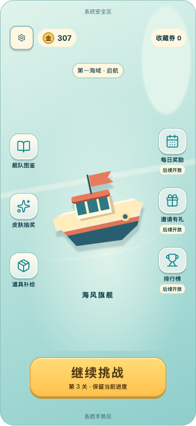
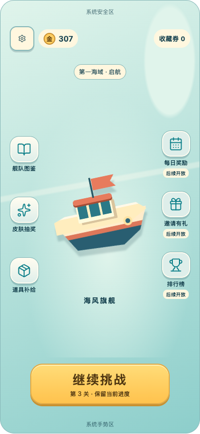
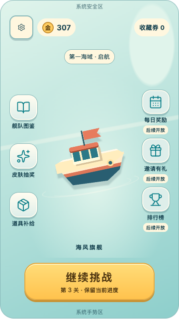
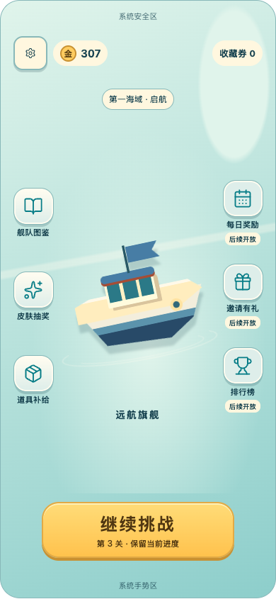

# 无标题主页与展示船动效候选核对

2026-09-20。用户已确定主页不放游戏标题，背景借鉴图1港湾层次、整体借鉴图3清爽感；展示船可更换并轻微摆动，船下水纹先评估。完整制作安排见[后续工作计划](V2_NEXT_WORK_PLAN.md)。

## 本轮已做

- 从主页及图鉴背后的主页去掉中文游戏名和英文副标题，不恢复已通关进度条。
- 在已有展示船选择示例上增加轻摆；更换展示船后继续摆动，五槽及当前挑战不变。
- 两条低对比接触水纹作为候选，可单独关闭；轻摆也可单独关闭。对照控件在预览顶部，不属于正式游戏HUD。
- 动效仅作用主页展示船与水纹，按钮、文案、船名保持静止；打开弹窗暂停，离开主页不播；接入文档可见性暂停与系统减少动态降级。
- 保留“通关外观·切换演示”样例，进入图鉴的主页船分类可选择另一款，再关闭图鉴看变化。当前是颜色／布局示意，不是两款正式模型或完整换船转场。

当前候选为5秒周期、约±1°及上下2参考像素；水纹6秒缓慢透明度变化。参数并非产品冻结，预览没有真实港湾背景；真实水面已有足够接触波纹时应减少或关闭额外效果。水纹与可收藏航行拖尾分开，不产生解锁或奖励。

## 验证

独立无头Chrome：三档画布×轻摆开关×水纹开关共12组，加结算／图鉴／抽奖／补给4个页面，合计16组。检查无标题／进度条、横向边界、按钮44参考单位下限；无脚本异常。

额外核对变换随时间改变、按钮位置不变、弹窗暂停、减少动态时停止动画、更换展示船后继续轻摆、恢复第3关、局内不加入主页水纹。首次发现暂停样式被动画简写优先级覆盖，修正后重跑通过，见[检查记录](HomeMotionBrowserChecks.txt)。文档可见性暂停已接线，但浏览器后台／移动端后台仍需后续实测；未运行Unity测试。

截图为静止取帧，摆动效果需在可点击稿中查看。

| 轻淡水纹 | 关闭水纹 |
|---|---|
|  |  |

| 短屏 | 更换展示船 |
|---|---|
|  |  |

## 待后续实现

B1确定真实船体轮廓与密集可读性；B2准备图1背景＋图3质感的主页／局内／结算样片与图鉴组件板，验证两款展示模型、水线、镜头包围和水纹融合。真实换船资源准备／淡入／释放、正式模型、背景层、Unity动效和多语言尚未接入；本轮不冒充正式美术交付。
