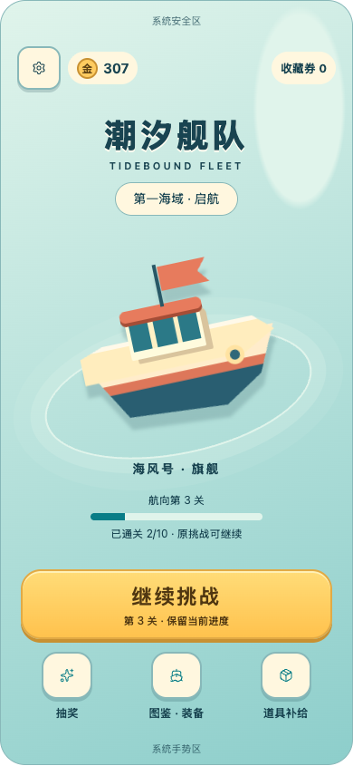
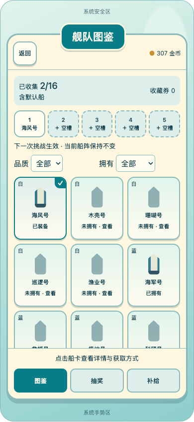
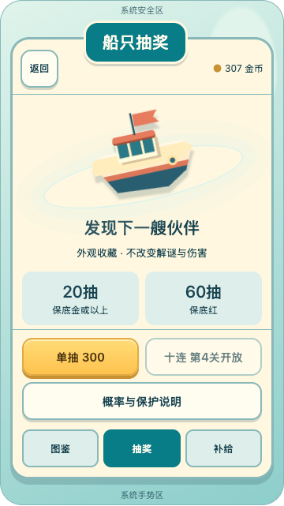
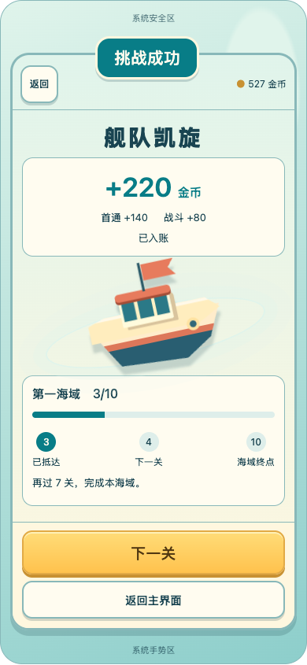

# V2-A2 竞品参考后的版式优化

2026-09-20。依据用户提供的“参考图”目录17张截图逐张查看后调整。交付为可点击的配色与版式提案；旗舰仍是构图示意，不代表正式3D模型、动效或Unity集成完成。原始竞品图片只读查看，未拷入仓库或用作产品素材。

## 借鉴与取舍

| 参考页面 | 观察到的结构 | 本作采用 |
|---|---|---|
| 主界面、排行标注图 | 中央大角色、顶部钱包、底部强主操作、周边入口 | 大旗舰成为视觉中心；金币与券在上方；金色开始／继续按钮；图鉴、抽奖、补给集中在底部 |
| 4张皮肤弹窗 | 突出的标题牌、三列卡片、锁定剪影、装备角标、稳定底部导航 | 象牙白面板与青色标题；五槽在顶部；未拥有剪影与已装备勾选；固定图鉴／抽奖／补给导航 |
| 游戏结算 | 庆祝标题、奖励、大角色、进度与下一关分层 | 金币到账单独成块；旗舰展示；个人真实海域进度与下一关，不使用无法验证的排名百分比 |
| 奖励领取、设置及局内设置 | 遮罩聚焦、明确主操作、关闭／返回位置稳定 | 统一标题、按钮与弹层边界；保留收下和显式装备、继续和重开／返回等原有交互 |
| 道具使用、死局提示 | 上下文提醒与道具入口关联 | 保留局内专注玩法；不改完全死局条件，不强制消耗道具；5秒提示仍只针对当前能直接驶出的船 |
| 3张加载、签到、分享 | 启动和进关分开；独立奖励入口 | 加载仍按既有E2分镜；签到、分享、额外收藏分类与新货币不扩入本批 |

截图不能证明底层渲染方式、排行榜后台或加载时间。首页与结算复用旗舰的建议来自布局观察，正式实现仍遵循真实3D＋正交相机＋2D HUD的既有路线。

## 版面调整

- 主界面由中性堆叠线框调整为海港主题：浅海色背景、较大的旗舰、低对比水面、稳定文字和底部主按钮。次入口使用图标＋中文，避免围绕旗舰堆满活动按钮。
- 图鉴用三列等宽卡片统一轮廓、品质、拥有和装备状态；详情与抽取结果仍独立展开。五槽和底部导航保持可达，长列表在中部滚动。
- 抽奖页突出船展示、保底信息与单抽／十连操作；短屏允许说明滚动，操作固定在底部。价格沿用当前样例，未启用C3候选。
- 结算按“凯旋→首通／战斗／合计→旗舰→章节目标→下一关”组织。第2关待领蓝皮返回主页；第10关结束当前内容；保存失败仍先重试。
- 公共面板统一暖白底、青色标题牌与金色主按钮；加入按下层次、选中状态、深色显示适配。颜色仍是候选，不冻结正式色板。

## 检查与证据

独立无头Chrome检查360×640、390×844、430×932：21种画布×状态及18种画布×页面，共39种组合，无脚本异常、横向溢出或页面按钮横向越界／宽度小于44参考单位。这里的44是浏览器布局单位，不代表设备dp或真机触控验收。

交互复核：主页继续与回港后仍在第3关；局内菜单无收藏／抽奖／购买；显式装备；第2关领取蓝皮并装备后进入第3关；十连10条；满槽显式替换。目视检查主页、图鉴、抽奖、结算及深色主页，调整结算旗舰位置以避免桅杆侵入奖励区。见[检查记录](ReferenceBrowserChecks.txt)。这39种是此次配色稿检查，不覆盖或替代上一版57种检查记录。

| 主界面 | 图鉴 |
|---|---|
|  |  |

| 短屏抽奖 | 结算 |
|---|---|
|  |  |

[短屏主界面](Layout_Home360.png)、[短屏结算](Layout_Result360.png)。界面内数据和抽取均为示例；不读取玩家存档。未运行Unity测试，本轮只改变设计预览和说明，真机仍延期。

## 接下来

V2-B按此层级准备主界面、真实80船局内、结算三张小规模风格样片，复用默认船、固定长船和一款蓝皮；用真实3D检查密度与方向，再进入V2-C主页和公共UI接入。此次配色稿不计作三张正式风格样片验收，不批量生成皮肤，不接真实支付或广告。
