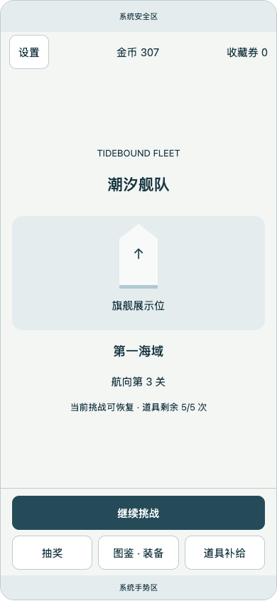
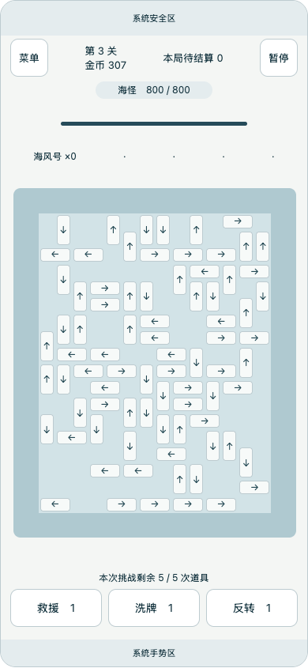
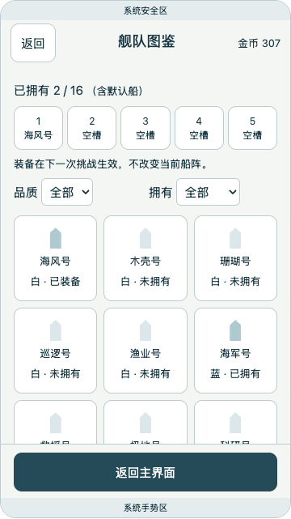
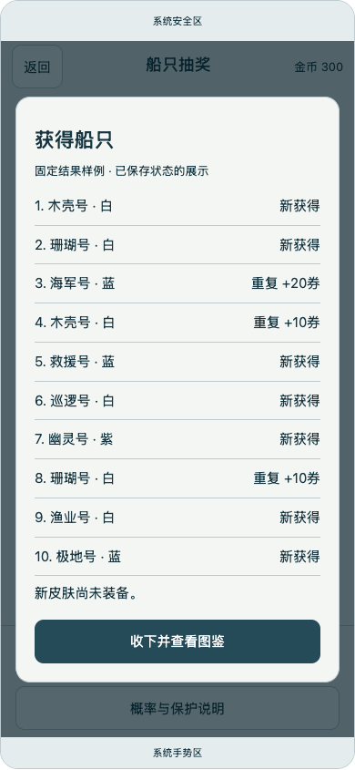

# V2-A准备稿核对记录

**后续更新：** [V2-A2竞品参考版式](REFERENCE_REFINEMENT.md)已替换可点击稿的呈现；下方57种检查与截图保留为原线稿历史证据。新版另有39种检查，不混记。

日期：2026-09-20。结论：结构与导航准备完成，可进入V2-B风格样片；**不是正式UI上线、Unity集成或美术风格验收**。

本轮用户明确修订：抽奖与图鉴放在进入游戏前的主界面，游戏内只保留玩的功能。准备稿已同步主页、局内、结算、首蓝、收藏、装备和补给路径。未修改运行时、经济参数、存档或场景。

## 文件

- [页面／导航／安全区／接线方案](V2_PREPARATION.md)
- [首批资产工单](ASSET_BRIEF.md)
- `tidebound-v2-wireframe.html`：可点击结构稿源，主界面默认显示；可在对话内切换画布与状态。系统字体与平面占位，非正式游戏画面。
- [浏览器检查记录](BrowserChecks.txt)

## 已执行

1. 对照 `PortraitBoardLayout`计算360×640、390×844、430×932以及设计留白；HTML不把参考像素宣称为设备dp／mm。
2. 第3关原始80船按 `GridFootprint.Cells`尾格与方向转换成左下包围坐标：160个占格、无重叠、不越14×18边界。初版线稿误将尾格都当左下角，核查后已修正，再次截图确认。
3. 使用独立无头Chrome和Playwright检查最终稿：21种画布×状态组合，加36种画布×安全区开关×页面组合，共57种；没有脚本异常／横向溢出，页面按钮水平边界有效。面板纵向滚动可达，不将列表超出可见区域误记为裁切。
4. 核对主界面→继续→局内菜单→主界面→图鉴→显式装备→继续仍为第3关；局内菜单没有抽奖、图鉴或购买入口。
5. 核对第2关结算→主界面领取→显式装备→第3关；十连结果完整10条；满5槽显式替换；保存失败返回主页时交易入口不可用，重试后显示已入账样例。
6. 目视检查主页、390局内、360图鉴及十连结果：中部旗舰占位、底部主操作、安全区、短屏滚动和独立遮罩；未将占位箭头当作正式3D效果。
7. 提交前检查Markdown相对链接、Git空白、仅设计文档变动，以及原有UI交接文档／CHANGELOG条目仍未纳入本轮提交。

## 图像证据：仅结构稿

| 主界面 | 局内 |
|---|---|
|  |  |

| 短屏图鉴 | 十连展示 |
|---|---|
|  |  |

## 限制与后续

结构稿中的购买／抽取／装备只更新浏览器内示例数据，结果固定，不复刻随机引擎、完整保底计数、兑换事务或实际失败恢复。刷新会恢复样例，不访问玩家存档；外部画布／状态控件是评审工具，不属于游戏页面。真实第1关与最后关、5秒提示、死局判定、动画／音效和异形设备须在Unity接入时验证。现阶段仍无真实广告、付费、排行榜或正式资产。

Unity本轮未运行测试：406/406 EditMode为C3历史结果，54/54 PlayMode为C2历史结果。后续主界面会改变启动和返回接线，因此不能仅凭本轮HTML检查宣布集成通过，须补新档开始、同attempt恢复、旧胜利查看、失败保存拦截、首蓝装备时机、后台和连续下一关回归。

下一步：V2-B先制作主界面／80船局内／结算三张风格样片，只展开默认船、固定长船和一款蓝皮；确定样片方向后进入V2-C Unity主界面与公共UI接入。
