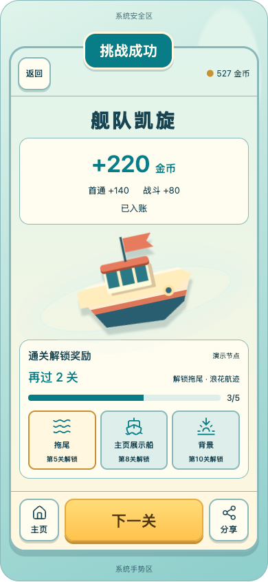
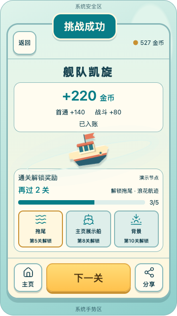
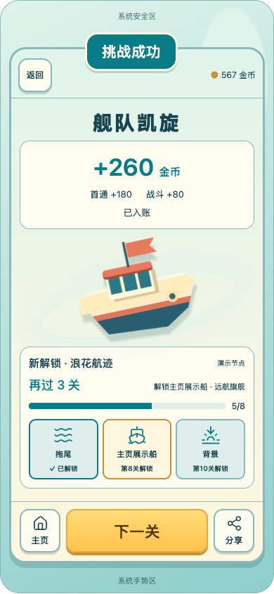
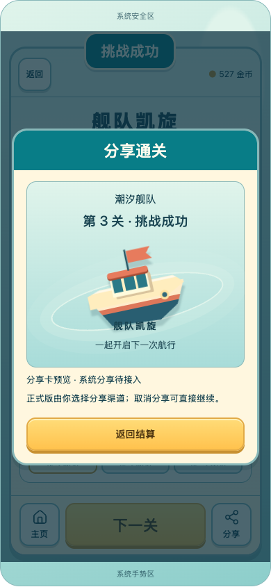
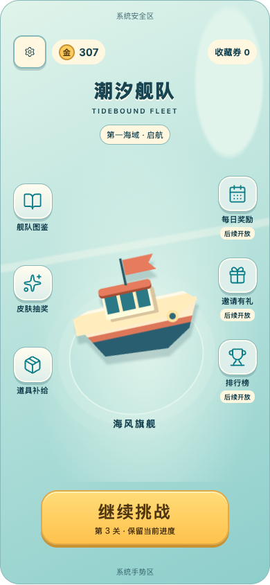
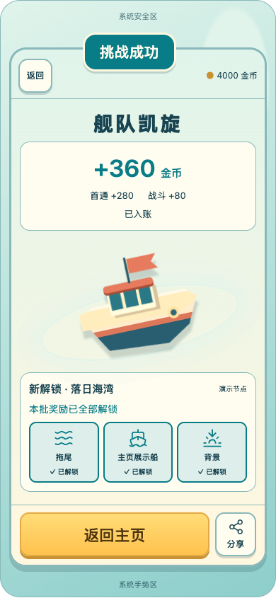

# V2-A4：结算奖励目标、分享与主页简化

2026-09-20。依据用户本轮要求与《游戏结算界面图.png》修改，覆盖旧“第一海域3/10”的结算统计及主页已通关进度条。只修改可点击设计稿与规范；Unity运行时、真实存档和经济参数未改。

## 当前版面

- 结算：成功标题→已入账金币（首通／战斗／合计）→展示船→可获取奖励→主页／下一关／分享。
- 奖励模块：突出最近的通关外观目标、还差几关、当前量／目标量；下方用拖尾、主页展示船、背景三个缩略节点展示解锁状态。点击节点查看奖励名称与途径，不在局内结算里换装。
- 主页：移除已通关比例、文字统计和进度条；保留中央展示船、双侧功能入口、开始／继续按钮里的当前关号。保存失败及首蓝待领时保留必要状态提示。
- 分享：次级按钮与主页按钮分列主按钮两侧；点击查看通关卡片。预览只含游戏名、已完成关卡、船体示意和主题文案。

参考图借鉴奖励缩略节点与底部主页／下一关／分享组合，不沿用排行榜百分比、其他玩家头像或分享+200金币。分享奖励没有被用户确认，本轮不增加。

## 演示配置与状态

| 情况 | 呈现与行为 |
|---|---|
| 第3关结果 | 示例下一目标为第5关浪花航迹：3/5、再过2关；不是海域完成比例 |
| 第5关结果 | 浪花航迹“新解锁／已解锁”；下一目标第8关主页展示船，显示5/8、再过3关 |
| 第10关结果 | 示例三项均已解锁；返回主页和分享，无不存在的第11关入口 |
| 第2关首蓝待领 | 保留回港领奖路径；不跳过已确认的首次蓝皮流程 |
| 奖励未配置 | 显示后续通关奖励准备中，不伪造百分比或目标 |
| 结算保存失败 | 先重试；不显示成功分享、已入账或奖励解锁 |
| 分享取消／返回 | 关闭预览，继续结算；钱包、奖励和继续位置不变 |

**第5／8／10关、三款名称及对应关系仅用于呈现示例，并非已确认的正式发放计划。** 预览在奖励节点与详情标识“演示节点／演示配置”。后三类各自仍独立选择，不占五槽；对应样例图鉴与结算共用同一演示节点，避免结算已解锁但图鉴仍锁定。当前默认外观＋其余候选目录尚未冻结。

本轮分享按钮仅打开本地预览，未调用系统分享、上传图片、发送消息或触发奖励。正式接入建议先生成卡片再交给系统分享面板，由玩家选择渠道；取消和平台不可用时可正常继续游戏，不能阻塞结算，也不能把“打开分享”作为成功发送或发奖依据。

## 验证

使用独立无头Chrome，核对360×640、390×844、430×932三档：六种结果状态（普通、刚解锁、奖励待配置、首蓝、末关、保存失败）＋主页，共21组。检查脚本异常、横向溢出、有效按钮至少44参考单位、短屏结果无需纵向滚动。首次发现360短屏的轻微纵向溢出，收紧内容区留白后重跑；最终结果见[浏览器记录](RewardResultBrowserChecks.txt)。

额外核对3→5目标差额、解锁详情标记、第5关解锁与图鉴一致、分享预览／关闭／Escape不改钱包、下一关推进、第10关无第11关、保存失败重试后开放分享，以及主页无已通关条。目视核对三档关键结果、分享卡和深色结果。本轮未运行Unity测试，浏览器单位不是设备触控验收。

| 普通结算 | 短屏结算 |
|---|---|
|  |  |

| 新解锁 | 分享卡预览 |
|---|---|
|  |  |

| 简化主页 | 本批奖励完成 |
|---|---|
|  |  |

## 后续实施

V2-B样片按此次奖励目标结算与简化主页制作。V2-D接入时从统一通关进度、奖励目录和已保存发放凭证计算状态；重复查看结果、重试、分享和动画结束不得重复发放。先定奖励节点候选，补解锁幂等／旧档回退／图鉴一致性，再配置到工程。分享在平台适配步骤接入真实系统能力，真实分享与真机行为仍未验证。
