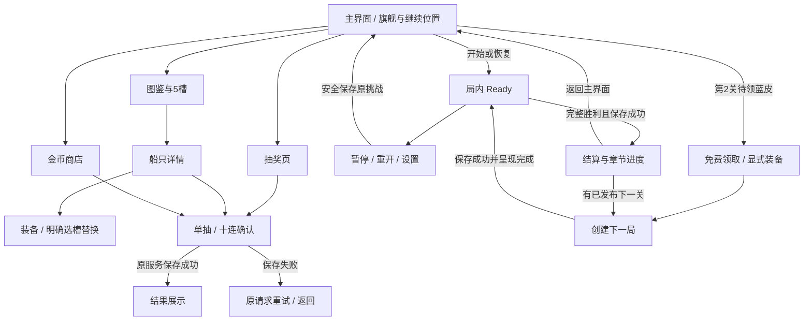

# V2-A UI与视觉制作准备

2026-09-20；依据生产玩法 `8c1256e`、I5-C3校准 `0b478cf`。本轮交付页面结构、可点击低保真稿、素材工单与接线顺序；没有接入正式UI、美术、经济候选或SDK。用户授权“开始准备”，参考文档中的执行要求与未确认参数不自动生效。

**V2-A2版面更新：** 已逐张查看用户新增17张竞品截图，完成海港配色、中央旗舰、三列图鉴与奖励／章节分层的可点击提案，见[参考优化与检查](REFERENCE_REFINEMENT.md)。以下导航和规则约束继续有效；此次未接Unity或制作正式3D资产。

## 当前修订：四类图鉴与双侧主页（V2-A3）

用户明确修正上一版：图鉴包含**船只皮肤、拖尾、主页展示船、背景**。船只皮肤通过抽奖获取；后三类通过通关获取。默认内容、既有第2关免费蓝皮与收藏券兑换继续保留，不把本次指令解释成取消已完成规则。具体通关节点、各类总数和内容表尚未确定。此条覆盖A2“不扩展额外收藏分类”和主页底部三个入口的旧取舍。

图鉴采用主页遮罩上的四标签弹窗，三列卡片、拥有／未解锁／使用中状态、获取途径详情；底部标签固定。抽奖按钮只在船只皮肤分类显示，其他三类明确“通关获取”。五槽装备只服务出战皮肤，放在皮肤页的“舰队装备”入口；拖尾、主页展示船和背景各自选择，不占五槽。主界面展示船拥有独立选择，视觉模型可复用，但不能从出战槽位推断其解锁或自动跟随。

主页采用顶部钱包／设置、中央展示船、左右功能入口、底部开始／继续。当前排布：左侧图鉴、皮肤抽奖、补给；右侧每日奖励、邀请有礼、排行榜预留。后续入口在评审稿中注明“后续开放”，点击只解释占位；不伪造红点、奖励、排行数据或联网功能。正式版本按开放状态控制，不能出现可领取却未实现的按钮。更多功能优先折叠进“更多”，不无限挤占中央展示区。

本次按图5的大角色与外围入口、图6的场景层次与有体积按钮组织海港主题，未复制参考的角色／资源、钻石、体力、邮件、宠物养成等系统。[修订报告与验证](FOUR_CATEGORY_REVISION.md)记录可点击稿的实现边界。

## 1. 设计取舍

沿用真实3D船体＋正俯视正交相机＋低成本接触阴影＋2D HUD。V1已跑通，不改相机俯角、不重写Grid输入、不重新做收藏服务。先把信息分层和页面结构做好，再用一小组视觉样片定风格。推荐参考稿中的明快玩具舰队方向，具体水色、按钮、字体与船体材质仍是候选。

当前灰盒主要拥挤点：图鉴把筛选、八卡、详情、预览、装备、单抽、十连、免费蓝皮、规则与返回全部放在一屏。V2拆为“图鉴列表／船只详情／抽取确认与结果”；五槽在图鉴顶部，详细收益和规则按需进入。拆的是视图，不另建账户或导航存档。

**本轮用户修订优先：增加进关前主界面，抽奖、图鉴与装备都在主界面处理，游戏内只做玩的功能。** 补给购买也归主界面，局内保留道具使用；库存不足可返回主界面补给，再继续同一挑战。该调整覆盖先前“暂不做独立首页”和C2菜单／结算内直接开图鉴的入口安排，不改变现有服务规则。

主界面参考已核查录屏：中央大角色换成本作旗舰、主要按钮在底部、角色可低幅活动，按钮和文字保持稳定；不复制竞品角色与品牌。结算保留一个主操作和一条真实章节进度。第2关领取蓝皮先回主界面，再显式装备／开始第3关；第10关显示当前内容完成。每日奖励、邀请有礼、排行榜按A3在主页预留，业务实现后置；不加入假排名或付费促销。

## 2. 参考到实施的边界

| 参考建议 | 本轮定稿约束 |
|---|---|
| 船有体积、背景安静 | 复用V1模型与共享资源；原线稿箭头与新版旗舰构图示意均非最终船图 |
| 55°～70°相机 | 继续现有正俯视；倾角仅作为未来独立可读性实验 |
| 航道缩放缓动 | 保留同帧对齐方向／中心及0.8倍；不重新加慢缩小 |
| 390×844棋盘区500～540px | 不直接抄绝对高度，以现有Safe Area计算为准；短屏须单列检查 |
| 全部触点48×48 | 作为HUD和弹层的设计目标，单位为参考逻辑单位；船的触区仍是Grid占格，不重叠扩张，不冒充设备dp/mm |
| 首次蓝皮／金币商店 | C2／B已实现；只重做呈现，保持解锁、历史定价及回执语义 |
| 加载和通关演出 | 复用E2分镜与Ready／胜利／保存屏障，资源已就绪不强制等待 |
| 章节追赶感 | 展示个人真实章节进度，尚无章节券／星币／真实排行榜 |
| 动画时长／颜色／字体 | 原参考均为提案，未作为真机或美术验收结果 |

参考：用户提供的《TIDEBOUND_FLEET_UI_VISUAL_MOTION_GUIDE_20260920.md》（外部原件）、[体验路线](../../EXPERIENCE_ROADMAP_REVIEW_20260920.md)、[进关与结算分镜](../20260920_进关与结算/STORYBOARD.md)、[V1证据](../../验证记录/V1_3D船体可读性/V1_VALIDATION.md)、[C2证据](../../验证记录/I5C2_收藏闭环/I5C2_VALIDATION.md)、[C3报告](../../验证记录/I5C3_经济校准/I5C3_VALIDATION.md)。此次复用已有录屏核查，不宣称重新观看全部视频。

## 3. 页面及信息层级

| 页面 | 常驻主信息 | 主操作 | 次操作／溢出 | 数据来源／接线 |
|---|---|---|---|---|
| P00 主界面 | 游戏名／旗舰；已结算金币与券；当前海域；继续位置 | 开始／继续挑战 | 左右两侧图鉴／抽奖／补给与后续功能；设置在顶部 | 新增轻量Home视图，状态从原存档投影；不是另建钱包或关卡进度 |
| P01 局内 | 关号；已结算钱包；Boss与血条；棋盘／航道；三道具库存；本局剩余次数 | 点船／道具 | 菜单；暂停；待结算金币次级显示 | PortraitPuzzleGraybox、Combat／FleetRoster、现有存档和库存 |
| P02 菜单 | 当前暂停状态；继续 | 继续挑战 | 设置、重开确认、返回主界面 | 局内无图鉴／抽奖／购买入口；返回前复用现有安全保存边界 |
| P03 结算 | 通关；首通／战斗／合计；已入账；章节条 | 下一关；第2关待领时返回主界面领取蓝皮 | 返回主界面 | VictoryResult／匹配SettlementRecord；不按现价重算 |
| P04 航程概览 | 当前章节与已发布内容；继续位置 | 继续 | 返回结果 | 复用E2内存视图；不增加正式首页和额外赠送 |
| P05 图鉴 | 皮肤／拖尾／主页船／背景四分类，三列卡片与获取分组 | 查看并选择 | 皮肤五槽入口、关闭返回主页；皮肤页可抽奖 | 皮肤复用现有16款目录；新增三类目录与通关解锁待接入，不混进抽奖池 |
| P05b 抽奖 | 当前价格、券、保底进度、概率入口 | 单抽（不强推十连） | 可选十连、规则、返回主界面 | 从主界面进入；首蓝待领优先处理；不使用C3候选价 |
| P06 船只详情 | 大模型、工作名、品质、拥有状态、金币范围 | 装备／已装备卸下／券兑换 | 四向预览、炮击演示、返回 | CollectionShipPreview与SetEquipment；收益说明不暗示伤害提升 |
| P07 交易确认 | 商品／抽取种类、总价、余额及扣后余额 | 确认 | 取消；不足则明确缺口 | Collect／BuyWithCoins；UI不传可信价格，失败不展示结果 |
| P08 抽取结果 | 已保存结果；新获得／重复＋券；十连全部10项 | 收下 | 查看新船、装备（显式选择） | 已保存回执；跳过动画也不改变领取，禁止新皮自动替换 |
| P09 金币商店 | 钱包、库存、250救援／300洗牌／200反转／650组合 | 选择商品→确认 | 返回主界面；满额度说明下次可用 | CoinShopPanel；局内只用库存，无真实SDK时不显示可用广告／支付入口 |
| P10 帮助与错误 | 完全死局、使用失败、保存失败等明确原因 | 对应重试／可用道具 | 关闭、免费重开 | E1诊断、服务失败结果；无可直出船时绝不做5秒提示 |

图鉴设计候选：390宽采用3列卡片＋列表纵滚；长屏多显示行，短屏缩减可见行数，不整体压小字体。详情替代整页，返回恢复列表筛选／滚动位置（会话内）。五槽保持固定编号1～5，空槽仍可见；满槽时明确选择被替换槽，取消不改装备；“下一次挑战生效”始终可见。保留现有品质、来源筛选能力。

### 主界面状态与保存边界

| 存档状态 | 主界面主按钮 | 进入行为 |
|---|---|---|
| 新玩家、尚无attempt | 开始第1关 | 点击才准备／保存新局；仅浏览主页不创建挑战 |
| 有活动attempt | 继续第N关 | 恢复原船阵、航道／攻击、身份和剩余额度，绝不偷偷重开 |
| 已保存胜利 | 下一关；可查看上次结果 | 读旧凭证呈现余额；创建下一局前处理首蓝；普通下一关无需绕主页 |
| 第2关胜利且待领 | 领取首艘蓝皮 | 主页领取；显式装备；再开始第3关，不提前锁定装备 |
| 最后已发布关完成 | 查看航程 | 可图鉴／抽奖，但无第11关假入口 |
| 胜利待保存／保存失败 | 重试保存 | 不显示已入账，不允许交易／创建新attempt绕过失败 |

返回主界面不结算未命中金币、不刷新额度、不退还库存；移动或写入进行中需等现有事务完成／返回明确失败，再切场。不能靠停用GameObject打断保存。主界面换装影响下一次新挑战（新关或明确重开），继续旧挑战保留其快照；主界面须说明“当前挑战仍使用开局装备”。

冷启动进入主界面，由存档决定主按钮；已保存结果保留“查看上次结果”入口。主页只是导航投影，不为了页面跳转增加经济账本或重放奖励。收藏／金币抽第3关、十连第4关、兑换第5关、工具补给第3关按服务资格显示，锁定状态给明确信息。新导航需在后续Unity接入步验证，目前只有结构稿。

首页顶部只常驻钱包／券和设置；旗舰居中；海域进度为次级；底部单一主按钮；左侧图鉴／抽奖／补给，右侧预留每日奖励／邀请／排行。抽奖不常驻红点闪烁，不让收藏页打断连闯。线稿不演示摇摆，正式样片再比较幅度与减少动态版本。

## 4. 安全区与尺寸账本

本轮线稿使用真实第3关80船位置的平面示意；不运行移动、求解、奖励或Unity渲染。数据示例与真实玩家档案无关。文件：[可点击结构稿](tidebound-v2-wireframe.html)。可切三档画布和刘海留白，并查看独立的首抽／十连／满槽／保存失败样例。

沿用 `PortraitBoardLayout`：安全区内顶部 `clamp(H×0.22,128,196)`、道具区 `clamp(H×0.14,88,120)`；中部高 `H−顶部−道具−16`；外边距16；航道宽1.5格；格宽 `min((W−32)/17,(中部高−32)/21)`。由布局负责投影，不把画布像素当物理触控尺寸。

以下顶／底留白是**设计测试输入**，不声称属于某款手机；设备实际读取Screen.safeArea。

| 画布 | 顶／底留白 | 可用高 | 顶部／道具高 | 每格宽约 | 棋盘14×18约 |
|---|---:|---:|---:|---:|---:|
| 360×640 | 24／24 | 592 | 130.2／88 | 15.51 | 217.2×279.2 |
| 390×844 | 44／34 | 766 | 168.5／107.2 | 21.06 | 294.8×379.1 |
| 430×932 | 44／34 | 854 | 187.9／119.6 | 23.41 | 327.8×421.4 |

短屏的船短边仅约15.5参考单位，这是已有布局风险，HTML完整显示不能算触控验收。先降低顶部装饰和常驻文字占用；需要改变分区参数时，在独立Unity接入步做格点映射、四边航道和三档回归。仍不局部缩放、滚动棋盘或扩张船触区。

HUD主触点候选最小48×48；正文16、次级14、页标题24、奖励32（参考单位，不全局线性缩小）。短屏长说明进滚动内容，底部主按钮独立固定，不能压住最后一行。弹层在Safe Area内，屏蔽背景输入，顺序单一；关闭动作明确回到调用页。金币不足／满额度／未解锁必须同时给原因，不能只变灰。品质、拥有、装备均加文字或符号，不仅靠颜色。

## 5. 状态与动效约束

| 状态 | 呈现／输入要求 | 减少动态 |
|---|---|---|
| 新局 | 沿用0.18s场地＋0.48s分组呈现；全部船可读且新局落盘后Ready | 沿用0.12s短路径 |
| 同局恢复 | 直接读保存身份／额度，不重播起航，不重新分配 | 同样短路径 |
| 5秒直出提示 | 只突出一艘当前CanExit船；E1的1.4s一次提示，UI／后台／操作清除 | 静态轮廓，方向标保留 |
| 完全死局 | 全部不可移动且队列结束后单次弹层；道具与免费重开并列可达 | 无弹跳 |
| 航道／入舰 | 0.8倍即时对齐；FIFO与每船一次攻击不变 | 可裁尾迹，不能裁真实攻击 |
| 顶部攻击 | 订阅真实事件；光效／浮字可合并，伤害、金币、令牌不合并 | 不震动棋盘，不持续闪屏 |
| 胜利 | 完整屏障＋成功落盘；沿用0.6s退场、0.18s可读、0.55s进度表现 | 直接显示凭证；不等待计数完成才能下一关 |
| 抽取／兑换／购买 | 先保存、后展示；一个请求处理中禁重复提交；失败可重试 | 直接结果，不删任何十连条目 |
| 暂停／后台 | 保留原暂停归属与恢复路径，未完成演出不能产生新结算 | 统一受同一开关控制 |

V2视觉预算候选：顶部同时最多3组装饰命中火花、1个合并浮字；水面不常驻高频噪声；80艘不各自增加Animator／材质实例。数字是待剖析的表现预算，不是已达设备性能。音效按事件限频且保留静音设置，不通过声音暗示未到账。

## 6. 可直接执行的制作顺序

1. **V2-B 风格样片**：先主界面、真实80船局内、结算三个关键画面；只做默认标准船、固定长船和一款蓝皮的外观探索，加一套通用按钮／弹层。旗舰优先复用同船型大展示。具体色板、材质、字体先在这组样片比较，避免直接铺开16套皮肤。
2. **V2-C 主界面导航与公共UI接入**：新增Home视图与导航协调，调整PortraitPuzzleGraybox启动／返回和C2入口接线，让浏览首页不创建attempt、返回不重开、已结算不重领奖。统一Safe Area、中文字体／数字、按钮状态、弹层遮罩；改局内HUD和战斗装饰。复用原服务，三档画布检查不盖棋盘、格点无漂移。
3. **V2-D 结算／收藏／商店接入**：先复用原皮肤服务实现四标签与五槽、抽奖、商店；再为拖尾／主页展示船／背景增加独立目录、拥有与使用状态、通关发放幂等及旧档迁移。解锁表需先定候选，不写死截图关数。补短屏滚动、十连十项、满槽替换、异常恢复与后台回归；不激活C3经济参数。
4. **V2-E 主题动效整合**：少量海浪、航行反馈、海怪退场、音效；继续按事件驱动，保留减少动态；再扩其余皮肤。
5. **I6前补设备与人机验收**：测方向识别、触控误点、连续攻击峰值、内存和恢复。达到门槛才冻结规格、推进30关生产；目标最低机型和性能预算仍待用户提供或后续另定。

本轮准备完成不代表风格已获确认。下一步默认先做V2-B样片供具体比较；正式批量美术在样片方向明确之后。现行10关可继续用于工程回归，真实支付／广告和排行榜仍按I7计划。

## 7. 本轮验证范围

静态链接、参考布局数字、HTML交互与三档画布检查记录见[REVIEW.md](REVIEW.md)。Unity运行时、场景和存档未改，不为文档／浏览器线稿重跑Unity测试；406 EditMode与54 PlayMode分别是C3／C2历史证据，不能计为本轮通过。未完成设备测试、正式字体授权核验或正式美术验收。
