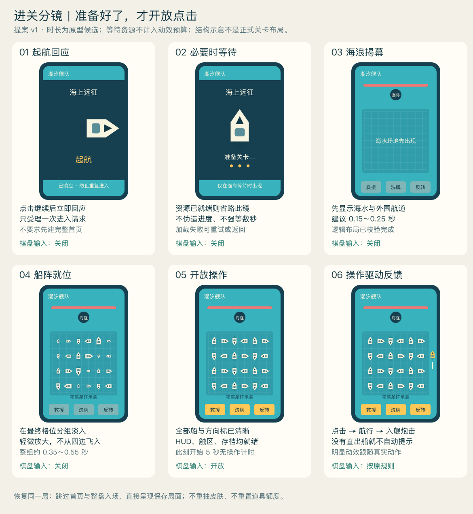
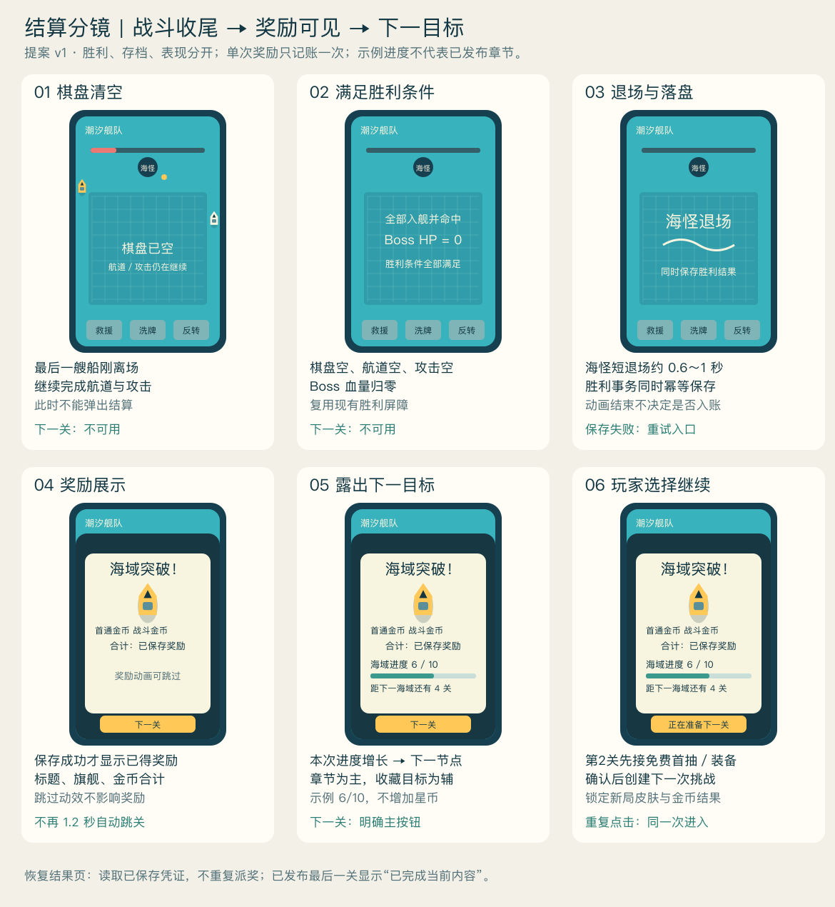

# 进关与结算分镜 v1

2026-09-20。E1与E2a灰盒已实现，结算页及主题演出待实施；图中船阵是流程示意，不是正式关卡或美术。补充[体验路线](../../EXPERIENCE_ROADMAP_REVIEW_20260920.md)，不改变I5-B及既有交易规则。

## 录屏复核与证据边界

本次输入为用户剪辑的`9月20日.mp4`及另一模型的分析，保留原文件不修改。实际解码时长59.533秒；按2秒间隔检查全片，在16.3～20.4、50.0～50.4、52.7～59.3秒补查关键帧。50.0秒仍为密集盘面、546金币；50.1秒突变为少量棋子、617金币。52.7秒压暗，52.9秒已出现成功结算，59.3秒仍停留在结果页。

因此：这版不能作为连续通关时长证据，也未展示点击“下一关”。上一轮177.65秒原录屏约166～168秒展示了下一关；两版时间码必须分开。启动、角色过渡、分批呈现、奖励与目标展示的方向得到支持，精确加载耗时、缓动曲线及竞品底层渲染方式未被验证。

用户提供的分析用于补充设计，不把其中建议自动视为已实现功能或冻结参数。下图动效时间是本项目候选，不是竞品实测。

E2a实现与实际验证见[记录](../../验证记录/E2a_进关与恢复/E2A_VALIDATION.md)。新局0.18秒场地＋0.48秒分组，恢复／减弱动效0.12秒；分镜里的品牌加载、起航与海浪仍由V2完成。

## A. 进入关卡

[可编辑矢量版](Entry_storyboard.svg)。

顺序：受理进入请求→必要时等待资源→场地揭幕→船阵在最终格位快速呈现→开放点击→动作反馈。主流程适用于正式新局；不是每关都返回首页。

| 关口 | 必须完成 | 操作规则 |
|---|---|---|
| 受理一次进入 | 防重入；确定继续当前局还是正式新开局 | 按钮立即反馈，重复点击不再创建attempt |
| 准备资源／数据 | 关卡校验、视图资源、Safe Area和映射准备 | 数据已就绪直接衔接；无法度量进度时显示不定进度，不伪造百分比 |
| 新attempt提交 | 在该新局首次可操作前可靠保存初始身份、皮肤、收益与额度 | 存档失败显示重试；不开放会丢失账户状态的正式操作 |
| 呈现场地与全部船 | 逻辑早已位于最终Grid；只变视觉Alpha／局部缩放，建议0.90→1.00 | 密集盘面全部可读前不接受船或道具输入；不缓存提前点击 |
| Ready | 视图、触区、HUD、持久状态一致；不允许隐藏船仍阻挡玩家 | 开始接收船／道具操作；5秒无操作计时从此处开始 |

动效候选：进入按钮响应即时；揭幕约0.15～0.25秒；整盘分组呈现约0.35～0.55秒。批次交错重叠，不逐船累计80次时长；不为了完整演出插入额外等待。暂停、返回和加载失败处理独立于棋盘输入锁。

冷启动：使用必要的品牌启动与真实初始化；不额外照搬小程序白底平台页。独立首页仍是后续产品选择，当前可保留直接继续关卡入口。

恢复同一局：加载现有attempt，直接呈现保存局面，可用很短淡入；不重复旗舰出发／整盘入场，不重新分配皮肤或收益，不刷新道具额度。若已在入场中落盘后退出，恢复仍使用同一attempt。

## B. 关卡结束

[可编辑矢量版](Victory_storyboard.svg)。

顺序：棋盘清空但继续航道／攻击→满足完整胜利屏障→海怪退场与可靠结算→展示奖励→露出下一目标→玩家选择继续。

| 关口 | 权威条件 | 表现和点击 |
|---|---|---|
| 最后一船离开棋盘 | 仍可能存在航道船、入口等待、待发／飞行攻击 | 不弹结算、不销毁航道和炮弹；关闭已无意义的帮助提示，道具不可用；暂停仍遵守原逻辑 |
| 胜利成立 | 棋盘、航道、入口等待、攻击全清空，Boss HP归零 | 使用现有一次胜利事件，不从“最后船的动画结束”推断 |
| 落盘与退场 | 同一attempt的胜利事务幂等保存；退场约0.6～1秒为候选，可与保存重叠 | 不让动画回调加金币；失败保留胜利待提交状态，显示重试，不显示已入账或进入下一关 |
| 奖励页 | 读取已保存胜利凭证的首通金币、战斗金币、合计 | 取消现有1.2秒自动跳关；跳过／减少动效仅改变展示 |
| 目标轨道 | 真实章节推进为主，收藏目标为辅 | 进度先变化再露出下一节点；示例6/10不新增星币或虚构榜单数据 |
| 继续／返回 | 结果已保存，目标关存在；点击只受理一次 | 返回不撤销奖励。最后已发布关显示内容完成；广告未接入时不显示可用翻倍 |

“下一关”可在结果保存且结果页可读时启用，不强迫观看完整计数动画。点击可以结束剩余展示，但不能跳过尚未完成的权威攻击或失败的保存。短暂退场不能成为新的不可恢复锁；关闭动态效果可直接到结果页。

退出恢复：已结算但未继续时恢复结果页；已受理继续且下一attempt已落盘则恢复新局。复用现有胜利凭证和attempt，仅补必要的流程状态，禁止另建金币账本。

## C. 与I5-C的交接点

第2关胜利→展示已保存奖励→免费未拥有蓝皮首抽→玩家装备／选择稍后→正式创建第3关。不得在玩家处理首抽前预先锁定第3关皮肤。

免费奖励资格与领取回执必须持久化、一次性；界面关闭不等于领取。同一用户已有超过解锁关的旧档仍按I5-C规则一次性补领。新皮肤不自动替换装备；恢复活动attempt不应用新装备。

图中结算旗舰可用局内同船型模型或独立插画，先占位；正式资源风格在V2确定。轨道的章节奖励、真钱礼包与广告频控仍各自按原计划校准，不随本分镜新增。

## D. 路线只做一处实质调整

在原E1→E2→V1→I5-C→V2顺序中，**将E2从单独的结算页，扩成进关与结算的完整灰盒流程**：

1. E1：5秒仅直出高亮、完全死局弹窗与统一弹层；Ready前不计时。
2. E2a：灰盒进入／恢复、输入开关、防重复进入；完整胜利屏障与保存失败分支。
3. E2b：结果页、真实章节目标、继续／返回和结果恢复；预留首抽接口。
4. V1：最小3D船体验证，并检查分组呈现不会错位、遮挡或穿插。
5. I5-C：原定收藏存档、抽取保底、图鉴装备、经济校准，接第2关结果与第3关开局。
6. V2：把灰盒流程替换为旗舰起航、海浪揭幕、海怪退场、统一HUD；不重写流程服务。
7. I6及之后：真机补验、30关、真实榜单与商业化顺序不变。

本分镜作为E2与V2共享的实现依据，不新增一轮长篇设计或整套首页前置。美术可以后接，输入、保存、恢复与胜利边界先验证。

关键验收：Ready前点船不触发／不排队；恢复不刷新额度；棋盘空但仍有一发攻击时不弹结果；保存失败不显示已得奖励；重复继续只创建一个新attempt；结果中杀进程不重发奖励；第2关首抽装备作用于第3关；最后关不越界；暂停／后台／减少动态均可安全返回。
