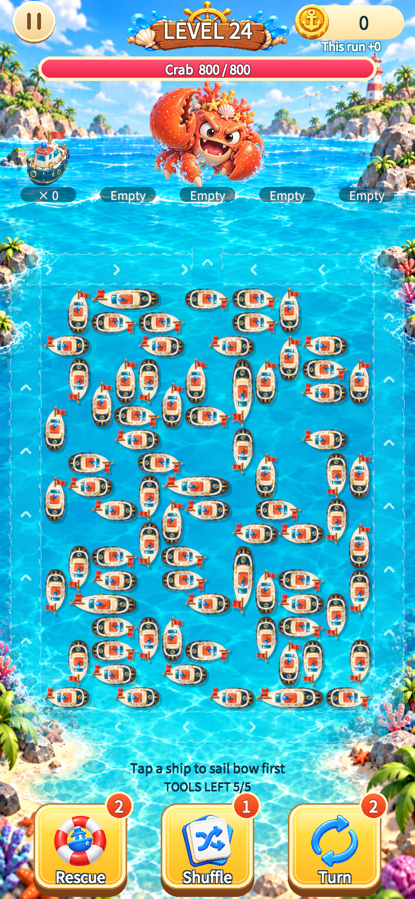
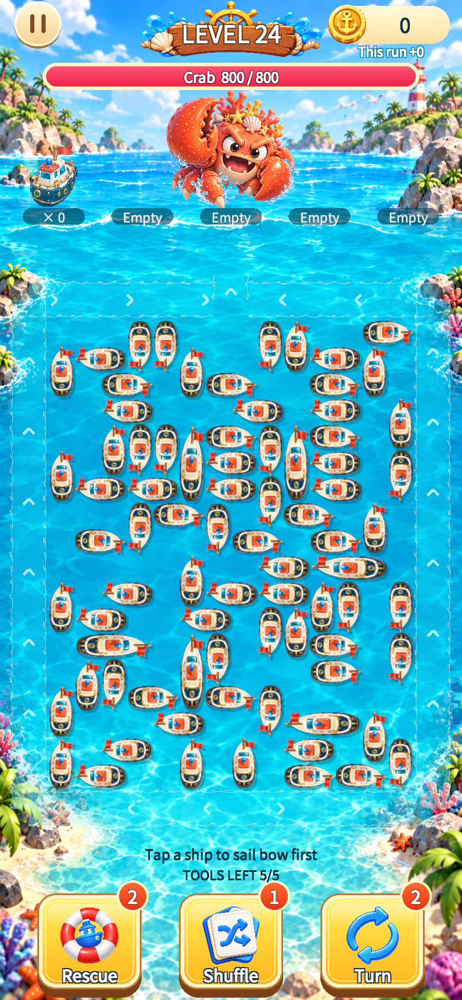

# 2026-09-27 风险难度、边缘审查与编辑器验证

范围：只读风险／道具模拟、编辑器接入、原100关审查、两个评审B80重排。正式100关路由与布局／证明、玩家存档、道具实现及价格未改变。

## 验证结果

- Unity 2022.3.25f1隔离工程：**21／21 EditMode通过**。覆盖小题安全／死局、Unknown预算、恢复路线回放、最多128个可达小状态的放宽投影证据与独立求解交叉检查、80船重复ID见证失败回退、编辑器过期分析／草稿／试玩保护、两关形态和完整证明。
- **3／3 PlayMode通过**：两项评审入口／10关真实动画回放、一次双关截图。10关658有效动作，652次离场、6次部分移动；按每步指纹和Outcome校验，攻击／胜利事件及场景清空通过。
- 最后风险分析增量只影响编辑器调用的纯分析代码，最终EditMode在增量后运行。PlayMode与截图先完成；之后未改关卡、游戏移动／航道／战斗。测试后唯一代码文字变化为一条洗牌诊断预算注释。
- 正式Campaign与旧十关共**205份JSON**前后SHA-256：0变化，包含布局、证明、清单，不是205关。
- CLI `validate`复验10关哈希、658个Core事务、局部结构与对照关系；`audit-risk`输出100关审查及指定样本风险。

证据：[EditMode-results.xml](EditMode-results.xml)、[PlayMode-results.xml](PlayMode-results.xml)、[verification.json](verification.json)、[risk-audit.json](risk-audit.json)。未复制Unity许可日志或账号环境信息。

## 难度结论

1. 正式100关均有纯直出完成路线；75关最长同向列至少4船，99关至少3船。扫描覆盖全板、允许1格间隔，不能偷换成“75关封边”。
2. 4船小题4个有效首步均安全，不能凭“必要部分移动”给出风险高难标签。
3. 8船小题H先动后无解；错误态反向4／8目标有完整解，外围救援22／28对有解、6对无解；4个洗牌种子找到可解方案。
4. 重排B80-R完成证明的34步后，误点H使A／B／G／H构成闭合零位移环。父状态有正确完整后续解，错误子状态有确定死局证据。100组外围救援检查中70组有完整后续解，未枚举全部随机结果，不能写成随机救援成功率70%。风险出现偏晚，不符合新第5关要求。
5. B80-T未在记录路线找到立即形成此类闭环的错步，并非全状态无死局证明。80船一步分析仍有Unknown，未计入致死动作。
6. 放宽投影只证明无解：移除其他船后，允许保留船在每个中途空格停靠，覆盖其他船可能提供的停靠条件。穷尽更宽松状态空间仍无解，才可证明原状态无解；找到解或预算耗尽不证明原状态有解。

## 新B80摆放

| 项目 | B80-T修复后 | B80-R修复后 |
|---|---:|---:|
| 船／长船 | 80／6 | 80／6 |
| 完整见证动作 | 81 | 82 |
| 开局直出 | 6（此前20） | 7（此前15） |
| 最长同向列，含1格间隔 | 2 | 2 |
| 最大空矩形 | 6格 | 6格 |
| 4×4窗口最小方向熵 | 0.6855 | 0.6855 |
| 4×4窗口P10方向熵 | 0.7610 | 0.7610 |

核心关系船保留身份和占格，填充船重排。工具在临时目录生成验证，成功后仅替换两个评审关的布局／证明／报告与manifest，GUID不变。

下面为780×1688真实Unity Game View截图，统一使用第24关显示槽对比；不是新正式第24关或已验收第5关。没有修改／拼接图片。

## 编辑器操作

1. 打开 `Tools → Tidebound → Level Studio`，打开JSON。
2. 在“错误分支与道具救回”中点“检查每一步”。先载入已有证明可帮助快速验证安全分支。
3. 列表区分仍有解、已证死局、未知；“执行并查看”进入可回退的编辑器试玩分支。
4. 对死局点“检验道具救回”，或分析当前状态道具效果。只模拟，不扣库存或余额。
5. 导出状态指纹、规则版本、每步证据、恢复目标／种子及后续解法；导出不等于批准发布。

## 尚未验收

真人难度／道具使用频率、真机触控与性能；新5／8／12／20关和新版100关；锁定核心画刷／形态高亮；动态提示；保证有效的正式救援策略；版本路由。见[风险重设计](../../LEVEL_RISK_REDESIGN_20260927.md)。

仓库整体`git diff --check`发现既有UI资源meta和原场景的尾随空格，本轮未改这些文件；本轮代码／工具范围另行检查。
