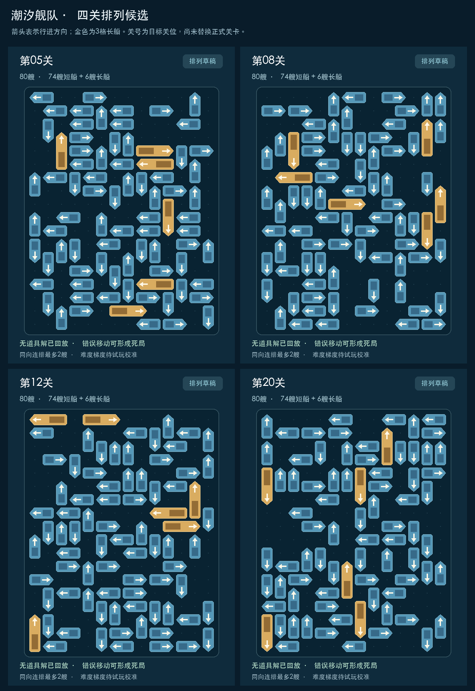

# 第5、8、12、20关：排列候选

2026-09-28。为“把这4关的排列展示给我”生成的独立评审草稿，尚未替换正式关卡。关号表示目标关位；不是已经验收的难度曲线。

箭头图直接由本目录四份布局JSON绘制，箭头为行进方向，金色为3格船。`RC_005.png`、`RC_008.png`、`RC_012.png`、`RC_020.png`为对应JSON在独立Unity工程中的780×1688 Game View原始截图。完整JSON可导入关卡编辑器；正式百关路由与玩家存档未切换。

## 已验证

| 目标关位 | 船数／长船 | 记录解法步数 | 已证明的错误死局位置 | 开局直出 |
|---|---:|---:|---:|---:|
| 5 | 80／6 | 82 | 1 | 8 |
| 8 | 80／6 | 82 | 1 | 8 |
| 12 | 80／6 | 84 | 2 | 8 |
| 20 | 80／6 | 85 | 2 | 8 |

- 四份无道具解由正式Core事务回放，再在Unity实际动画中执行333步，包括320次出海、13次部分前进；每步校验状态指纹，每关80次Boss命中、清盘、船体视图清空。1项覆盖四关的PlayMode测试通过，结果见`PlayMode-results.xml`。
- 每个错误例均有可达前缀、父状态完整安全解和错误后零位移闭环证据，不把搜索超时计作死局。具体船ID及状态指纹见各`.analysis.json`。
- 含一格间隔的同向横／纵连排最多2艘，最大空白矩形6格，4×4窗口最低方向熵约0.685、P10至少0.75。
- 看图复核后额外约束：每条最外边至少2种方向、单一方向占比不超过60%；外侧两格带至少3种方向、单一方向占比不超过55%。避免把同向船拉开间隔后仍排成一整边。边缘统计见`edge-audit.json`。
- 截图状态指纹与解法／布局一致；原正式关包205份配置文件哈希未变。见`capture.json`、`verification.json`。

## 尚未验收

- 当前四关用于比较排列，仍复用交叉口错误落点的P8关系核心；第12、20关是双核心变体，不能据此宣称已完成两种全新跨区机制。长船本轮参与填充与阻挡，没有逐艘证明其不可替代性。
- 这些错误例可很早触发，尚未校准为第5关目标中的“前5～12步遇到”，也未证明两个核心必须以特定交接顺序解决。记录解法步数不是最短解或真人难度评分。
- 第5／8关以及第12关两个错误例、第20关第一个错误例，均找到至少一种单次道具救回的完整解。第20关第二个错误例在当前预算内尚未找到完整救回证据，属于待验证，不等于道具无法救回。随机救援也未保证每种抽取结果均可解。
- 轮廓仍为14×18矩形候选，尚未达到竞品上下收窄的紧凑团块效果；难度梯度、道具使用频率、真人触控和真机均待验证。因此这批只交付排列评审，不能直接量产替换百关。

## 文件对应

- `RC_0xx.json`：真实占格、方向和船长。
- `RC_0xx.solution.json`：按正式规则验证的逐步解法与状态指纹。
- `RC_0xx.analysis.json`：局部质量、错误前缀、死局证据及有预算的道具恢复搜索。
- `level-xx-layout.png`：单关方向示意图；`four-layouts.png`：四关总览。
- `RC_0xx.png`：Unity原始截图，HUD展示目标关号；使用隔离的内存关卡目录，无存档服务。
