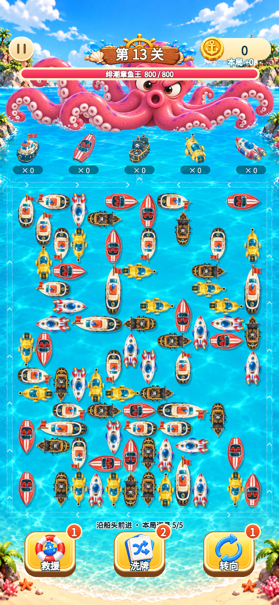

# 新地图布局与五海怪 Unity 接入

用户已批准新布局与五海怪三态，并要求正式实现。正式工程：`10_开发工作区/TideboundFleet_Unity/`。本目录截图均由 Unity 2022.3.25f1 Game View 渲染，不是网页预览。

## 实际效果

五怪均有健康、受伤紧张、重伤虚弱三态：

| 海怪 | 健康 | 受伤紧张 | 重伤虚弱 |
|---|---|---|---|
| 绯潮章鱼王 | [800HP](Octopus_Healthy_780x1688.png) | [480HP](Octopus_Tense_780x1688.png) | [200HP](Octopus_Weak_780x1688.png) |
| 珊瑚巨钳蟹 | [800HP](Crab_Healthy_780x1688.png) | [480HP](Crab_Tense_780x1688.png) | [200HP](Crab_Weak_780x1688.png) |
| 雷鳍蝠鲼王 | [800HP](Manta_Healthy_780x1688.png) | [480HP](Manta_Tense_780x1688.png) | [200HP](Manta_Weak_780x1688.png) |
| 锤头鲨霸主 | [800HP](Shark_Healthy_780x1688.png) | [480HP](Shark_Tense_780x1688.png) | [200HP](Shark_Weak_780x1688.png) |
| 礁岩龙龟 | [800HP](Turtle_Healthy_780x1688.png) | [480HP](Turtle_Tense_780x1688.png) | [200HP](Turtle_Weak_780x1688.png) |

截图按五皮肤独立内存展示夹具拍摄，原关卡船位／方向未改。受伤与虚弱由实际点击32／60艘船、航道运行和真实命中触发；没有反射修改HP。正式账号仍按用户已拥有并装备的皮肤显示，不会自动赠送截图中的五种皮肤。

响应式画面：[360×640](Layout_360x640.png)、[390×844](Layout_390x844.png)、[430×932](Layout_430x932.png)、[360×800](Layout_360x800.png)、[英文](Layout_English.png)、[暂停菜单](01_Pause_NewMap.png)。高分辨率三态图使用780×1688，模拟上44／下34参考单位安全边距。

## 验证结果

| 验证 | 结果 | 证据 |
|---|---|---|
| 新布局、15资源、血量阈值、分段映射、外围路线、旧布局、舰队／连击与百关模型 | 71/71通过 | [EditMode.xml](EditMode.xml) |
| 实际输入、长船、碰撞暂停、连击时钟、首页入口、设置暂停、百关真实动画 | 17/17通过 | [PlayMode.xml](PlayMode.xml) |
| 100关动画、航道、每船一次攻击、胜利一次、所有船视图清空 | 100关／7927船通过，包含于上述PlayMode | `CampaignPlaybackTests.EveryPublishedCampaignLevelClearsThroughAnimationLaneAndCombat` |
| 最终GUI截图／流程检查 | 398项通过，含300次挪船完成检查 | [visual_checks.txt](visual_checks.txt) |
| 背景及五怪三态与批准源图一致 | 16/16哈希一致 | [ASSET_IMPORT.json](ASSET_IMPORT.json) |
| 既有配置与纯核心代码保护 | 569/569配置、78/78 Core/Data与任务初始哈希一致 | 本次接入前后核对 |

GUI覆盖：首页开始新第13关、暂停／继续、返回首页后重新开局、五怪映射、五槽和右二槽镜像、真实800→480→200HP、每船10伤害且命中一次、暂停冻结海怪位置与战斗时钟、四尺寸棋盘点击坐标一致、紧凑道具说明实际生成文字网格。最终GUI运行无编译错误或运行异常。

截图工具最初使用了不存在的 `ShipPlacementData.SkinId` 字段，已改用现有 `SavedGameRuntime.CreateCollected` 生成独立展示夹具；单独编译确认通过后才继续执行。期间另一个并行测试文件短暂缺少命名空间引用，后续已恢复，本次未修改该文件。最终截图工具已编译并完整运行。

## 变更边界

- 运行时修改限于 Unity 展示层：`PortraitBoardLayout`、`GameplayBattleLayout`、`PortraitPuzzleGraybox`的展示配置、航道展示路径／图形、船尺寸、`FleetBattleArtView`和连击展示。
- 正式百关布局、Core/Data、伤害、金币、道具事务、存档schema和玩家档案未被本任务修改。浏览器设计稿及旧Boss素材保留。
- 新资源位于 `Assets/Tidebound/Resources/TideboundUI/Gameplay/BossWide/` 及 `Open_Ocean_v1.png`。统一水线依赖目录中的Alpha UV元数据；不能直接用整张PNG透明边缘重新居中。
- 当前仍为位图轻摆与命中脉冲，不是海怪骨骼动画。手机触控、Android／iOS性能和纹理内存预算尚未真机验收。

## 查看方式

在Unity菜单选择 **Tidebound → 打开完整游戏（100关）**，从主页点击“开始游戏”。第1–20／21–40／41–60／61–80／81–100关分别显示章鱼、巨钳蟹、蝠鲼、锤头鲨、龙龟。健康阈值为60%，虚弱阈值为25%。
