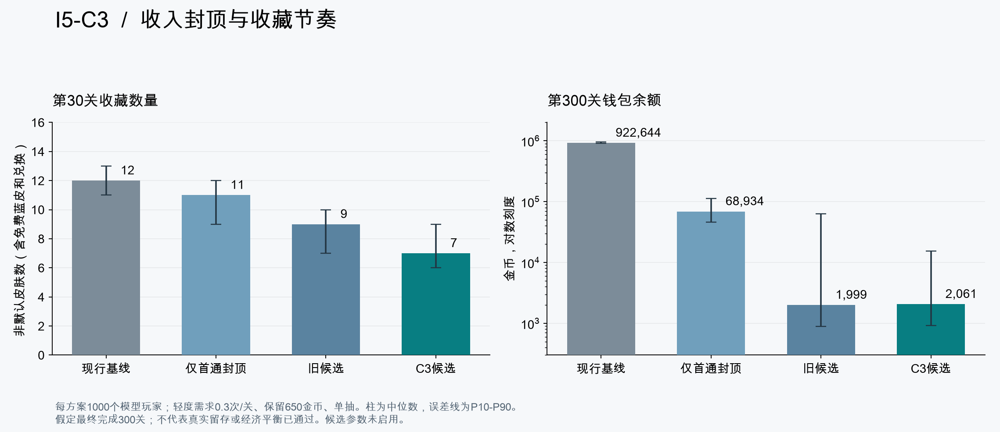
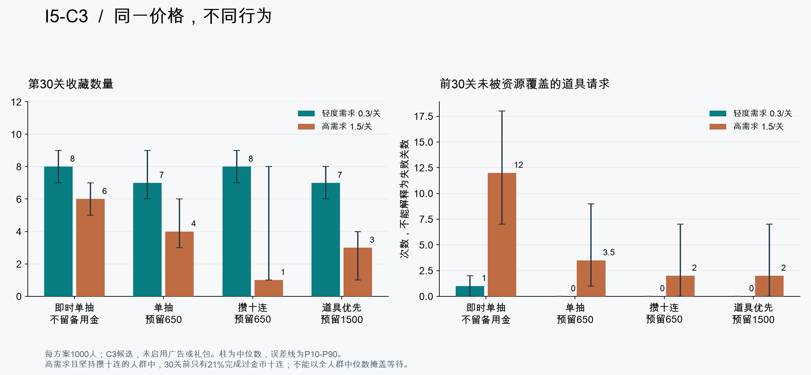

# I5-C3 长期经济校准与决策记录

日期：2026-09-20。工程基线：I5-C2 `8c1256e`。状态：**离线校准和候选筛选完成；未更改游戏价格、收益公式、存档或真实SDK。经济平衡尚未冻结。**

## 1. 本轮结论

建议将“首通第10关后封顶280＋C3分档抽价”作为下一轮30关体验验证的主候选，保留旧候选作对照。C3主样本（轻度道具需求0.3次／关、玩家选择五款高品质皮肤、单抽并保留650金币）在第30关有6／7／9款非默认皮肤（P10／中位／P90），达到原5～7款中位目标和P10不少于5的模型筛选起点。

这不是统一人群的承诺：轻度攒十连中位8款；高需求单抽中位4款；高需求且只攒十连中位仍只有免费蓝皮，30关前仅21%完成金币十连。不能为了让一张总表好看而把十连设为必做目标，也不能通过广告或付费补给替代关卡难度和免费容错的验收。

本轮不激活候选。当前只有10个正式候选关，首通封顶对这10关没有影响；收藏涨价却会立刻影响早期消费，须作为单独版本变更再实施。下一步可以进入V2的UI与视觉制作准备；30关体验阶段补经济真人数据，再决定是否启用候选。

## 2. 先修正模型口径

旧I5-B结果是历史记录，不能与本轮直接相减归因于价格。新版修正了：

- 纳入十连9倍起价锁价、批内紫保底和金／红／重复保护；券兑换在整笔交易之后，当前关号达到5才开放。
- 第2关胜利后当前关号已是3，免费蓝皮后即可金币单抽；模型即时收藏策略的首次单抽实际发生在第2关结算后。
- 前10关读取真实船数：7／80／80／80／80／80／80／80／80／80；长船为0／0／0／4／4／4／6／6／6／8。未来关用第2～10关船数结构循环作工作量假设，没有生成30／100／300关。
- 道具分类型库存、250／300／200单价、650组合包、第三关各1与每10关随机1的入场赠送；购买只用已结算钱包，库存跨关，每attempt合计最多5次。
- 取消单一35%／65%预算限制，比较4种玩家消费策略；另比较默认船、单款偏好和五款高品质装备。实际游戏不自动装备。
- 用生产C#导出的520笔事务做逐字段对照，结果、价格、券与保底一致；金币按生产概率的分组二项分布采样。分组采样与金币分布等价，但不是逐船奖励seed复刻。

固定seed20260920，55个方案×1000人×300关＝**16,500,000个模型关卡回合**，另有165次单元测试中的完整情景回放。记录3／10／30／100／300关分位数。所有人最终通过300关是外生假设；没有模拟弃游、失败导致的停止进度、真实广告填充或支付转化。

## 3. 收入与价格的主对照

下表统一为无广告／礼包、轻度需求0.3／关、预留650金币的单抽策略。收藏含免费蓝皮与兑换，不含默认白船；首批可收集池15款。

| 方案 | 30关收藏 P10／中位／P90 | 100关收藏中位 | 300关收藏中位 | 300关钱包中位 |
|---|---:|---:|---:|---:|
| 现行：首通线性＋现价 | 11／12／13 | 15 | 15 | 922,644 |
| 只封顶首通280 | 9／11／12 | 13 | 15 | 68,933.5 |
| 封顶＋旧候选抽价 | 7／9／10 | 13 | 14 | 1,999 |
| 封顶＋C3候选抽价 | 6／7／9 | 12 | 14 | 2,061 |

首通线性增长是后期过剩的主要来源；仅封顶后仍有较高余额和较快收藏。C3轻度单抽300关钱包P10／中位／P90为913／2061／15426；约14.4%已集齐15款而停止抽取，因此不能宣称完全消除了长期金币积累。

### 建议保留为测试候选的参数

| 参数 | 当前生产 | C3候选（未激活） |
|---|---|---|
| 首通 | 100＋20×(关号−1) | 100＋20×min(关号−1,9) |
| U=0～2 | 按现有档，300 | 300 |
| U=3～5 | U3为300，U4～5为450 | 900 |
| U=6～9 | U6～7为450，U8～9为700 | 1600 |
| U=10～14 | U10～11为700，U12～14为1000 | 2400 |
| U=15～19／20+ | 当前15款池无新增目标 | 3100／3800，仅扩池敏感实验 |
| 道具单价／组合包 | 250／300／200／650 | 保持 |
| 十连、概率、保底、转券、兑换 | CollectionBaselineV1 | 保持已确认规则 |

U包括赠送和兑换获得的非默认唯一皮肤。C3把价格变动集中在U≥3，初期300金币单抽的可负担性保留；未重新定价已完成订单。

## 4. 同价下的玩家行为差异

“预留”是模型中玩家主动保留的备用金，产品不能强制分配这些预算。组合包策略是在至少两类库存为空且有650金币时选择组合包，否则单买；即时收藏策略只单买。

| 行为 | 轻度30关收藏中位 | 高需求30关收藏中位 | 高需求未覆盖请求中位 | 高需求30关首次金币抽取达成率 |
|---|---:|---:|---:|---:|
| 即时单抽、不预留 | 8 | 6 | 12 | 100.0% |
| 单抽、预留650 | 7 | 4 | 3.5 | 99.7% |
| 只攒十连、预留650 | 8 | 1 | 2 | 21.0% |
| 单抽、预留1500，道具优先 | 7 | 3 | 2 | 79.8% |

- **十连收益不能忽略。** 免费蓝皮后U=1，第一笔十连仍锁在2700金币，即使批次中跨过U3／U6也不加价。这是已确认规则的一部分。轻度人群首次十连中位第12关，P90第15关；早期收藏可能一次跳升，不能通过暗改批次价格压到所有人统一5～7款。
- **能力达标与主动延迟要分开。** 即时单抽策略可在第2关结算后完成首笔300金币单抽；保留650金币的轻度玩家主动延迟至第5关。不要把模型的储蓄偏好误判为系统没有提供初次抽取机会。
- **重度需求是设计风险。** 高需求为1.5次／关的假设，预留650单抽者前30关道具请求覆盖率中位91.5%，未覆盖3.5次；这些不是3.5关失败。保留1500虽减少短缺，也把首次抽取和收藏推迟。要实测请求是否为玩家可选容错，而非必需。
- **收藏不可只看拥有数量。** C3轻度单抽到300关的最大付费抽取间隔中位7关、P90为8关；高需求则为28／40关。这里只统计金币抽取间隔，不代表中间完全没有免费领取、兑换或通关反馈，也不能换算真实天数。

## 5. 敏感情景与取舍

以下均相对C3“预留650单抽”改变一个条件。每格仍来自1000人。礼包为模型假设每10个已完成关最多购买一次；广告按假定80%完成奖励、每日6道具／1抽／3战斗翻倍、工具广告至少90秒间隔；不对应实际渠道数据。

| 情景 | 轻度30关收藏中位 | 高需求30关收藏中位 | 高需求300关请求覆盖率中位 | 轻度300关收藏／当期池 |
|---|---:|---:|---:|---:|
| 基准：五款高品质 | 7 | 4 | 97.3% | 14／15 |
| 只使用默认船 | 7 | 3 | 95.0% | 13／15 |
| 只使用一款高品质偏好 | 7 | 4 | 95.9% | 13／15 |
| 券优先攒红皮 | 7 | 4 | 97.2% | 14／15 |
| 模型广告补给 | 9 | 7 | 99.8% | 15／15 |
| 每次三类各2礼包 | 8 | 6 | 99.3% | 14／15 |
| 每次三类各5礼包 | 8 | 8 | 100.0% | 14／15 |
| 25%关卡额外尝试一次 | 7 | 3 | 92.9% | 14／15 |
| 101／201关各扩5款 | 7 | 4 | 97.3% | 20／25 |
| 第11关后100艘 | 8 | 4 | 97.9% | 14／15 |
| 第11关后110艘 | 8 | 5 | 97.9% | 14／15 |
| 每10关额外10收藏券 | 8 | 4 | 97.3% | 14／15 |

由此建议：

1. 继续允许单皮肤和默认船选择。高需求300关只用默认船的覆盖率中位95.0%，五款高品质为97.3%，经济差异应说明，不能宣称皮肤没有经济影响或用强制装备掩盖差异。
2. 广告、礼包确实会推进收藏，而不仅补道具；各5礼包比各2更明显。后续优先验证明确数量的各2包，价格／转化／真实订单另做，当前不激活任何礼包或广告奖励。
3. 重试会消耗更多库存。额外尝试情景中高需求覆盖率降至92.9%、30关收藏中位3；死局部分收益没有补平消耗。免费重开和无道具解法必须保留，先改难度／教学和提示，再讨论补给。
4. 每10关加10券会把轻度30关收藏中位从7推至8。现阶段章节进度先做展示，避免同时加金币、券、道具三类奖励。原有每10关1个道具赠送保留。
5. 100／110艘使轻度30关收藏中位升至8，说明船数冻结会影响经济；不能拿80船模拟提前冻结所有密度。扩池实验300关为轻度20／25、高需求15／25，并未制作新皮肤或新关。

## 6. 重开与套利边界

基准情景没有失败尝试；25%额外尝试情景假设其中一半是真死局，获得该次抽样战斗金币的50%，其余主动重开0金币。所有重开都消耗当天序号，只有序号1～10的真死局有部分收益；单元测试用主动／死局交替12次验证后两次均为0。一天仍按10个最终通关关卡定义，是真实时长未知时的简化。

这验证了模型账本和既有次数边界，**没有证明不存在策略性刷死局**。80船、每船最多8金币，按全盘收入保守上界估算，每日死局奖励不超过6400金币（实际死局必有留船，且高额收益概率受装备占比限制）。次数每日恢复，也不意味着跨日没有可重复收益。后续记录实际死局命中数、奖励额、重开序号及用道具成本，再评估；本轮不擅自削减已确认的重开奖励。

## 7. 采用候选前的工程与体验门槛

- 当前生产仍为BattleCoinsV1、CollectionBaselineV1与15个可抽皮肤，历史钱包和回执没有改写。采用候选时必须分别新增收益／收藏规则版本，旧订单按旧价校验；活动attempt仍用其开局版本，不能直接改现有FirstClear或SinglePrice函数。
- 30关体验验证按关卡记录：首过／重试、严格死局、道具请求／实际使用／失败或取消、五次额度耗尽、购买与余额不足、抽取与兑换、装备池、放弃／恢复。不采集私人账户信息；这些是后续测试口径，本轮没有接分析SDK。
- 将0.3／1.5需求换成真实分布，按单抽／十连和装备偏好分层；保留不看广告、不付费、不优化装备的群体。指标不合格时先检查关卡和交互，而不是假定全部玩家应看广告。
- 不提高首抽价格、不强制攒十连、不把皮肤变成过关属性，不临时按余额改价。新皮与正式UI继续按V2计划制作，真机触控／帧率仍待验收。

## 8. 验证与复现

| 检查 | 本轮结果 |
|---|---|
| Python模型单元测试 | 14／14通过；含520笔生产差分对照、源文件变更拒绝、二项分布均值／方差、账本／库存守恒、每日额度与确定性 |
| Unity EditMode | 406／406通过；新增Editor导出和程序集引用编译成功 |
| Unity PlayMode | 本轮未重跑；运行时与页面未改，上轮I5-C2的54／54仅作为历史基线 |
| 场景矩阵 | 55×1000×300＝16,500,000模型关卡回合；全部逐关校验金币、券和库存守恒 |
| 图表 | Matplotlib输出PNG／SVG，已目视核对中文、标签、P10-P90范围和对数轴 |
| 真机／真实玩家／SDK | 未验证、未接入 |

复现入口见[模型README](../../../10_开发工作区/TideboundFleet_Unity/Tools/Economy/README.md)。原始结果：[EconomyScenarios.json](EconomyScenarios.json)；[Python测试记录](ModelTests.txt)；[Unity EditMode](EditMode.xml)。图片可在同目录以SVG导出。当前代码与原始JSON是同一次确定性模拟的依据，不能把图表中位数解释为个体承诺。
