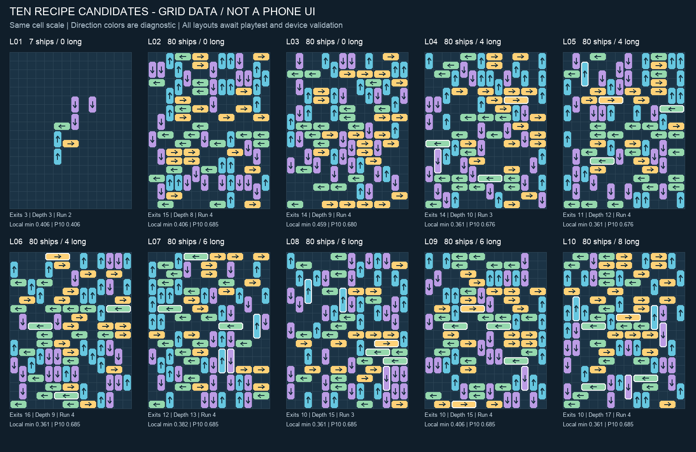

# Phase 5R I2b：十关配方候选验收

日期：2026-09-19。任务：T-P04b 的算法、数据及模型自动验证。**已完成十关候选；未完成真人筛选、真实竖屏动画场景、G1或规格冻结。**

## 1. 交付

- `RecipeLevelGenerator`、`LevelRecipe`：显式十关配方、反向构造、保持完整依赖图无环的局部改进、最终独立求解与证明。
- `LevelLayoutIdentity`：忽略ID／数组顺序，按原图、水平镜像、垂直镜像、180°旋转归一，十关没有几何重复。包含船型、长度、位置、方向、网格、规则／出口版本；暂不做90°旋转、平移或近似相似度归类。
- `LevelCandidateJson`：候选证明、配方／生成版本、局部指标、三种释放曲线、完整十关清单。
- `Tools > Tidebound > Generate Ten Recipe Candidates`：统一导出10布局＋10证明＋manifest，保存在正式工程 `Assets/Tidebound/Config/LevelPrototypes/Phase5R_TenLevelCandidates/`。
- 全部标记 `CandidateNeedsPlaytest`，不会变成正式已批准内容或自动进入旧启动场景。旧I1与12个历史原型保持回归用途。

## 2. 生成与保证边界

本轮探测发现直接用原反向排序套后期配方容易在未满80船时耗尽预算，成功布局仍会出现局部单向区。没有降低最终船数、长船配额、出口或链深指标。

完整体量先用显式的构造阶段配方：同网格、同80船及长船数、出口12～20、链深3～20，形成已可解的反向插入骨架。随后在限定次数内对单船位置／方向做确定性局部提案，长度不变，始终拒绝越界、重叠及完整阻挡环；退火只在无环布局中寻找最终配方和局部筛选均满足的候选。教学直接用中心6×8原配方。

最终根据完整图重新取得逆序插入证据，逐个重建全部插入前缀，以实际 `QueryForwardPath` 验证每次新船都有直线出口；再由独立 `LevelSolver` 求解并逐步回放构造解和Solver解。因此最终文件仍有反向生成不变量，局部改进不代替可解性证明。失败返回明确状态且没有部分关卡输出；全批未凑齐不落盘。已有候选文件只允许同内容重现，差异或额外文件会被拒绝，避免覆盖人工修改。

默认每配方最多8个连续种子，单次最多60000次提案、60000ms（包含构造与认证），构造阶段另受其自身预算约束。本次十关都在首种子20260919成功；[实际尝试记录](GENERATION_ATTEMPTS.csv)。时间预算可能让慢机器提前失败，不承诺每个种子必定成功。生成发生在编辑期；移动端读取已验证JSON。

所有候选均有每船一次直接出场的N步解，因此在当前点击计步规则下最短为N步。**80步只是最优性证明，不能代表九关难度相同，也不能证明任意乱点后仍有解。** 玩家点击受阻船时仍会实际向前移动，原布局证明随状态变化失效，后续运行时必须重新求解当前状态；本轮未修改移动规则。

## 3. 本轮暂定筛选版本

`TenRecipesV1`沿用重设计十关的船数、长船、初始出口及链深范围；`LocalCandidateScreenV1`用于候选筛选，尚非产品验收门槛。

- 完整体量：最长同向排列≤4（包括诊断器允许的单格空隙）、4×4窗口最小方向熵≥0.30、P10≥0.65、最大空矩形≤12格。全局聚集度≤0.55，其余原配方全局门槛继续使用。
- 教学仅中心6×8：同向排列≤3、最小熵≥0.30、P10≥0.40、最大空矩形≤16格；外侧留白不计作异常空洞。
- 4×4窗口至少含4艘船才纳入熵统计，覆盖率随证明记录。筛选版本与全部参数写入每关证明文件；后续校准应升级版本，不能为凑数量静默降门槛。
- 本轮从旧80船的最长6／最小熵0改善为最长3～4／最小熵0.3610～0.4591；局部视觉有改善，但没有证据证明这些阈值等同于好玩或易触控。

## 4. 实际十关

链深按完整依赖图节点数；空洞为配方分析区域内最大空矩形；提案次数含被硬约束拒绝的提案。统一14×18仍为候选，不是正式冻结规格。

| 关 | 船数 / 长船 | 初始出口 | 链深 | 最长同向 | 最小熵 / P10 | 最大空洞 | 改进提案 |
|---|---|---|---|---|---|---|---|
| 1 | 7 / 0 | 3 | 3 | 2 | 0.4056 / 0.4056 | 12 | 0 |
| 2 | 80 / 0 | 15 | 8 | 4 | 0.4056 / 0.6855 | 7 | 9520 |
| 3 | 80 / 0 | 14 | 9 | 4 | 0.4591 / 0.6805 | 9 | 9867 |
| 4 | 80 / 4 | 14 | 10 | 3 | 0.3610 / 0.6758 | 10 | 5347 |
| 5 | 80 / 4 | 11 | 12 | 4 | 0.3610 / 0.6758 | 8 | 4345 |
| 6 | 80 / 4 | 16 | 9 | 4 | 0.3610 / 0.6855 | 9 | 10462 |
| 7 | 80 / 6 | 12 | 13 | 4 | 0.3821 / 0.6855 | 8 | 9284 |
| 8 | 80 / 6 | 10 | 15 | 3 | 0.3610 / 0.6855 | 4 | 7732 |
| 9 | 80 / 6 | 10 | 15 | 4 | 0.4056 / 0.6855 | 8 | 4780 |
| 10 | 80 / 8 | 10 | 17 | 4 | 0.3610 / 0.6855 | 7 | 6908 |

对照图由保存的JSON绘制；颜色仅编码四方向，白边代表长船，箭头表示真实逻辑方向。它是布局诊断图，不是新增美术、手机布局或Unity场景截图。

## 5. 多顺序释放曲线

三条真实可执行序列分别为Solver按ID升序、构造证据按ID降序、固定种子挑选当前出口。每步保存可直接离场数、可前进受阻数、新解锁出口数；三种顺序都必须清空。下表为前60%点击的平均／最大可直接离场数，说明顺序会改变过程，初始出口不能单独代表难度。

| 关 | Solver升序 | 构造降序 | 种子出口 |
|---|---|---|---|
| 1 | 2.00 / 3 | 2.60 / 3 | 2.20 / 3 |
| 2 | 10.73 / 17 | 9.42 / 15 | 10.40 / 16 |
| 3 | 8.83 / 14 | 8.83 / 15 | 10.71 / 17 |
| 4 | 8.90 / 15 | 8.15 / 14 | 9.17 / 14 |
| 5 | 9.06 / 15 | 5.33 / 11 | 7.00 / 11 |
| 6 | 9.25 / 16 | 10.33 / 17 | 10.65 / 17 |
| 7 | 6.67 / 12 | 9.81 / 16 | 6.94 / 13 |
| 8 | 5.67 / 11 | 8.62 / 13 | 6.58 / 11 |
| 9 | 7.44 / 12 | 8.42 / 12 | 8.27 / 12 |
| 10 | 9.54 / 13 | 7.92 / 13 | 7.50 / 13 |

Level10虽然链更深，其Solver前60%平均出口仍高于Level8；因此现在只认为满足结构配方，不宣称实际难度严格递增。G1试玩后可据观察继续修配方或重排候选。

## 6. 真实验证

Unity 2022.3.25f1，批处理实际导出10/10成功。完整EditMode **217/217通过，0失败、0跳过**（原168＋新增49），[原始XML](EditMode.xml)。

新增覆盖：10关保存数据的独立求解、配方检查、构造证明和每个反向插入前缀；三种顺序共30次 `ShipMovementSystem → TransitSystem` 清盘，逐步核对保存的出口／受阻／解锁指标；727艘×3共2181次出棋盘与入舰，事件顺序一致；首／末配方固定种子精确复现布局及完整元数据；预算耗尽不返回降标结果；NaN等非法参数、缺失清单；ID重排、镜像归一及网格差异检测。

本轮没有改动画、输入、场景或移动事务，因此未重跑PlayMode；此前6/6仍是I1历史结果，不能当成本轮新关卡真实场景验收。当前自动回调在EditMode模型层完成，不等于动画完成回调、屏幕点击和Android性能通过。

## 7. 下一步

T-P05a＋T-U01～02：把这些候选接入最小验证入口和统一竖屏运行时灰盒，支持十关选择、重开、当前状态求解／自动演示。顶部预留Boss、底部预留道具，中间棋盘和航道统一缩放；真正接Input→动画完成→Movement→Transit。优先验证受阻停在新位置、连点事务与各手机比例的边界，再安排5名首次玩家和最低Android设备G1。门槛通过前不接战斗、不做30关量产。
