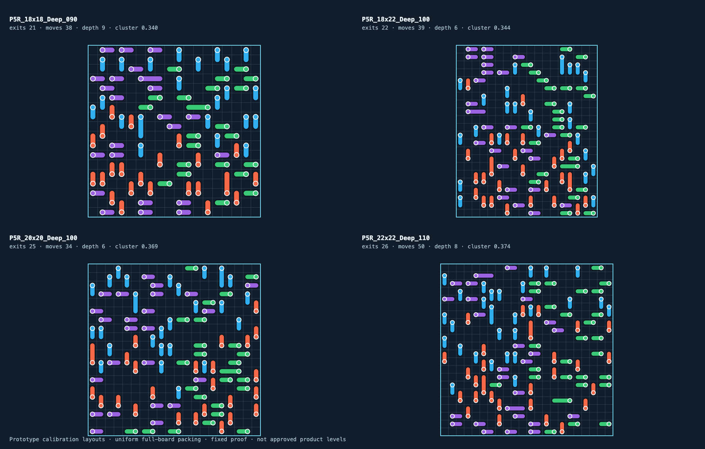

# Phase 5R 关卡体系校准验证记录

> 历史记录：以下结果对应允许受阻部分前进的既有实现，该移动行为与用户最新澄清一致，继续保留。Phase 5R因生成结构、动态求解和统一竖屏验收重新打开；这些历史结果不能作为新生成方案及10关的验收。当前计划见[重设计方案](../../PHASE5R_REDESIGN.md)。

日期：2026-09-19

Unity：2022.3.25f1

历史状态：**当次原型自动化通过；该状态不代表当前5R只差真人／真机。当前还须完成新生成、求解、10关与真实灰盒集成。**

## 1. 本轮结论

Phase 5R 已把关卡合法性、产品门槛和可解性证明拆成独立层次。运行时只拒绝危险或非法数据；编辑器产品配置负责船数、长船比例、方向混合、空间聚集、初始出口和硬锁环；解法证明从原始 JSON 重建 `BoardModel` 并逐步执行真实移动事务。

当前建立了 18×18、18×22、20×20、22×22 四种候选网格，共 12 个、80～110 艘的固定原型。它们全部可加载、通过当前候选门槛，并有与布局指纹绑定的完整清盘证明。它们仍是比较样本，不是正式第 2～30 关。

正式网格、常用船数、最大船数和长船比例尚未冻结。缺少 5 名首次玩家的点击与方向识别数据，以及最低目标 Android 设备的帧率、内存和连续操作数据，因此不能把自动化通过写成产品验收完成。

## 2. 实施内容

- 运行时技术护栏调整为最大 24×24、160 艘；移除 12×18、82 艘、172 占格、44 空格等旧产品常量。
- 新增 `LevelProductionProfile` 与 `LevelProductionValidator`，把候选产品门槛留在编辑器和内容生产流程。
- 新增真实首阻挡依赖图、初始出口／可移动统计、最长依赖链、强连通分量和零位移硬锁环检测。
- 新增方向熵、相邻同方向聚集度、最大方向占比、占用率和长船数量分析。
- 新增小规模棋盘有界精确搜索、布局 FNV-1a 指纹、解法录制和真实事务回放。
- Level Studio 支持候选尺寸、结构分析、真实规则试玩、重置、录制、验证和原子保存证明。
- 新增从同一 JSON 生成的 Unity 灰盒预览；视图不保存布局副本，点击后视图数量与 `BoardModel` 同步。

## 3. 候选构造校正

第一轮反向插入样本虽然可解，但产生了边缘方向带和中心空洞，视觉结构仍接近被否决的分区／条带思路，因此未保留。

当前第二轮样本先在全盘均匀放置互不重叠的 1×2／1×3 footprint，再按真实可直出步骤逐层剥离并反向记录方向和证明序列。这个方法消除了整片空心区，使四方向在全盘交错。它只用于建立可比较原型；`Open／Mid／Deep` 是工作标签，现有依赖深度并未在每种尺寸内严格单调，不能当作正式难度分级。

图例：蓝色为上、红色为下、紫色为左、绿色为右，白色圆点标记船头。图片是逻辑灰盒，不代表正式船体、美术尺寸或触控区域。

## 4. 12 个原型指标

| 原型 | 船数 | 长船 | 占格 | 方向熵 | 同向聚集 | 初始直出 | 初始可移 | 依赖深度 |
|---|---:|---:|---:|---:|---:|---:|---:|---:|
| 18×18 Open | 80 | 6 | 166 | 0.9995 | 0.4535 | 31 | 25 | 7 |
| 18×18 Mid | 85 | 3 | 173 | 0.9994 | 0.4271 | 24 | 32 | 8 |
| 18×18 Deep | 90 | 4 | 184 | 0.9998 | 0.3398 | 21 | 38 | 9 |
| 18×22 Open | 90 | 4 | 184 | 0.9995 | 0.3804 | 36 | 30 | 5 |
| 18×22 Mid | 95 | 3 | 193 | 0.9996 | 0.3107 | 22 | 40 | 7 |
| 18×22 Deep | 100 | 5 | 205 | 0.9997 | 0.3445 | 22 | 39 | 6 |
| 20×20 Open | 90 | 5 | 185 | 0.9998 | 0.4157 | 33 | 32 | 6 |
| 20×20 Mid | 95 | 3 | 193 | 0.9996 | 0.3368 | 23 | 42 | 8 |
| 20×20 Deep | 100 | 4 | 204 | 0.9997 | 0.3694 | 25 | 34 | 6 |
| 22×22 Open | 100 | 7 | 207 | 0.9994 | 0.4239 | 36 | 34 | 5 |
| 22×22 Mid | 105 | 3 | 213 | 0.9999 | 0.4255 | 29 | 46 | 6 |
| 22×22 Deep | 110 | 6 | 226 | 0.9996 | 0.3738 | 26 | 50 | 8 |

当前生产阈值为校准阈值：方向熵至少 0.95、单方向占比不超过 0.32、相邻同方向聚集度不超过 0.70、长船比例不超过 10%、初始直出至少 4 艘，并拒绝零位移硬锁环。这些阈值必须在真人数据进入后重新标定。

## 5. 自动化结果

| 测试平台 | 结果 | 覆盖 |
|---|---:|---|
| EditMode | **119/119 通过** | 既有 Phase 1～5 回归、技术边界、依赖图、硬锁环、小图精确搜索、布局指纹、证明失效、条带拒绝、12 个原型合法性与完整回放 |
| PlayMode | **6/6 通过** | 既有移动／航道表现、四种候选 JSON 的灰盒生成、点击归属、离场后逻辑与视图同步 |

原始 XML：[`Validation/EditMode-results.xml`](Validation/EditMode-results.xml)、[`Validation/PlayMode-results.xml`](Validation/PlayMode-results.xml)。测试使用 Unity Test Runner 管理退出，命令行未添加会提前终止结果写入的 `-quit`。

## 6. 尚未通过的产品门槛

1. 在 360×640、390×844、430×932 三类安全区记录 5 名首次玩家各 30 次指定点击，正确命中率目标不低于 95%。
2. 记录方向识别准确率，目标不低于 90%；验证 18～22 列时船头、尾部和箭头仍清晰。
3. 用接近第 2 关的完整体量样本测试首个有效目标发现时间，目标至少 4/5 玩家在 3 秒内找到。
4. 在最低目标 Android 设备验证满盘、连续点击、移动与后续航道并发；持续帧率不得低于 30 FPS，同时记录峰值内存。
5. 产品负责人结合以上数据选择正式网格、常用船数、最大船数和 1×3 长船比例。

在这些门槛完成前，Phase 6 可以做计划评审，但不能开始 30 关量产，也不能把任一候选直接命名为正式第 2 关。
